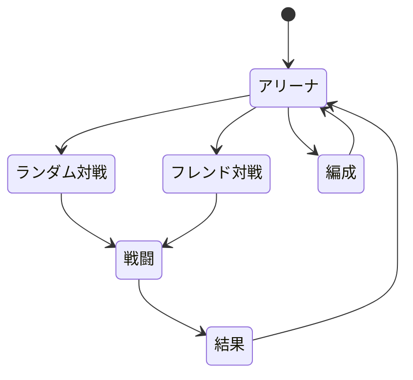
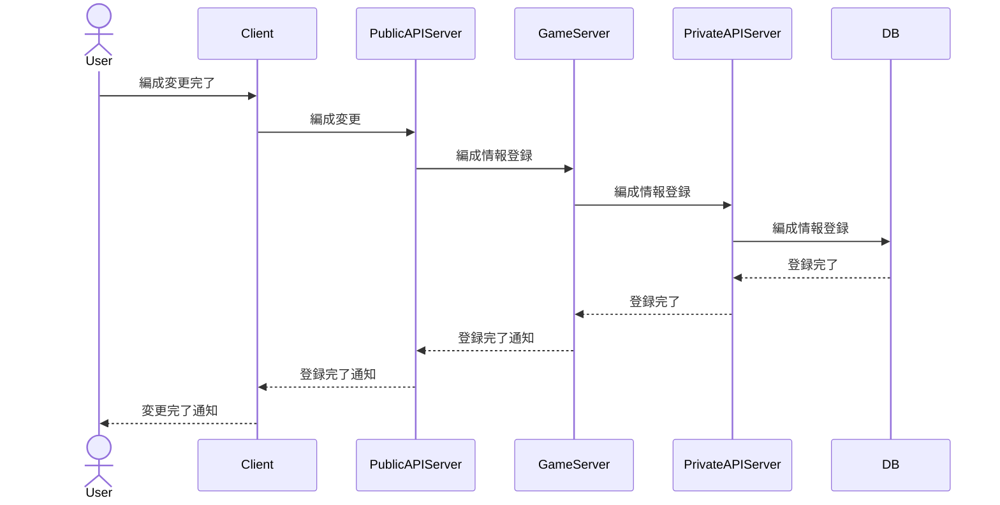
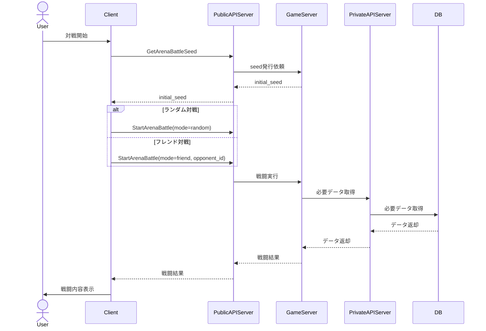

# アリーナ仕様

## 概要

アリーナはキャラクター同士で行う戦闘形式である.
戦闘の基本処理は[戦闘仕様](battle.md)に従う.

相手は2つのパターンがあり, どちらのパターンを選ぶかはプレイヤーが選ぶことができる.
* 任意の相手と戦闘する.
* ランダムな相手と戦闘する.

## 制約

* 30ターンの制限がある.
* 1ターンに行動できるのは1キャラクターのみ.
* 同一キャラクターを複数編成できない.
* 最低1キャラクターを編成する必要がある.
  - 最大5キャラクター
* 初期シード値はサーバーに問い合わせて得た値を使用する.

## 勝敗条件

以下のいずれかで勝敗を決定する.

* 相手を全滅させた側が勝利.
* 30ターン経過時は総合残HPが最も高い側が勝利する.
  - 同一の場合は以下の順序で判定していく
    1. `総合残HP / 総合最大HP`の割合で比較する.
    1. 総合ステータス(全キャラクターの最大HP+攻撃+防御の合計)が高いほうが勝利する.
    1. 総合最大HPが高いほうが勝利する.
    1. 最初に行動したほうが勝利する.

## 表示・進行操作

以下の操作が可能.

* 勝敗までスキップ
* 戦闘中の2倍速
* 戦闘中の4倍速

## 遷移

## シーケンス

### 編成登録時

### 対戦時

