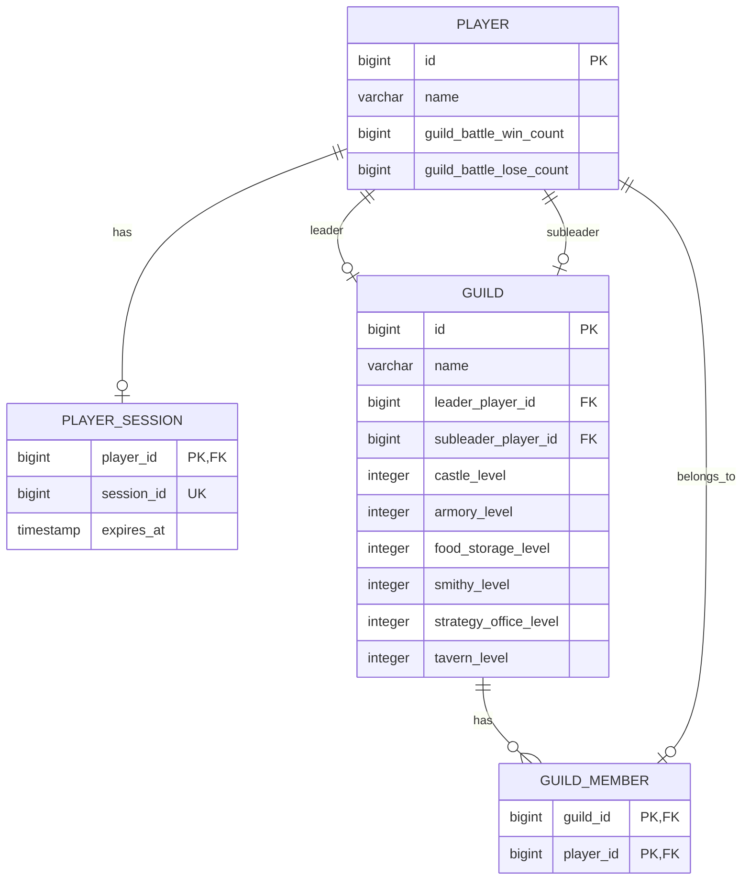
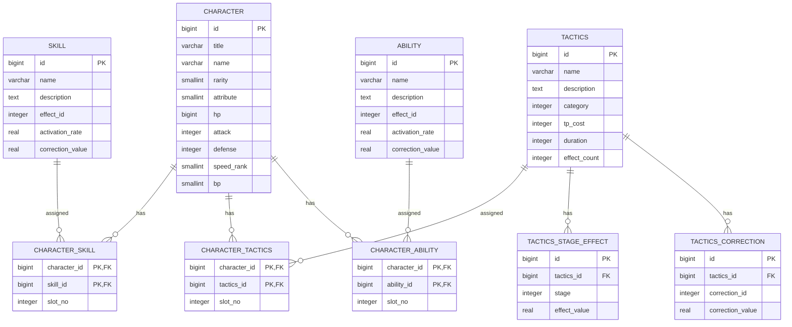
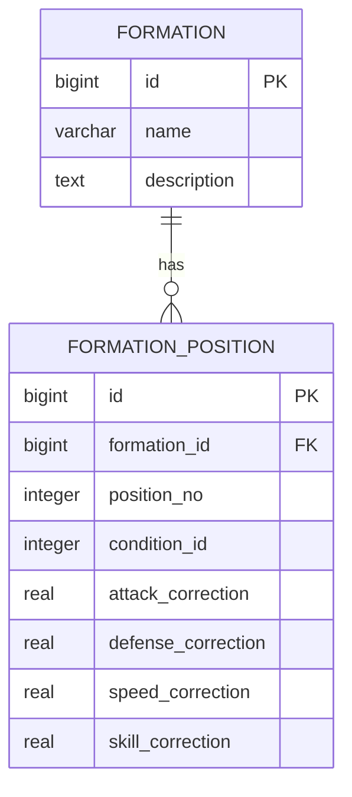
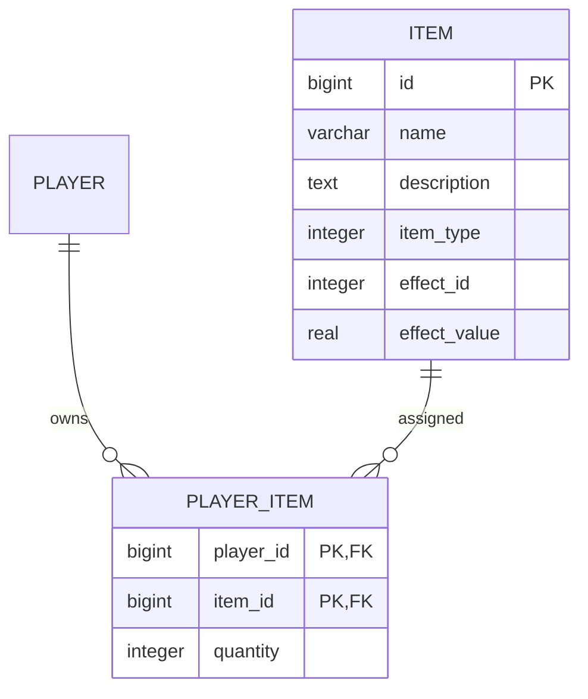
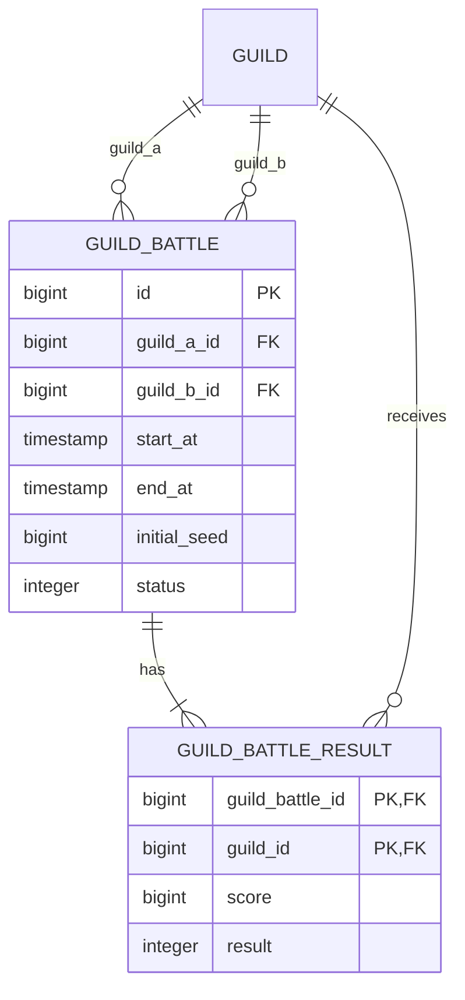

# データベース

PostgreSQLを使用する

## テーブル設計

### 全体共通

```mermaid
erDiagram
    PLAYER {
        bigint id PK
        varchar name
        bigint guild_battle_win_count
        bigint guild_battle_lose_count
    }

    PLAYER_SESSION {
        bigint player_id PK, FK
        bigint session_id UK
        timestamp expires_at
    }

    GUILD {
        bigint id PK
        varchar name
        bigint leader_player_id FK
        bigint subleader_player_id FK
        integer castle_level
        integer armory_level
        integer food_storage_level
        integer smithy_level
        integer strategy_office_level
        integer tavern_level
    }

    GUILD_MEMBER {
        bigint guild_id PK, FK
        bigint player_id PK, FK
    }

    GUILD ||--o{ GUILD_MEMBER : has
    PLAYER ||--o| GUILD_MEMBER : belongs_to
    PLAYER ||--o| PLAYER_SESSION : has

    PLAYER ||--o| GUILD : leader
    PLAYER ||--o| GUILD : subleader
```

```mermaid
erDiagram
    CHARACTER {
        bigint id PK
        varchar title
        varchar name
        smallint rarity
        smallint attribute
        bigint hp
        integer attack
        integer defense
        smallint speed_rank
        smallint bp
    }

    SKILL {
        bigint id PK
        varchar name
        text description
        integer effect_id
        real activation_rate
        real correction_value
    }

    ABILITY {
        bigint id PK
        varchar name
        text description
        integer effect_id
        real activation_rate
        real correction_value
    }

    TACTICS {
        bigint id PK
        varchar name
        text description
        integer category
        integer tp_cost
        integer duration
        integer effect_count
    }

    TACTICS_STAGE_EFFECT {
        bigint id PK
        bigint tactics_id FK
        integer stage
        real effect_value
    }

    TACTICS_CORRECTION {
        bigint id PK
        bigint tactics_id FK
        integer correction_id
        real correction_value
    }

    CHARACTER_SKILL {
        bigint character_id PK, FK
        bigint skill_id PK, FK
        integer slot_no
    }

    CHARACTER_TACTICS {
        bigint character_id PK, FK
        bigint tactics_id PK, FK
        integer slot_no
    }

    CHARACTER_ABILITY {
        bigint character_id PK, FK
        bigint ability_id PK, FK
        integer slot_no
    }

    CHARACTER ||--o{ CHARACTER_SKILL : has
    SKILL ||--o{ CHARACTER_SKILL : assigned

    CHARACTER ||--o{ CHARACTER_TACTICS : has
    TACTICS ||--o{ CHARACTER_TACTICS : assigned

    CHARACTER ||--o{ CHARACTER_ABILITY : has
    ABILITY ||--o{ CHARACTER_ABILITY : assigned

    TACTICS ||--o{ TACTICS_STAGE_EFFECT : has
    TACTICS ||--o{ TACTICS_CORRECTION : has

```

```mermaid
erDiagram
    FORMATION {
        bigint id PK
        varchar name
        text description
    }

    FORMATION_POSITION {
        bigint id PK
        bigint formation_id FK
        integer position_no
        integer condition_id
        real attack_correction
        real defense_correction
        real speed_correction
        real skill_correction
    }

    FORMATION ||--o{ FORMATION_POSITION : has
```

```mermaid
erDiagram
    ITEM {
        bigint id PK
        varchar name
        text description
        integer item_type
        integer effect_id
        real effect_value
    }

    PLAYER_ITEM {
        bigint player_id PK, FK
        bigint item_id PK, FK
        integer quantity
    }

    PLAYER ||--o{ PLAYER_ITEM : owns
    ITEM ||--o{ PLAYER_ITEM : assigned
```

### 騎士団戦専用

```mermaid
erDiagram
    GUILD_BATTLE {
        bigint id PK
        bigint guild_a_id FK
        bigint guild_b_id FK
        timestamp start_at
        timestamp end_at
        bigint initial_seed
        integer status
    }

    GUILD_BATTLE_RESULT {
        bigint guild_battle_id PK, FK
        bigint guild_id PK, FK
        bigint score
        integer result
    }

    GUILD ||--o{ GUILD_BATTLE : guild_a
    GUILD ||--o{ GUILD_BATTLE : guild_b
    GUILD_BATTLE ||--|{ GUILD_BATTLE_RESULT : has
    GUILD ||--o{ GUILD_BATTLE_RESULT : receives
```

## アリーナ
