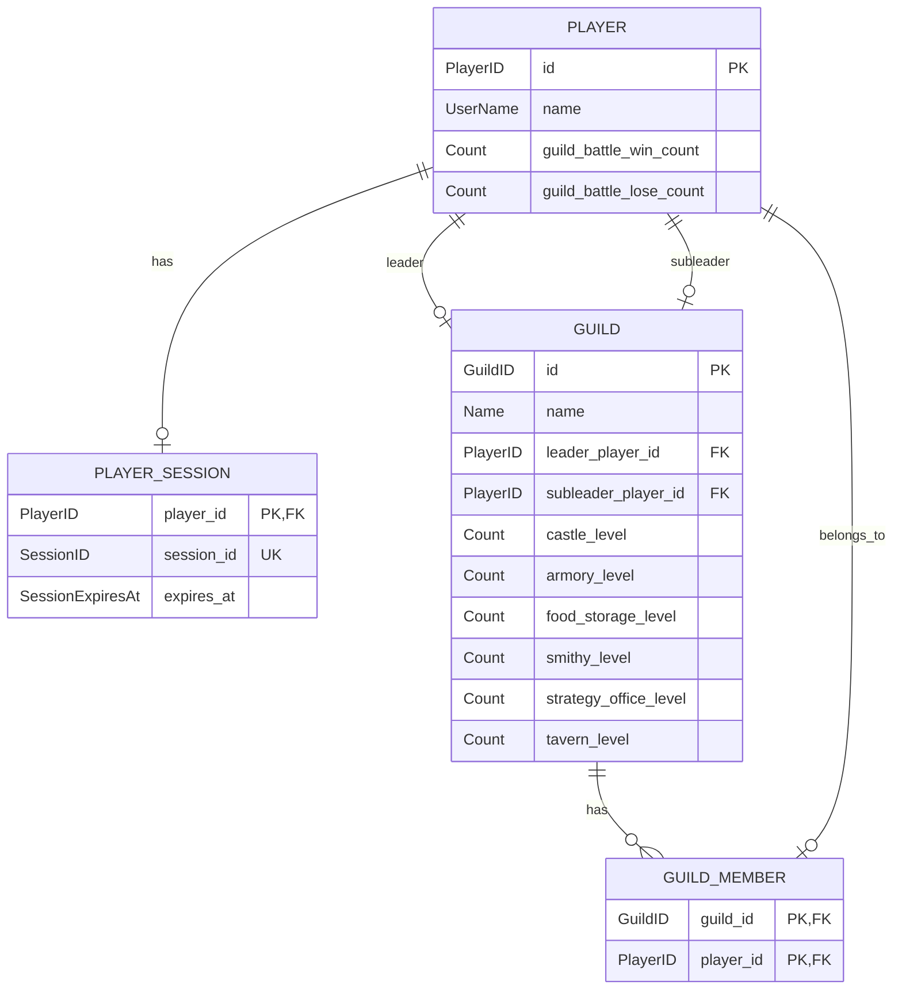
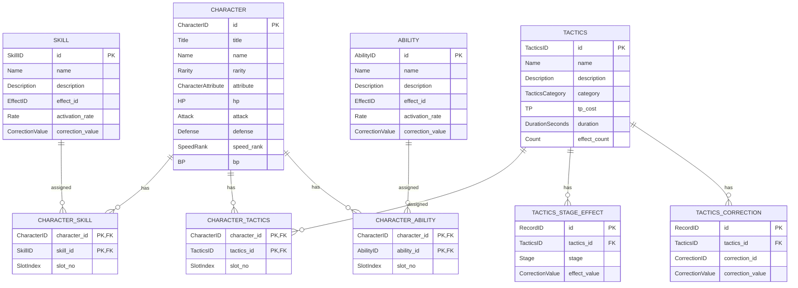
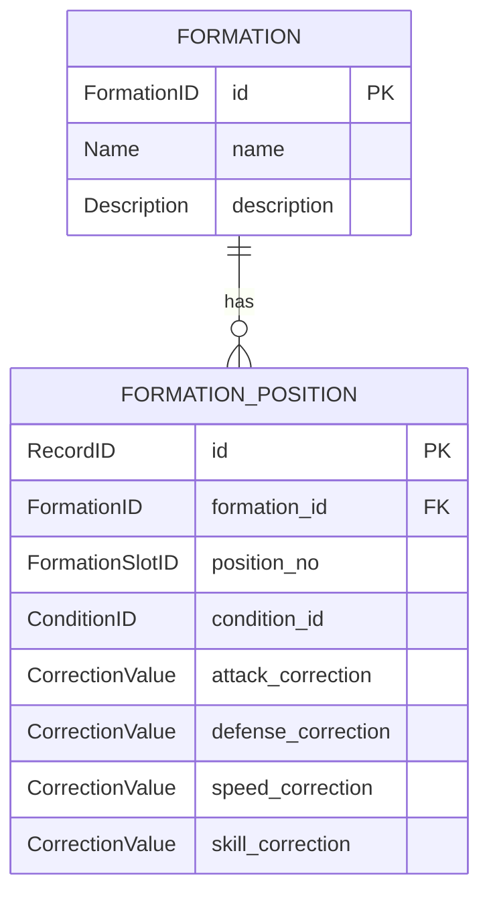
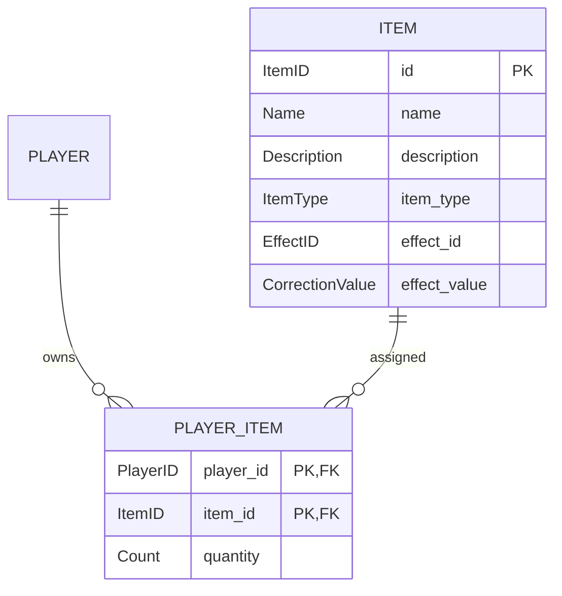
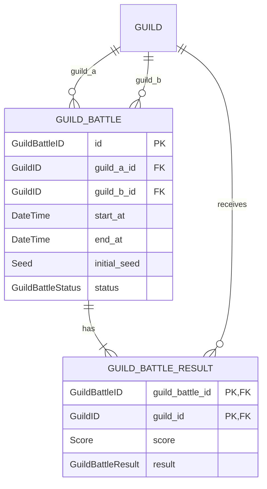

# データベース

PostgreSQLを使用する
各カラムの論理型およびPostgreSQL物理型への対応は「[型定義](types.md)」を参照する

## テーブル設計

### 全体共通

```mermaid
erDiagram
    PLAYER {
        PlayerID id PK
        UserName name
        Count guild_battle_win_count
        Count guild_battle_lose_count
    }

    PLAYER_SESSION {
        PlayerID player_id PK, FK
        SessionID session_id UK
        SessionExpiresAt expires_at
    }

    GUILD {
        GuildID id PK
        Name name
        PlayerID leader_player_id FK
        PlayerID subleader_player_id FK
        Count castle_level
        Count armory_level
        Count food_storage_level
        Count smithy_level
        Count strategy_office_level
        Count tavern_level
    }

    GUILD_MEMBER {
        GuildID guild_id PK, FK
        PlayerID player_id PK, FK
    }

    GUILD ||--o{ GUILD_MEMBER : has
    PLAYER ||--o| GUILD_MEMBER : belongs_to
    PLAYER ||--o| PLAYER_SESSION : has

    PLAYER ||--o| GUILD : leader
    PLAYER ||--o| GUILD : subleader
```

```mermaid
erDiagram
    CHARACTER {
        CharacterID id PK
        Title title
        Name name
        Rarity rarity
        CharacterAttribute attribute
        HP hp
        Attack attack
        Defense defense
        SpeedRank speed_rank
        BP bp
    }

    SKILL {
        SkillID id PK
        Name name
        Description description
        EffectID effect_id
        Rate activation_rate
        CorrectionValue correction_value
    }

    ABILITY {
        AbilityID id PK
        Name name
        Description description
        EffectID effect_id
        Rate activation_rate
        CorrectionValue correction_value
    }

    TACTICS {
        TacticsID id PK
        Name name
        Description description
        TacticsCategory category
        TP tp_cost
        DurationSeconds duration
        Count effect_count
    }

    TACTICS_STAGE_EFFECT {
        RecordID id PK
        TacticsID tactics_id FK
        Stage stage
        CorrectionValue effect_value
    }

    TACTICS_CORRECTION {
        RecordID id PK
        TacticsID tactics_id FK
        CorrectionID correction_id
        CorrectionValue correction_value
    }

    CHARACTER_SKILL {
        CharacterID character_id PK, FK
        SkillID skill_id PK, FK
        SlotIndex slot_no
    }

    CHARACTER_TACTICS {
        CharacterID character_id PK, FK
        TacticsID tactics_id PK, FK
        SlotIndex slot_no
    }

    CHARACTER_ABILITY {
        CharacterID character_id PK, FK
        AbilityID ability_id PK, FK
        SlotIndex slot_no
    }

    CHARACTER ||--o{ CHARACTER_SKILL : has
    SKILL ||--o{ CHARACTER_SKILL : assigned

    CHARACTER ||--o{ CHARACTER_TACTICS : has
    TACTICS ||--o{ CHARACTER_TACTICS : assigned

    CHARACTER ||--o{ CHARACTER_ABILITY : has
    ABILITY ||--o{ CHARACTER_ABILITY : assigned

    TACTICS ||--o{ TACTICS_STAGE_EFFECT : has
    TACTICS ||--o{ TACTICS_CORRECTION : has

```

```mermaid
erDiagram
    FORMATION {
        FormationID id PK
        Name name
        Description description
    }

    FORMATION_POSITION {
        RecordID id PK
        FormationID formation_id FK
        FormationSlotID position_no
        ConditionID condition_id
        CorrectionValue attack_correction
        CorrectionValue defense_correction
        CorrectionValue speed_correction
        CorrectionValue skill_correction
    }

    FORMATION ||--o{ FORMATION_POSITION : has
```

```mermaid
erDiagram
    ITEM {
        ItemID id PK
        Name name
        Description description
        ItemType item_type
        EffectID effect_id
        CorrectionValue effect_value
    }

    PLAYER_ITEM {
        PlayerID player_id PK, FK
        ItemID item_id PK, FK
        Count quantity
    }

    PLAYER ||--o{ PLAYER_ITEM : owns
    ITEM ||--o{ PLAYER_ITEM : assigned
```

### 騎士団戦専用

```mermaid
erDiagram
    GUILD_BATTLE {
        GuildBattleID id PK
        GuildID guild_a_id FK
        GuildID guild_b_id FK
        DateTime start_at
        DateTime end_at
        Seed initial_seed
        GuildBattleStatus status
    }

    GUILD_BATTLE_RESULT {
        GuildBattleID guild_battle_id PK, FK
        GuildID guild_id PK, FK
        Score score
        GuildBattleResult result
    }

    GUILD ||--o{ GUILD_BATTLE : guild_a
    GUILD ||--o{ GUILD_BATTLE : guild_b
    GUILD_BATTLE ||--|{ GUILD_BATTLE_RESULT : has
    GUILD ||--o{ GUILD_BATTLE_RESULT : receives
```

## アリーナ
