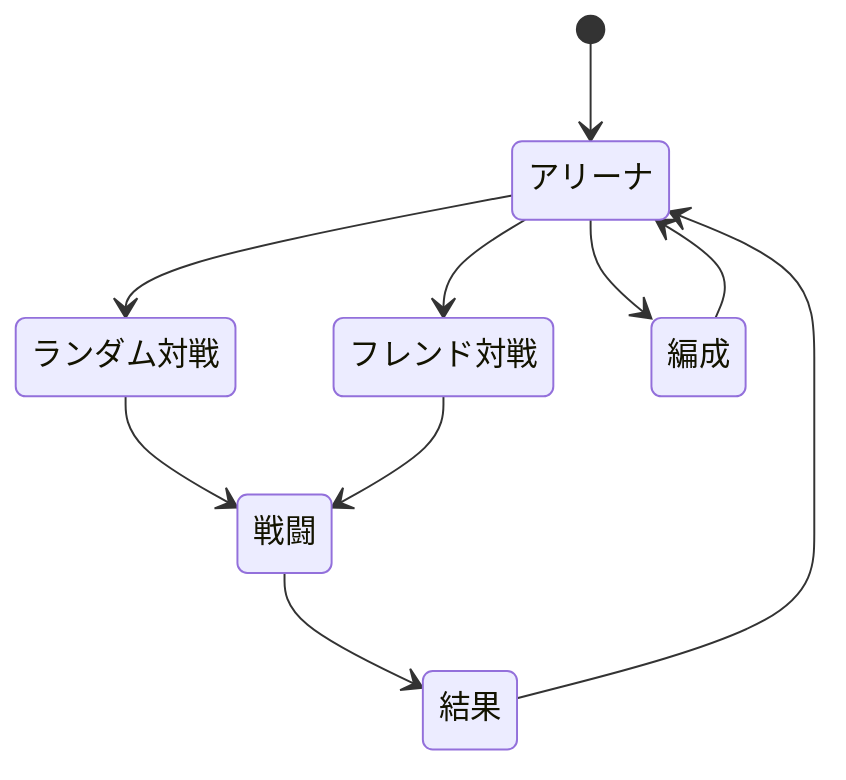
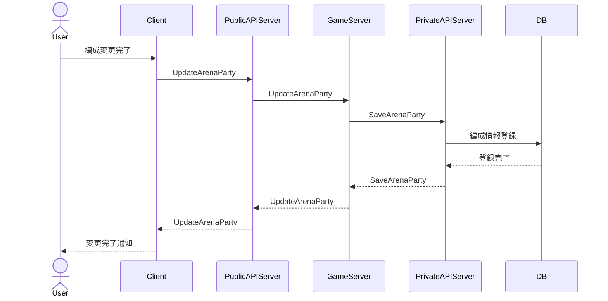
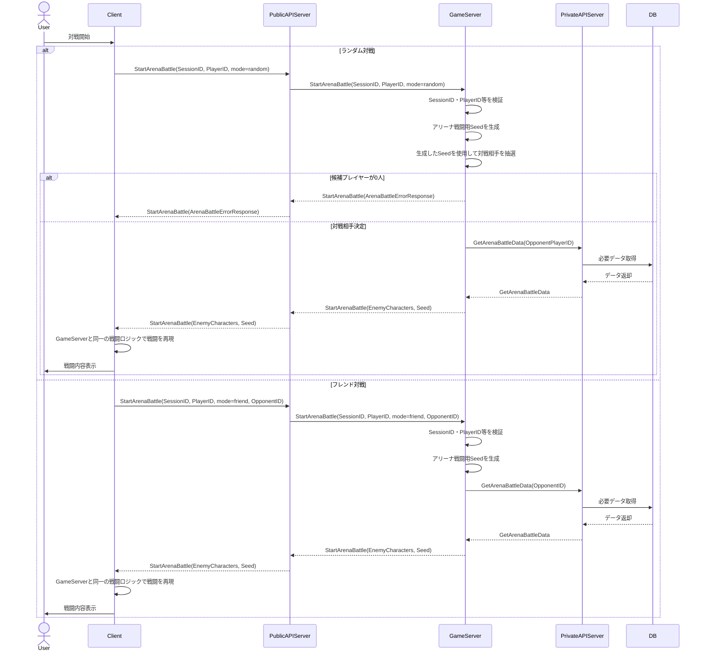

## 戦闘結果の扱い

ClientとGameServerは同一バージョンの戦闘ロジックを保持する. GameServerは戦闘を実行するが、`StartArenaBattle`の成功レスポンスでは戦闘結果そのものを返さず、Clientで同じ戦闘を再現するための相手キャラクター初期状態とSeedを返す.

Clientは自身の初期状態、GameServerから受け取った相手初期状態、Seedを用いて同一の戦闘ロジックを実行する. 同一入力から算出される結果は一致することを前提とし、結果の正本はGameServerの計算結果とする.

## 遷移

## シーケンス

### 編成登録時

### 対戦時

## ランダム対戦候補同期

GameServerはPrivateAPIの`GetAllPlayerIDs`を使用してDatabase上の全PlayerIDを取得し、ランダムアリーナ候補のPlayerIDキャッシュを同期する。抽選時は自身のPlayerIDを候補から除外する。
