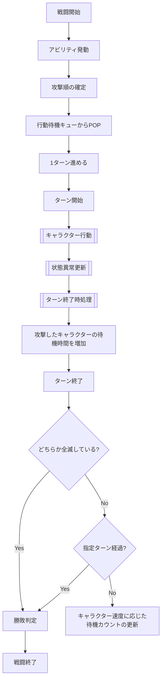

## フロー
### 戦闘

戦闘開始直後は待機カウント更新を行わず, 全キャラクターの待機カウント0の状態から仕様書の初回規則に従って攻撃順を確定する. `UpdateWaitCount`は初回攻撃順確定後のターン進行でのみ使用する.
`状態異常更新`で毒ダメージによりHPが0になった場合は, 戦闘不能時アビリティを発動せず, そのままターン終了時処理へ進む.
同一キャラクターで同一タイミングに複数アビリティの発動条件が成立した場合は, Abilityスロット番号の小さい順に判定・処理する. 複数キャラクターで同一タイミングに成立した場合は, 戦闘計算上の速度が速い順, 同一速度ならフォーメーション内部値が小さい順, 速度・内部値とも同一ならPlayerIDの小さい順で抽選対象リストを作成して疑似乱数の抽選順で処理する.
戦闘開始時に`SkillBattleState.activation_count=0`とし, 各`AbilityBattleState.activation_count=0`, `activated_this_turn=false`で初期化する. ターン開始時にすべての`AbilityBattleState.activated_this_turn`をfalseへ戻す. スキル発動時は`SkillBattleState.activation_count`を1増加し, Ability発動時は対応するAbilityIDの`AbilityBattleState.activation_count`を1増加して`activated_this_turn=true`とする. 最大発動回数判定は各マスターデータの`max_activation_count`と戦闘中状態の`activation_count`を比較して行う.
戦闘フロー内の「回避は発動済み?」「状態異常付与アビリティは発動済み?」「追撃は発動済み?」「反撃は発動済み?」は, 対応するAbilityIDの`AbilityBattleState.activated_this_turn`を参照する. 発動済み状態はAbilityEffectID単位では共有しない.
通常の行動順決定で敵味方の速度・フォーメーション内部値が同一となる場合も, PlayerIDの小さい順で抽選対象リストを作成する.
戦闘中キャラクターは`BuffDebuffState`, `BuffDebuffEffectState`, `StatusAbnormalityState[]`を保持する. スキル・アビリティによるバフ・デバフ付与時は`BuffDebuffEffectState`の実値を更新し, その有無から`BuffDebuffState`を更新する. 状態異常付与・更新時は`StatusAbnormalityState[]`を更新する. フォーメーションおよびタクティクス補正はこれらのバフ・デバフ状態へ影響しない.
暗闇状態の攻撃成功判定に失敗した場合は, `追撃は発動済み?`の判定を行わず, 直接`追撃率 > 乱数?`へ進む. この分岐は仕様上の意図した処理とする.

### TacticsBattleSpecialType適用

騎士団戦の戦闘開始・行動・被弾・敵全滅処理では, 有効な`TACTICS_EFFECT_BATTLE_SPECIAL`を確認し, `special_type`ごとに「[タクティクス仕様](../specification/tactics.md#特殊効果系列)」の効果を適用する. 攻撃・防御・速度・スキル発動率・最大TP等の数値効果は`TacticsBattleSpecialParameters`の対応フィールドを使用する. 強襲無効, 最初の通常攻撃ダメージ0, 回避発動は`special_type`固有挙動として処理する.

### ダメージ乱数の消費規則

ダメージ乱数は各対象・各HITごとに個別取得する. 1回の行動で複数対象へ命中する場合も対象ごとに取得し, 複数HITの場合も各HITごとに取得する.

### キャラクター行動

```mermaid
flowchart TD;
    Start[行動開始];
    End[行動終了];
    Start --> CheckSkillCount

    CheckEmptyList{攻撃対象リストが空?};
    GetAttackRange[攻撃対象リストの取得];
    PopAttackRange[攻撃対象リストからPOP];

    CalculateEnemyHP[[相手HP処理]];
    CalculateFriendHP[[味方HP処理]];
    CalculateEnemyHP2[[相手HP処理]];

    Attack[攻撃];

    CheckSkillCount{SkillBattleState.activation_count < 最大発動回数?};
    CheckSilent{沈黙状態?};
    CheckSkill{スキル発動率 > 乱数?};
    ActivateSkill[[スキル発動]];

    CheckSkillCount -- Yes --> CheckSilent;
    CheckSkillCount -- No --> GetAttackRange;
    CheckSilent -- Yes --> GetAttackRange;
    CheckSilent -- No --> CheckSkill;
    CheckSkill -- Yes --> ActivateSkill;
    CheckSkill -- No --> GetAttackRange;
    
    ActivateSkill --> End

    GetAttackRange --> CheckEmptyList
    CheckEmptyList -- Yes --> CheckAttackerHP;
    CheckEmptyList -- No --> PopAttackRange;

    CheckActivatedAvoidance{回避は発動済み?};
    CheckAvoidance{回避率 > 乱数?};
    CheckAvoidanceDisable{回避無効化率 > 乱数?};
    AvoidanceAbility[回避アビリティ発動];

    PopAttackRange --> CheckActivatedAvoidance
    CheckActivatedAvoidance -- Yes --> CheckBlindness;
    CheckActivatedAvoidance -- No --> CheckAvoidance;
    CheckAvoidance -- Yes --> CheckAvoidanceDisable;
    CheckAvoidance -- No --> CheckBlindness;
    CheckAvoidanceDisable -- Yes --> CheckBlindness;
    CheckAvoidanceDisable -- No --> AvoidanceAbility;
    AvoidanceAbility --> CheckActivatedCounter

    CheckBlindness{暗闇状態?};
    CheckBlindnessAttack{攻撃成功?};

    CheckBlindness -- Yes --> CheckBlindnessAttack;
    CheckBlindness -- No --> CheckActivatedStatusAbnormality;
    CheckBlindnessAttack -- Yes --> CheckActivatedStatusAbnormality;
    CheckBlindnessAttack -- No --> CheckPursuit;

    CheckActivatedStatusAbnormality{状態異常付与アビリティは発動済み?};
    CheckStatusAbnormalityAvoidance{状態異常回避 > 乱数?};
    CheckStatusAbnormality{状態異常付与率 > 乱数?};
    AddStatusAbnormality[状態異常付与]; 

    CheckActivatedStatusAbnormality -- Yes --> Attack;
    CheckActivatedStatusAbnormality -- No --> CheckStatusAbnormalityAvoidance;
    CheckStatusAbnormalityAvoidance -- Yes --> Attack;
    CheckStatusAbnormalityAvoidance -- No --> CheckStatusAbnormality;
    CheckStatusAbnormality -- Yes --> AddStatusAbnormality;
    CheckStatusAbnormality -- No --> Attack;

    AddStatusAbnormality --> Attack;
    Attack --> CalculateEnemyHP --> CheckActivatedPursuit;

    CheckActivatedPursuit{追撃は発動済み?};
    CheckPursuit{追撃率 > 乱数?};
    Pursuit[追撃アビリティ発動]; 
    CheckActivatedPursuit -- Yes --> CheckActivatedCounter;
    CheckActivatedPursuit -- No --> CheckPursuit;
    CheckPursuit -- Yes --> Pursuit;
    CheckPursuit -- No --> CheckActivatedCounter;
    Pursuit --> CalculateEnemyHP2

    CheckActivatedCounter{反撃は発動済み?};
    CounterAbility[反撃アビリティ発動];
    CheckCounter{反撃率 > 乱数?};
    CheckCounterDisable{反撃無効化率 > 乱数?};

    CheckActivatedCounter -- Yes --> CalculateEnemyHP2;
    CheckActivatedCounter -- No --> CheckCounter;
    CheckCounter -- Yes --> CheckCounterDisable;
    CheckCounter -- No --> CalculateEnemyHP2;
    CheckCounterDisable -- Yes --> CalculateEnemyHP2;
    CheckCounterDisable -- No --> CounterAbility;

    CheckEmptyHP{相手のHP > 0?};
    KilledAbility[HP0時のアビリティ発動];
    CounterAbility --> CalculateFriendHP
    CalculateEnemyHP2 --> CheckEmptyHP
    CalculateFriendHP --> CalculateEnemyHP2
    CheckEmptyHP -- Yes --> CheckEmptyList
    CheckEmptyHP -- No --> KilledAbility
    KilledAbility --> CheckEmptyList

    CheckAttackerHP{攻撃者のHP > 0?};
    KilledAttackerAbility[HP0時のアビリティ発動];
    CheckAttackerHP -- Yes --> End
    CheckAttackerHP -- No --> KilledAttackerAbility
    KilledAttackerAbility --> End
```

戦闘フロー内の回避率, 状態異常回避率, 回避無効化率, 状態異常付与率, 追撃率, 反撃率, 反撃無効化率は, 対応するアビリティの`AbilityMasterData.activation_rate`を使用する.

状態異常回避判定は, 付与しようとしている`StatusAbnormalityID`と一致する`ABILITY_EFFECT_AVOIDANCE`だけを対象とし, 当該Abilityの`activation_rate`で判定する.
