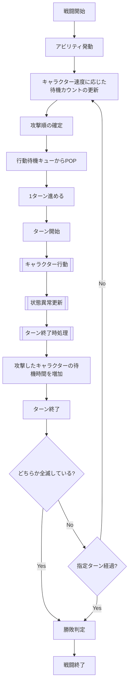

## フロー
### 戦闘

`状態異常更新`で毒ダメージによりHPが0になった場合は, 戦闘不能時アビリティを発動せず, そのままターン終了時処理へ進む.
同一キャラクターで同一タイミングに複数アビリティの発動条件が成立した場合は, Abilityスロット番号の小さい順に判定・処理する. 複数キャラクターで同一タイミングに成立した場合は, 戦闘計算上の速度が速い順, 同一速度ならフォーメーション内部値が小さい順, 速度・内部値とも同一ならPlayerIDの小さい順で抽選対象リストを作成して疑似乱数の抽選順で処理する.
通常の行動順決定で敵味方の速度・フォーメーション内部値が同一となる場合も, PlayerIDの小さい順で抽選対象リストを作成する.
戦闘中キャラクターは`BuffDebuffState`を保持し, スキル・アビリティによるバフ・デバフ付与状態に応じて更新する. フォーメーションおよびタクティクス補正はこの状態へ影響しない.
暗闇状態の攻撃成功判定に失敗した場合は, `追撃は発動済み?`の判定を行わず, 直接`追撃率 > 乱数?`へ進む. この分岐は仕様上の意図した処理とする.

### ダメージ乱数の消費規則

ダメージ乱数は各対象・各HITごとに個別取得する. 1回の行動で複数対象へ命中する場合も対象ごとに取得し, 複数HITの場合も各HITごとに取得する.

### キャラクター行動

```mermaid
flowchart TD;
    Start[行動開始];
    End[行動終了];
    Start --> CheckSkillCount

    CheckEmptyList{攻撃対象リストが空?};
    GetAttackRange[攻撃対象リストの取得];
    PopAttackRange[攻撃対象リストからPOP];

    CalculateEnemyHP[[相手HP処理]];
    CalculateFriendHP[[味方HP処理]];
    CalculateEnemyHP2[[相手HP処理]];

    Attack[攻撃];

    CheckSkillCount{スキル発動可能回数 > 0?};
    CheckSilent{沈黙状態?};
    CheckSkill{スキル発動率 > 乱数?};
    ActivateSkill[[スキル発動]];

    CheckSkillCount -- Yes --> CheckSilent;
    CheckSkillCount -- No --> GetAttackRange;
    CheckSilent -- Yes --> GetAttackRange;
    CheckSilent -- No --> CheckSkill;
    CheckSkill -- Yes --> ActivateSkill;
    CheckSkill -- No --> GetAttackRange;
    
    ActivateSkill --> End

    GetAttackRange --> CheckEmptyList
    CheckEmptyList -- Yes --> CheckAttackerHP;
    CheckEmptyList -- No --> PopAttackRange;

    CheckActivatedAvoidance{回避は発動済み?};
    CheckAvoidance{回避率 > 乱数?};
    CheckAvoidanceDisable{回避無効化率 > 乱数?};
    AvoidanceAbility[回避アビリティ発動];

    PopAttackRange --> CheckActivatedAvoidance
    CheckActivatedAvoidance -- Yes --> CheckBlindness;
    CheckActivatedAvoidance -- No --> CheckAvoidance;
    CheckAvoidance -- Yes --> CheckAvoidanceDisable;
    CheckAvoidance -- No --> CheckBlindness;
    CheckAvoidanceDisable -- Yes --> CheckBlindness;
    CheckAvoidanceDisable -- No --> AvoidanceAbility;
    AvoidanceAbility --> CheckActivatedCounter

    CheckBlindness{暗闇状態?};
    CheckBlindnessAttack{攻撃成功?};

    CheckBlindness -- Yes --> CheckBlindnessAttack;
    CheckBlindness -- No --> CheckActivatedStatusAbnormality;
    CheckBlindnessAttack -- Yes --> CheckActivatedStatusAbnormality;
    CheckBlindnessAttack -- No --> CheckPursuit;

    CheckActivatedStatusAbnormality{状態異常付与アビリティは発動済み?};
    CheckStatusAbnormality{状態異常付与率 > 乱数?};
    AddStatusAbnormality[状態異常付与]; 

    CheckActivatedStatusAbnormality -- Yes --> Attack;
    CheckActivatedStatusAbnormality -- No --> CheckStatusAbnormality;
    CheckStatusAbnormality -- Yes --> AddStatusAbnormality;
    CheckStatusAbnormality -- No --> Attack;

    AddStatusAbnormality --> Attack;
    Attack --> CalculateEnemyHP --> CheckActivatedPursuit;

    CheckActivatedPursuit{追撃は発動済み?};
    CheckPursuit{追撃率 > 乱数?};
    Pursuit[追撃アビリティ発動]; 
    CheckActivatedPursuit -- Yes --> CheckActivatedCounter;
    CheckActivatedPursuit -- No --> CheckPursuit;
    CheckPursuit -- Yes --> Pursuit;
    CheckPursuit -- No --> CheckActivatedCounter;
    Pursuit --> CalculateEnemyHP2

    CheckActivatedCounter{反撃は発動済み?};
    CounterAbility[反撃アビリティ発動];
    CheckCounter{反撃率 > 乱数?};
    CheckCounterDisable{反撃無効化率 > 乱数?};

    CheckActivatedCounter -- Yes --> CalculateEnemyHP2;
    CheckActivatedCounter -- No --> CheckCounter;
    CheckCounter -- Yes --> CheckCounterDisable;
    CheckCounter -- No --> CalculateEnemyHP2;
    CheckCounterDisable -- Yes --> CalculateEnemyHP2;
    CheckCounterDisable -- No --> CounterAbility;

    CheckEmptyHP{相手のHP > 0?};
    KilledAbility[HP0時のアビリティ発動];
    CounterAbility --> CalculateFriendHP
    CalculateEnemyHP2 --> CheckEmptyHP
    CalculateFriendHP --> CalculateEnemyHP2
    CheckEmptyHP -- Yes --> CheckEmptyList
    CheckEmptyHP -- No --> KilledAbility
    KilledAbility --> CheckEmptyList

    CheckAttackerHP{攻撃者のHP > 0?};
    KilledAttackerAbility[HP0時のアビリティ発動];
    CheckAttackerHP -- Yes --> End
    CheckAttackerHP -- No --> KilledAttackerAbility
    KilledAttackerAbility --> End
```

