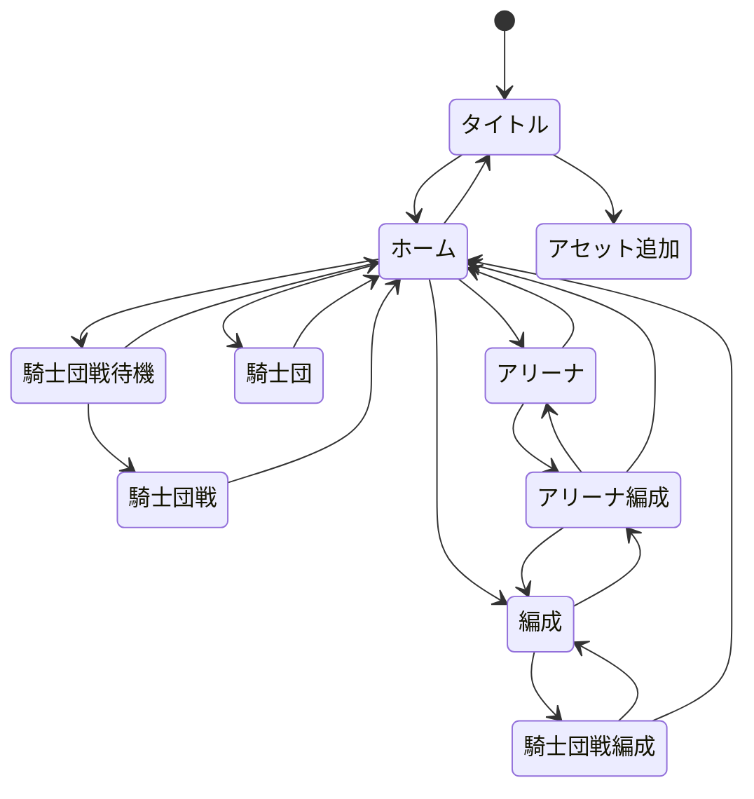

# シーン

## 遷移

## UI

### 初期Clientプロトタイプ限定

* 初期プロトタイプではServerとの通信を行わず、タイトル画面と仮ホーム画面の表示・画面遷移を検証する。完成版のScene遷移とServer非接続時の操作制限は変更しない。
* タイトル画面には試験用PNG`proto_type_title.png`を表示し、タイトルからの遷移先である仮ホーム画面には試験用PNG`proto_type_home.png`を表示する。画像の内容は任意の試験用とし、正式なゲーム画面資料とは扱わない。
* 複数のテスト用ボタンを配置し、タッチ・マウスによる入力反応を確認する。個数・ラベル・配置および操作時の具体的な表示変更は未指定とする。
* プロトタイプ用の画面遷移とボタン操作はプロトタイプ専用ビルドでのみ使用する。

### タイトル

* キャッシュクリアボタンを配置する.
* 「アセットの追加」ボタンを配置し, 押下時に専用の「アセット追加」シーンへ遷移する.
* キャッシュクリアはOPFSの`cache`フォルダ内のファイルのみを削除対象とする.
* ログイン不可またはServer未接続ではホーム画面への移動以外の操作は不可とする.

### アセット追加

* アセット追加シーンからの戻り先・戻り操作は未定義とする.

* ユーザーがPNG画像およびHCA音声を選択し, Clientへ取り込めるシーンとする. コピーまたは移動の操作を想定するが, 元ファイルの削除を伴う移動および端末別のファイル/フォルダ選択方法は未確定とする.
* 取り込んだファイルと割当情報はOPFSに保持し, Server配布のファイル名SHA-256ハッシュ対応辞書に従いキャラクター画像を自動配置する. 同名ファイルはファイル内容のSHA-256で配置先を判別する. アセットの自動削除は行わない.
* PNGの表示には`createImageBitmap()`を使用する. 詳細は「[クライアント仕様](client.md)」を参照する.

### ホーム

### 騎士団戦

### 騎士団戦編成

## 参照資料

* `design/client/client.md`.
* 添付`rust_wasm_png_hca_library_selection(1).md`（2026-10-09）, 第1～4節.

* 2026-10-09のユーザー確定事項（アセット追加専用シーン, オフライン制限）.
