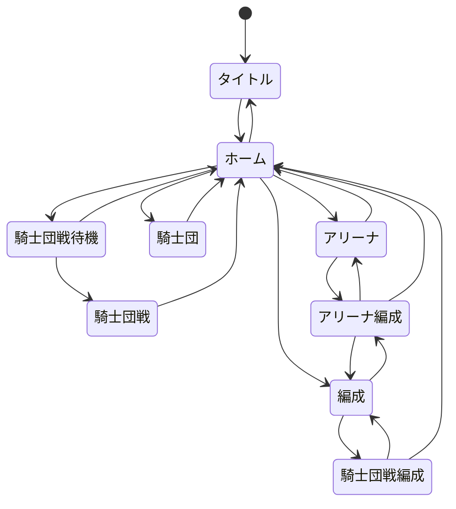

# シーン

## 遷移

```mermaid
stateDiagram-v2
    [*] --> タイトル
    タイトル --> ホーム
    ホーム --> タイトル
    ホーム --> 騎士団戦待機
    ホーム --> 騎士団
    ホーム --> アリーナ
    ホーム --> 編成

    アリーナ --> ホーム
    騎士団 --> ホーム
    騎士団戦 --> ホーム

    騎士団戦待機  --> 騎士団戦
    騎士団戦待機 --> ホーム

    編成 --> 騎士団戦編成
    騎士団戦編成 --> 編成
    騎士団戦編成 --> ホーム

    編成 --> アリーナ編成
    アリーナ編成 --> 編成
    アリーナ編成 --> アリーナ
    アリーナ編成 --> ホーム
    アリーナ --> アリーナ編成
```

## UI

### タイトル

### ホーム

-

### 騎士団戦

### 騎士団戦編成

