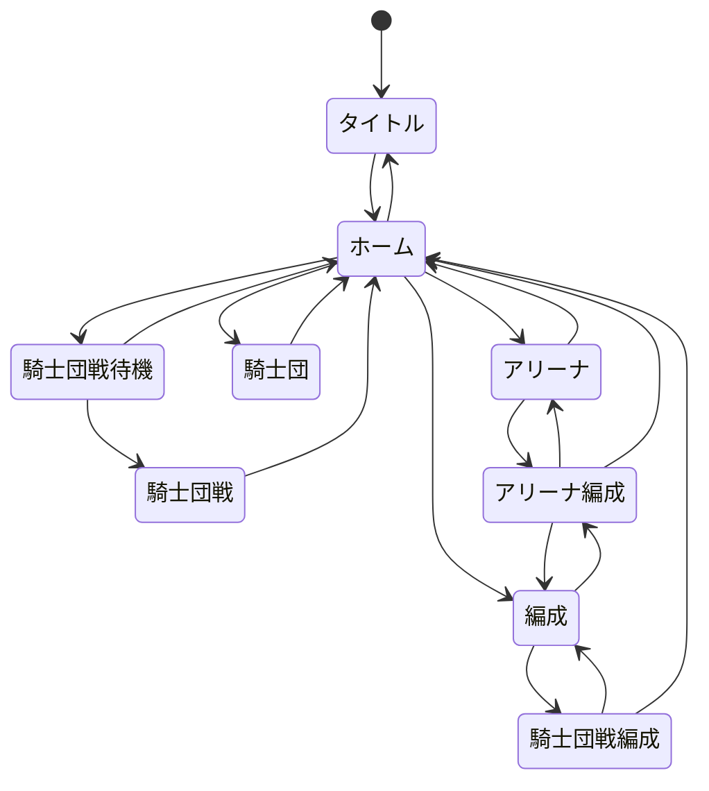

# シーン

## 遷移

## UI

### タイトル

* キャッシュクリアボタンを配置する.
* アセット追加ボタンを配置する. このボタンからプレイヤーが画像を選び, ゲーム内のキャラクターへ割り当てられる.
* アセット追加では, ユーザーが選択したフォルダ内のPNGアセット等をOPFSへコピーして取り込む. PNGはブラウザの`createImageBitmap()`によるデコードを使用する. 詳細は「[クライアント仕様](client.md)」を参照する.
* フォルダ選択UIの端末別実現方法, キャラクターへの割当操作とその永続化, アセット追加操作を独立したシーンで扱うかどうかは未定義とする. このため, 上記遷移図へ新しいシーンを追加しない.

### ホーム

### 騎士団戦

### 騎士団戦編成

## 情報源

* `design/client/client.md`.
* 添付`rust_wasm_png_hca_library_selection(1).md`（2026-10-09）, 第1～4節.
