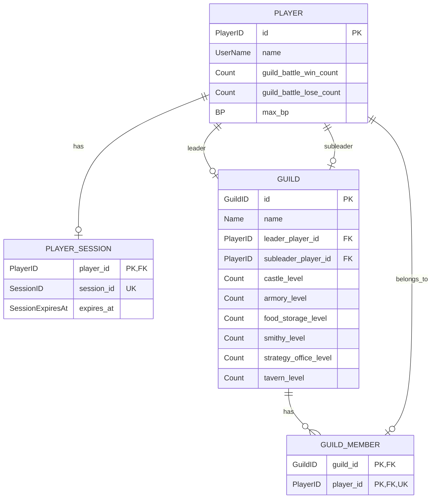
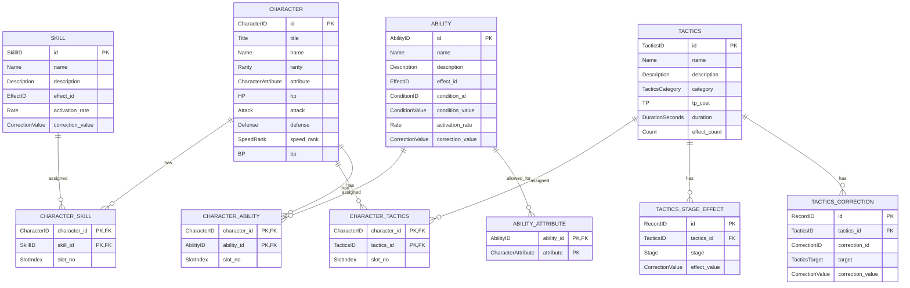
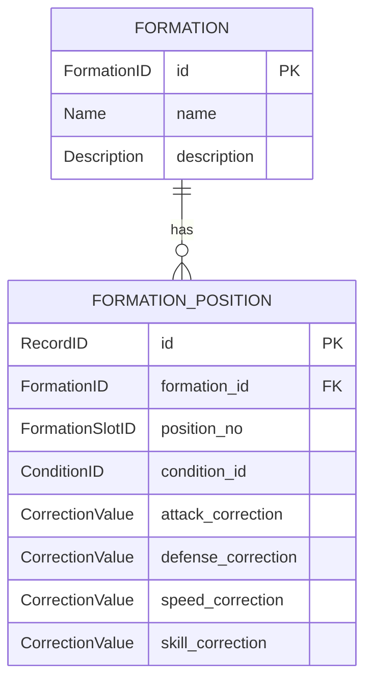
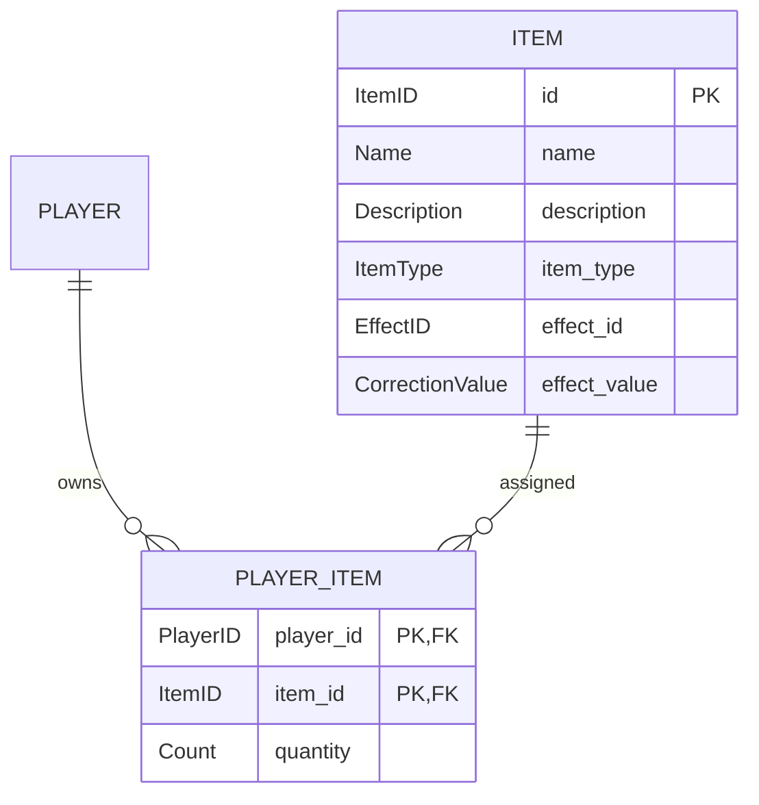
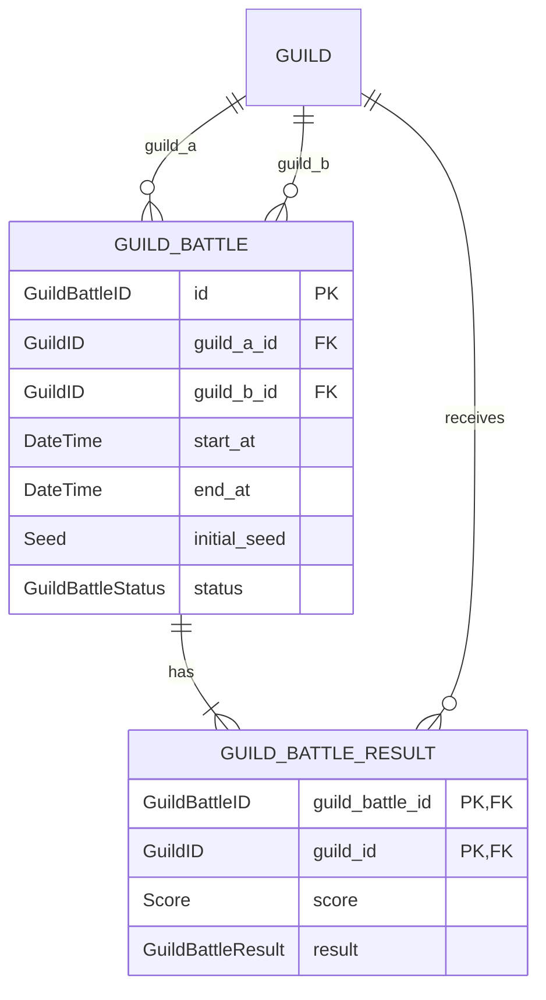
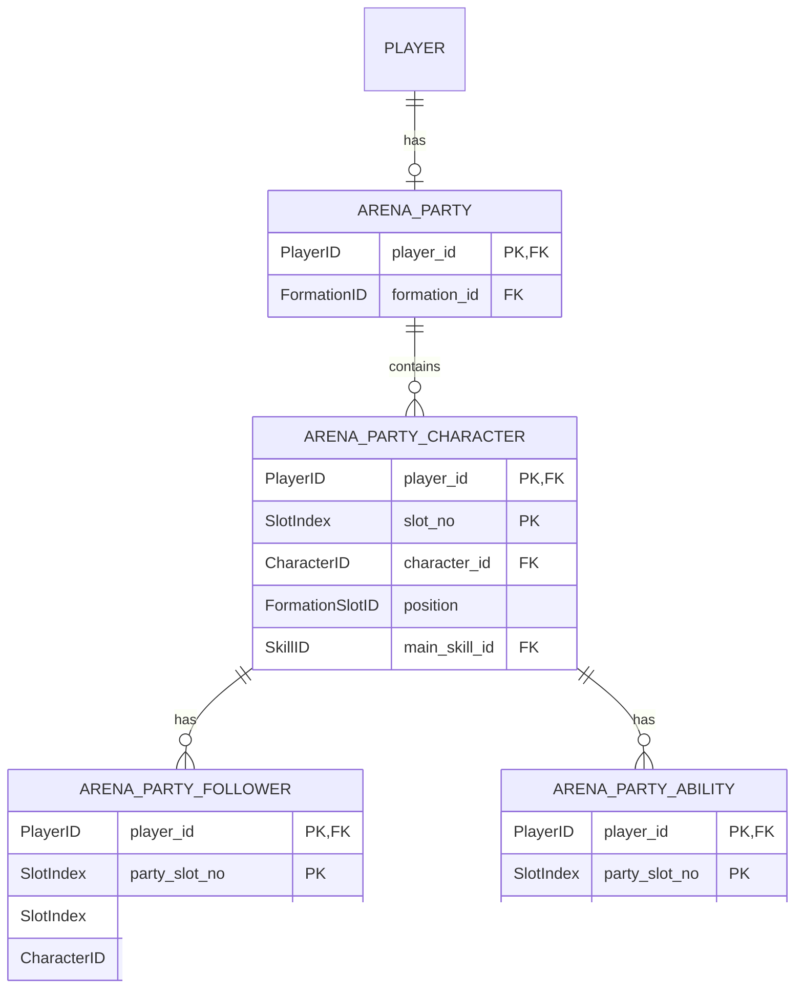
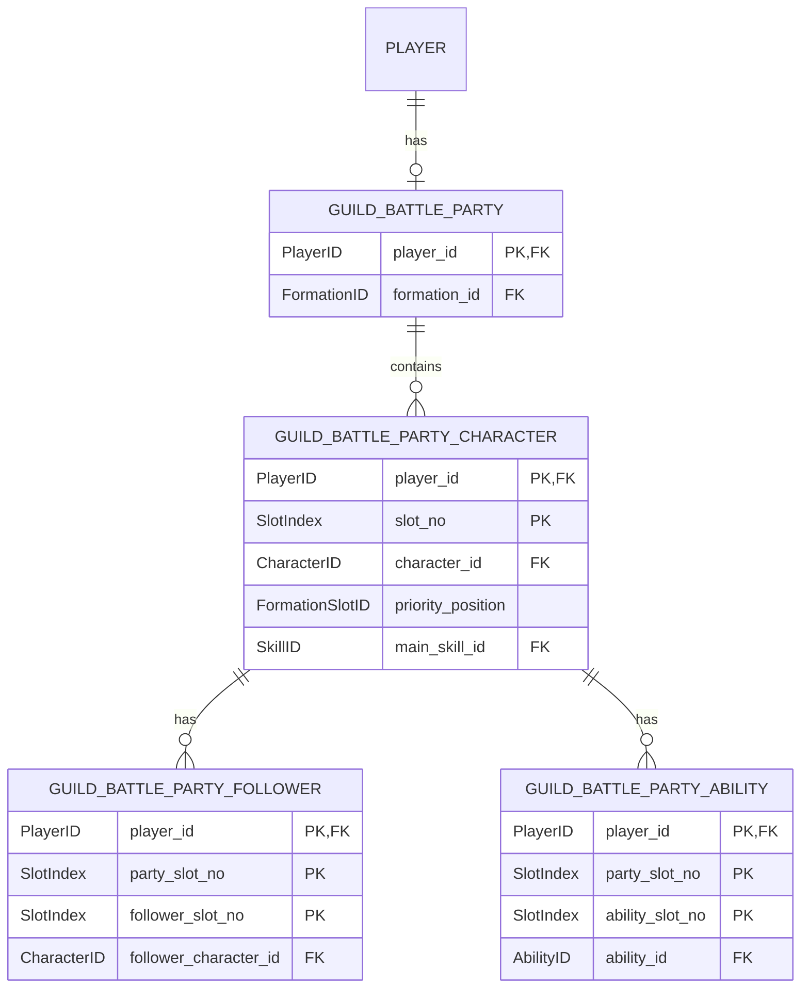
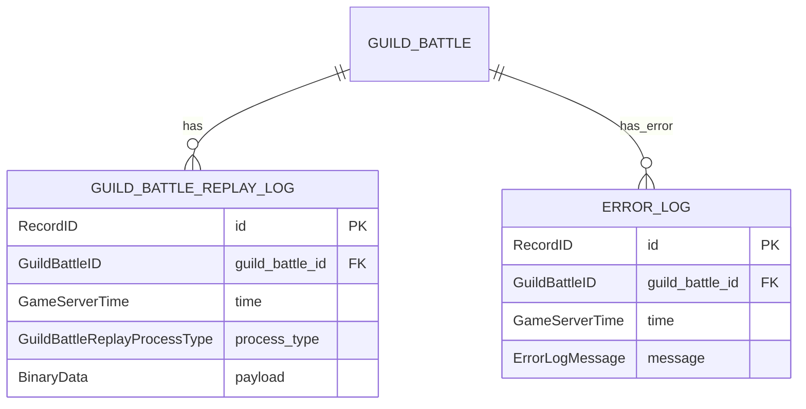

# データベース

PostgreSQLを使用する
各カラムの論理型およびPostgreSQL物理型への対応は「[型定義](types.md)」を参照する

## テーブル設計

### 全体共通

`InvalidateSession`実行時は対象`SessionID`の`PLAYER_SESSION`レコードを削除する.

## GUILD / GUILD_MEMBER 制約

* プレイヤーの初期騎士団は`GUILD.id = PLAYER.id`となるように作成する.
* 初期騎士団作成時は`castle_level`、`armory_level`、`food_storage_level`、`smithy_level`、`strategy_office_level`、`tavern_level`をすべて1で保存する.
* 初期騎士団は、その所有プレイヤーが別の騎士団へ所属している間も`GUILD`レコードを削除しない.
* 初期騎士団の`leader_player_id`は所有プレイヤーを保持する.
* 初期騎士団については、所有プレイヤーが別の騎士団へ所属している間に限り`GUILD_MEMBER`が0件となる状態を許可する.
* `player_id`には一意制約を設定し、1つのPlayerIDが同時に複数騎士団へ所属できないようにする.
* 所属変更時は、対象PlayerIDの既存`GUILD_MEMBER`行を削除してから新しいGuildIDの行を挿入する処理を同一トランザクションで行う.
* `LeaveGuild`では新しい`GUILD`レコードを作成せず、`guild_id = player_id`の既存初期騎士団へ`GUILD_MEMBER`を戻す.

`SaveSessionID`は`player_id`を競合キーとしてUPSERTする。既存レコードが存在する場合は`session_id`と`expires_at`を更新し、存在しない場合はINSERTする。`session_id`のUNIQUE制約に衝突した場合は保存失敗としてGameServerへ返し、GameServerはSessionIDを再生成する.

`SKILL.activation_rate`は基本スキル発動率`0.2`へ加算する値とする。
`SKILL.effect_id`および`ABILITY.effect_id`は個別処理IDではなく「[型定義](types.md)」の`EffectID`で定義する効果分類とする。
同一`CorrectionID`系列の補正値はすべて加算する。

### 騎士団戦専用

## アリーナ

`SaveArenaParty`は対象PlayerIDのアリーナ編成を上記テーブルへ保存する。既存編成がある場合は同一PlayerIDの編成を置換する。

## 騎士団戦編成

`SaveGuildBattleParty`は対象PlayerIDの騎士団戦編成を上記テーブルへ保存する。既存編成がある場合は同一PlayerIDの編成を置換する。

## ログ

`GUILD_BATTLE_REPLAY_LOG.payload`には、リプレイログファイルへ書き込むものと同じ処理種別対応構造体のバイナリデータを保存する。
