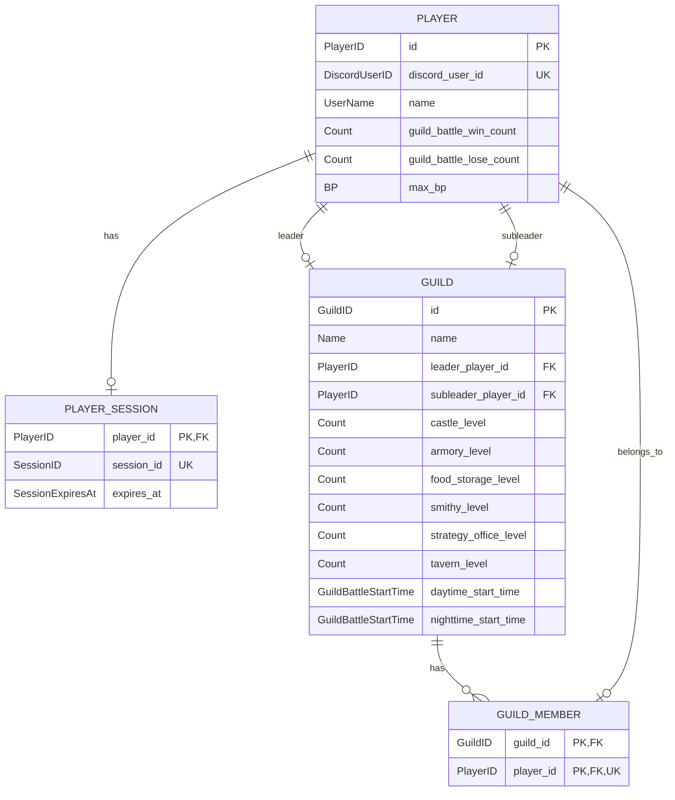
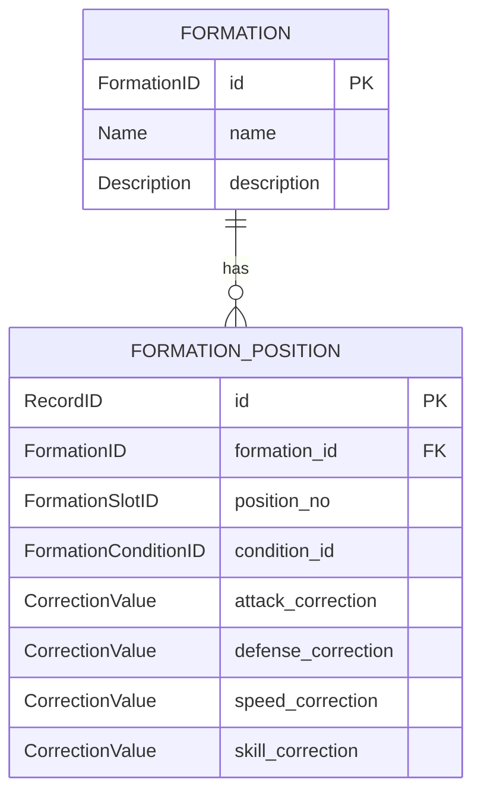
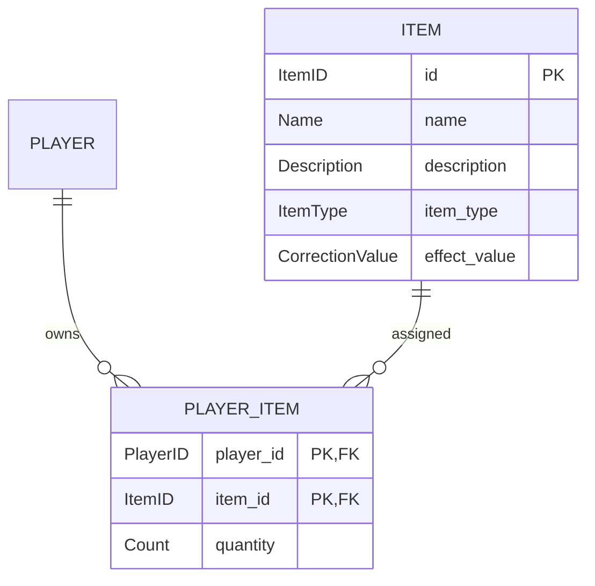
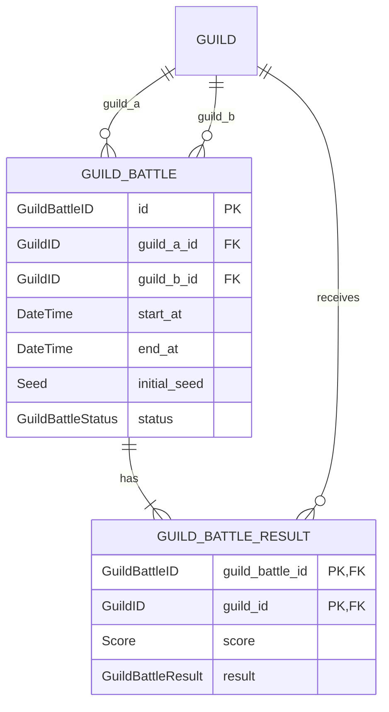
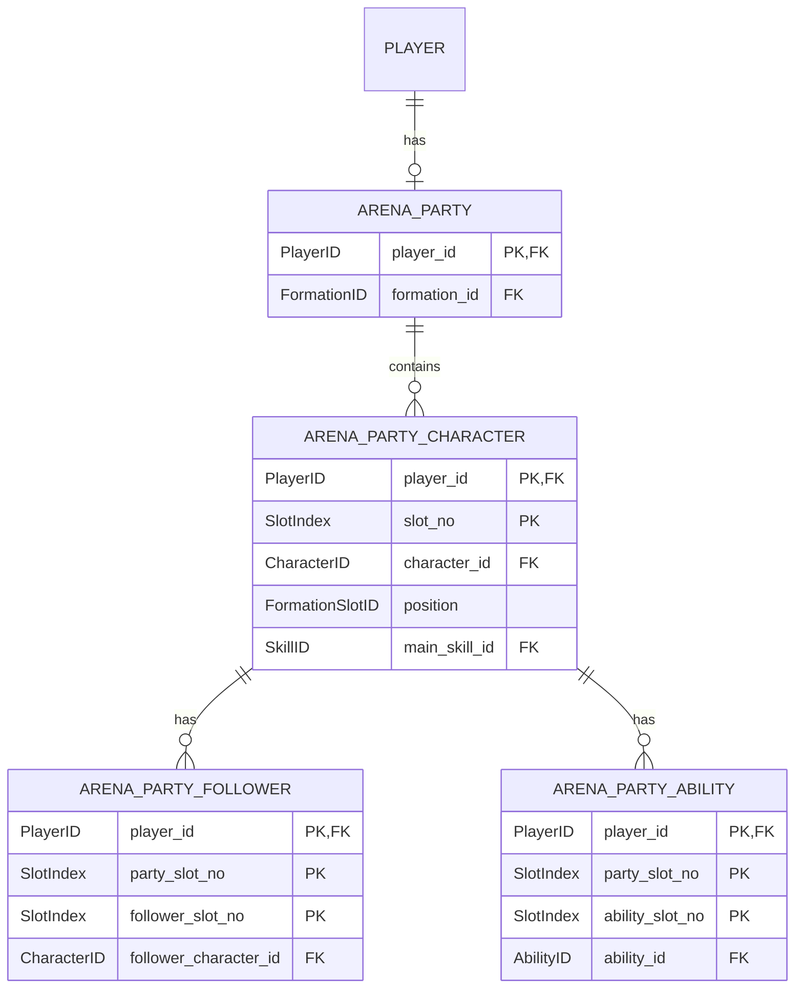
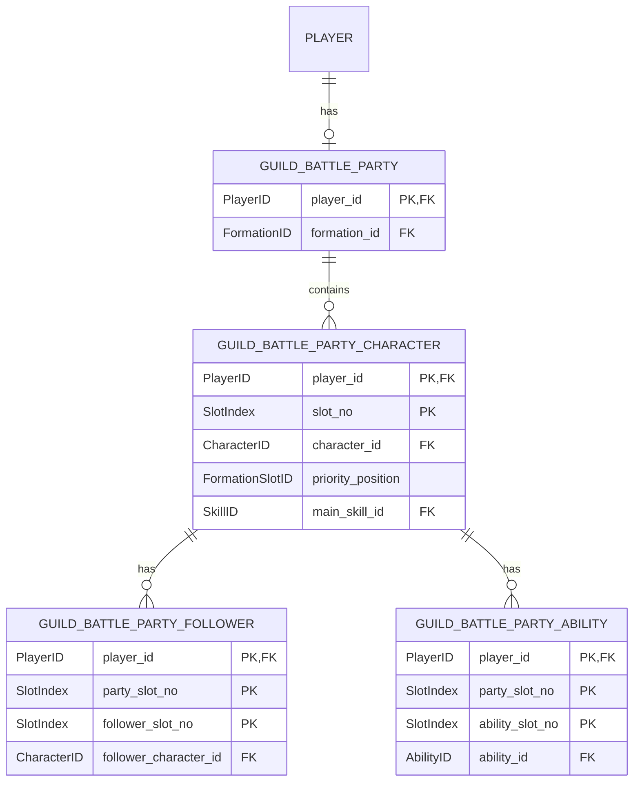

# データベース

PostgreSQLを使用する
各カラムの論理型およびPostgreSQL物理型への対応は「[型定義](types.md)」を参照する

## テーブル設計

### 全体共通

`InvalidateSession`実行時は対象`SessionID`の`PLAYER_SESSION`レコードを削除する.

`PLAYER.guild_battle_win_count`と`PLAYER.guild_battle_lose_count`の初期値はともに`0`とする.

## GUILD / GUILD_MEMBER 制約

* プレイヤーの初期騎士団は`GUILD.id = PLAYER.id`となるように作成する.
* 初期騎士団作成時は`castle_level`、`armory_level`、`food_storage_level`、`smithy_level`、`strategy_office_level`、`tavern_level`をすべて1で保存する.
* 初期騎士団は、その所有プレイヤーが別の騎士団へ所属している間も`GUILD`レコードを削除しない.
* 初期騎士団の`leader_player_id`は所有プレイヤーを保持する.
* 初期騎士団については、所有プレイヤーが別の騎士団へ所属している間に限り`GUILD_MEMBER`が0件となる状態を許可する.
* `player_id`には一意制約を設定し、1つのPlayerIDが同時に複数騎士団へ所属できないようにする.
* 所属変更時は、対象PlayerIDの既存`GUILD_MEMBER`行を削除してから新しいGuildIDの行を挿入する処理を同一トランザクションで行う.
* `LeaveGuild`では新しい`GUILD`レコードを作成せず、`guild_id = player_id`の既存初期騎士団へ`GUILD_MEMBER`を戻す.
* `GUILD.daytime_start_time`は`GUILD_BATTLE_START_1130`、`GUILD_BATTLE_START_1215`、`GUILD_BATTLE_START_1300`のいずれか1つとする.
* `GUILD.nighttime_start_time`は`GUILD_BATTLE_START_2100`、`GUILD_BATTLE_START_2200`、`GUILD_BATTLE_START_2300`のいずれか1つとする.

`SaveSessionID`は`player_id`を競合キーとしてUPSERTする。既存レコードが存在する場合は`session_id`と`expires_at`を更新し、存在しない場合はINSERTする。`session_id`のUNIQUE制約に衝突した場合は保存失敗としてGameServerへ返し、GameServerはSessionIDを再生成する.

```mermaid
erDiagram
    CHARACTER {
        CharacterID id PK
        Title title
        Name name
        Rarity rarity
        CharacterAttribute attribute
        HP hp
        Attack attack
        Defense defense
        SpeedRank speed_rank
        BP bp
    }

    SKILL {
        SkillID id PK
        Name name
        Description description
        SkillEffectID effect_id
        Rate activation_rate
        CorrectionValue correction_value
        SkillTargetRange target_range
        SkillTargetConditionID target_condition_id
        StatusAbnormalityID target_condition_status_abnormality_id
        Count random_hit_count
        StatusAbnormalityID status_abnormality_id
        Rate status_abnormality_rate
        SkillStatTarget stat_target
        Bool can_heal_incapacitated
        Rate heal_rate
    }

    ABILITY {
        AbilityID id PK
        Name name
        Description description
        AbilityEffectID effect_id
        AbilityConditionID condition_id
        Rate activation_rate
        Count max_activation_count
    }

    ABILITY_EFFECT_CORRECTION {
        AbilityID ability_id PK, FK
        CorrectionValue correction_value
    }

    ABILITY_EFFECT_STATUS {
        AbilityID ability_id PK, FK
        StatusAbnormalityID status
    }

    ABILITY_EFFECT_CONDITION_CORRECTION {
        AbilityID ability_id PK, FK
        ConditionValue condition_value
        CorrectionValue correction_value
    }

    ABILITY_EFFECT_STAT_CORRECTION {
        AbilityID ability_id PK, FK
        CorrectionValue attack
        CorrectionValue defense
    }

    ABILITY_ATTRIBUTE {
        AbilityID ability_id PK, FK
        CharacterAttribute attribute PK
    }

    TACTICS {
        TacticsID id PK
        Name name
        Description description
        TacticsCategory category
        TP tp_cost
        TacticsEndType end_type
        DurationSeconds duration
        Count effect_count
        TacticsCountConsumeTrigger count_consume_trigger
    }

    TACTICS_STAGE_EFFECT {
        RecordID id PK
        TacticsID tactics_id FK
        Stage stage
        TacticsEffectID effect_id
        TacticsTarget target
        CorrectionValue increase_value
    }

    TACTICS_STAGE_BATTLE_SPECIAL_EFFECT {
        RecordID tactics_stage_effect_id PK, FK
        CorrectionValue attack
        CorrectionValue defense
        CorrectionValue speed
    }

    TACTICS_EFFECT {
        RecordID id PK
        TacticsID tactics_id FK
        TacticsEffectID effect_id
        TacticsTarget target
        CorrectionValue effect_value
    }

    TACTICS_HP_RECOVERY_EFFECT {
        RecordID tactics_effect_id PK, FK
        TacticsHpRecoveryType recovery_type
        Rate recovery_rate
    }

    TACTICS_BATTLE_SPECIAL_EFFECT {
        RecordID tactics_effect_id PK, FK
        TacticsBattleSpecialType special_type
        TacticsBattleSpecialApplyTarget apply_target
        TacticsBattleSpecialTrigger trigger
        CorrectionValue attack
        CorrectionValue defense
        CorrectionValue speed
    }

    CHARACTER_SKILL {
        CharacterID character_id PK, FK
        SkillID skill_id PK, FK
        SlotIndex slot_no
    }

    CHARACTER_TACTICS {
        CharacterID character_id PK, FK
        TacticsID tactics_id PK, FK
        SlotIndex slot_no
    }

    CHARACTER_ABILITY {
        CharacterID character_id PK, FK
        AbilityID ability_id PK, FK
        SlotIndex slot_no
    }

    CHARACTER ||--o{ CHARACTER_SKILL : has
    SKILL ||--o{ CHARACTER_SKILL : assigned

    CHARACTER ||--o{ CHARACTER_TACTICS : has
    TACTICS ||--o{ CHARACTER_TACTICS : assigned

    CHARACTER ||--o{ CHARACTER_ABILITY : has
    ABILITY ||--o{ CHARACTER_ABILITY : assigned
    ABILITY ||--o{ ABILITY_ATTRIBUTE : allowed_for
    ABILITY ||--o| ABILITY_EFFECT_CORRECTION : effect_data
    ABILITY ||--o| ABILITY_EFFECT_STATUS : effect_data
    ABILITY ||--o| ABILITY_EFFECT_CONDITION_CORRECTION : effect_data
    ABILITY ||--o| ABILITY_EFFECT_STAT_CORRECTION : effect_data

    TACTICS ||--o{ TACTICS_STAGE_EFFECT : has
    TACTICS_STAGE_EFFECT ||--o| TACTICS_STAGE_BATTLE_SPECIAL_EFFECT : battle_special_increase
    TACTICS ||--o{ TACTICS_EFFECT : has
    TACTICS_EFFECT ||--o| TACTICS_HP_RECOVERY_EFFECT : hp_recovery
    TACTICS_EFFECT ||--o| TACTICS_BATTLE_SPECIAL_EFFECT : battle_special

```

`SKILL.activation_rate`は基本スキル発動率`0.2`へ加算する値とする。`SKILL`の効果別フィールドは加工済み`SkillMasterData.effect_data`の`oneof`に対応して格納する。該当しない効果別フィールドは未使用とし、DatabaseではNULLを許可する。`SKILL.target_condition_status_abnormality_id`は`target_condition_id=SKILL_TARGET_CONDITION_STATUS_ABNORMALITY`の場合のみ使用する。`SKILL.heal_rate`は対象の最大HPに対する回復割合とし、`SKILL.effect_id=SKILL_EFFECT_HEAL`では`SKILL.correction_value`を使用しない。
`SKILL.effect_id`は「[型定義](types.md)」の`SkillEffectID`、`ABILITY.effect_id`は`AbilityEffectID`、`TACTICS_EFFECT.effect_id`は`TacticsEffectID`を使用する。これら3つは相互に別の列挙型とする。`ABILITY`の効果固有値は加工済み`AbilityMasterData.effect_data`の`oneof`に対応する4つの詳細テーブルへ格納し、1つのAbilityIDについて有効な共有体に対応する詳細だけを使用する。
同一`TacticsEffectID`系列の効果値はすべて加算する。`TACTICS_STAGE_EFFECT`は段階ごと・`TacticsEffectID`ごと・`TacticsTarget`ごとの効果上昇量を保持する。`TACTICS_EFFECT_BATTLE_SPECIAL`の段階上昇量は`TACTICS_STAGE_BATTLE_SPECIAL_EFFECT`へ攻撃・防御・速度の3値として保持する。`TACTICS_EFFECT_HP_RECOVERY`は`TACTICS_HP_RECOVERY_EFFECT`、`TACTICS_EFFECT_BATTLE_SPECIAL`は`TACTICS_BATTLE_SPECIAL_EFFECT`へ効果固有値を保持し、それらでは`TACTICS_EFFECT.effect_value`を使用しないためNULLを許可する。`TACTICS.end_type=TACTICS_END_TYPE_COUNT`の場合は`TACTICS.count_consume_trigger`で残り回数を消費するイベントを指定する。

`FORMATION_POSITION.condition_id`の`FormationConditionID`条件と配置キャラクターの属性条件が一致する場合のみ、その位置の攻撃・防御・速度・スキル補正を適用する. 条件不一致時はその位置の補正を適用しない.

### 騎士団戦専用

## アリーナ

`SaveArenaParty`は対象PlayerIDのアリーナ編成を上記テーブルへ保存する。既存編成がある場合は同一PlayerIDの編成を置換する。

## 騎士団戦編成

`SaveGuildBattleParty`は対象PlayerIDの騎士団戦編成を上記テーブルへ保存する。既存編成がある場合は同一PlayerIDの編成を置換する。

## ログ

`GUILD_BATTLE_REPLAY_LOG.payload`には、リプレイログファイルへ書き込むものと同じ処理種別対応JSONオブジェクトを`jsonb`として保存する。

## 騎士団戦DB送信失敗時

騎士団戦中のDatabase更新・ログ保存要求が失敗した場合は、同一要求を1回だけ再試行する. 再試行も失敗した場合、GameServerはDB障害発生状態へ移行し、それ以降の騎士団戦中DB送信を停止して送信予定データをローカル保存する. 騎士団戦終了時にローカル保存データをDatabaseへ一括送信する.

`SaveGuildBattleResult`はこの一般規則とは別に、初回失敗後1回だけ再試行し、再試行も失敗した場合はErrorLogを保存してBotへ通知する. その後の原因調査・復旧は運営が手動で行う. `GUILD_BATTLE.status`の`completed`更新は最終結果保存が完了した場合に行う.

## GUILD_BATTLE生成規則

対象日・`GuildBattleStartTime`ごとに、その開始時刻を設定している騎士団を抽出し、疑似乱数の「抽選」を使用して順序を決める. 先頭から2騎士団ずつペアにし、奇数の場合は最後の騎士団を事前作成済みダミープレイヤーの初期騎士団と組み合わせる. 各ペアについて`GUILD_BATTLE`を`scheduled`状態で作成する.

`GuildBattleID`は`u64`で、`GuildBattleID = YYYYMMDD * 10^11 + GuildBattleStartTimeEnumValue * 10^8 + PairIndex`とする. これは`<YYYYMMDD 8桁><GuildBattleStartTime Enum値 3桁><PairIndex 8桁>`を10進連結した値に相当する.
