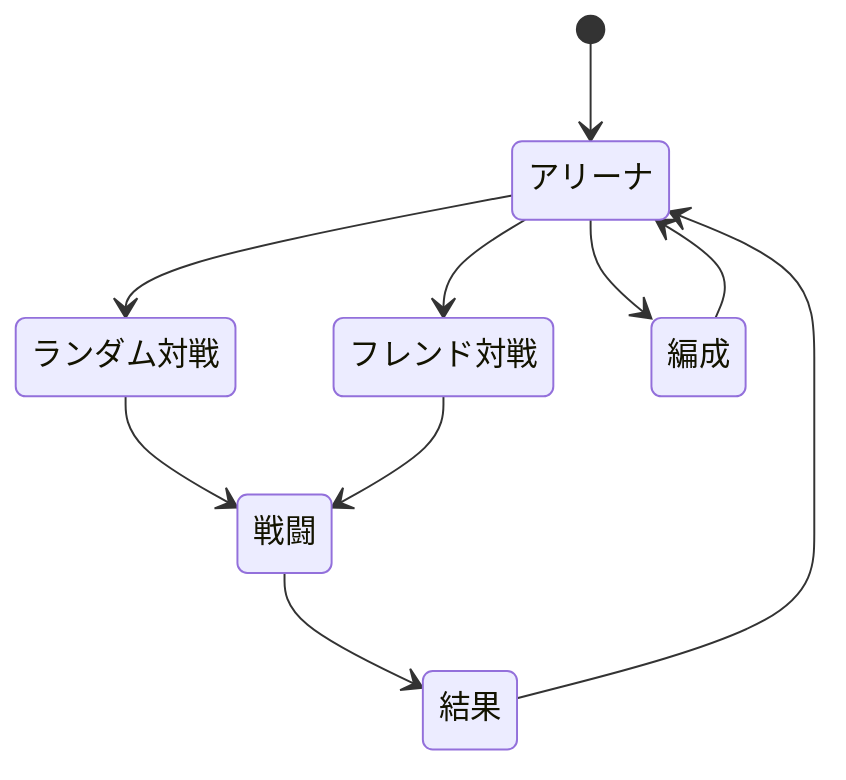

## 戦闘結果の扱い

ClientとGameServerは同一バージョンの戦闘ロジックを保持する. Version一致はLogin時に検証し, 不一致の場合はLoginを拒否してClientへ更新を促す. GameServerは戦闘を実行するが, `StartArenaBattle`の成功レスポンスでは戦闘結果そのものを返さず, Clientで同じ戦闘を再現するための相手キャラクター初期状態とSeedを返す.

Clientは自身の初期状態, GameServerから受け取った相手初期状態, Seedを用いて同一の戦闘ロジックを実行する. 同一入力から算出される結果は一致することを前提とし, 結果の正本はGameServerの計算結果とする.

## 遷移

