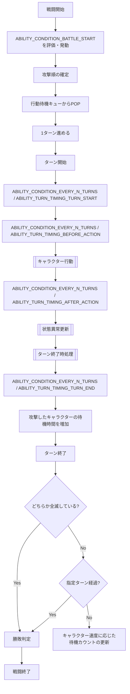
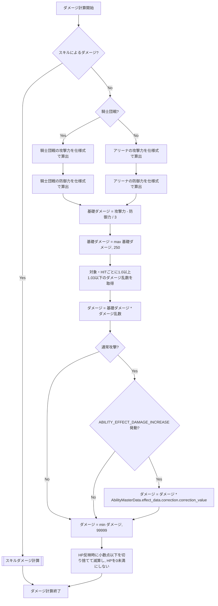
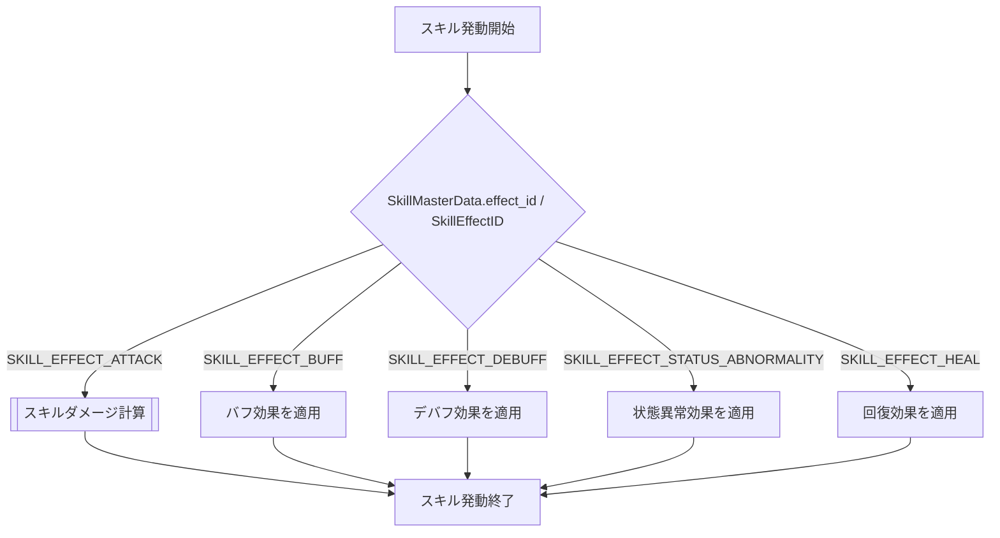
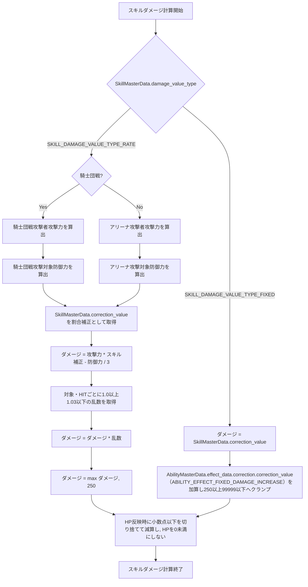

## フロー
### 戦闘

戦闘開始直後は待機カウント更新を行わず, 全キャラクターの待機カウント0の状態から仕様書の初回規則に従って攻撃順を確定する. `UpdateWaitCount`は初回攻撃順確定後のターン進行でのみ使用する.
`状態異常更新`で毒ダメージによりHPが0になった場合は, 戦闘不能時アビリティを発動せず, そのままターン終了時処理へ進む.
同一キャラクターで同一タイミングに複数アビリティの発動条件が成立した場合は, Abilityスロット番号の小さい順に判定・処理する. 複数キャラクターで同一タイミングに成立した場合は, 戦闘計算上の速度が速い順, 同一速度ならフォーメーション内部値が小さい順, 速度・内部値とも同一ならPlayerIDの小さい順で抽選対象リストを作成して疑似乱数の抽選順で処理する.
戦闘開始時に`SkillBattleState.activation_count=0`とし, 各`AbilityBattleState.activation_count=0`, `activated_this_turn=false`で初期化する. ターン開始時にすべての`AbilityBattleState.activated_this_turn`をfalseへ戻す. スキル発動時は`SkillBattleState.activation_count`を1増加し, Ability発動時は対応するAbilityIDの`AbilityBattleState.activation_count`を1増加して`activated_this_turn=true`とする. 最大発動回数判定は各マスターデータの`max_activation_count`と戦闘中状態の`activation_count`を比較して行う.
戦闘フロー内の「`ABILITY_EFFECT_AVOIDANCE`は発動済み?」「`ABILITY_EFFECT_STATUS_ABNORMALITY_ATTACK`は発動済み?」「`ABILITY_EFFECT_AVOIDANCE_COUNTER`は発動済み?」「`ABILITY_EFFECT_PURSUIT`は発動済み?」「`ABILITY_EFFECT_COUNTER`は発動済み?」は, 対応するAbilityIDの`AbilityBattleState.activated_this_turn`を参照する. 発動済み状態はAbilityEffectID単位では共有しない.
通常の行動順決定で敵味方の速度・フォーメーション内部値が同一となる場合も, PlayerIDの小さい順で抽選対象リストを作成する.
戦闘中キャラクターは`BuffDebuffState`, `BuffDebuffEffectState`, `StatusAbnormalityState[]`を保持する. スキル・アビリティによるバフ・デバフ付与時は`BuffDebuffEffectState`の実値を更新し, その有無から`BuffDebuffState`を更新する. 状態異常付与・更新時は`StatusAbnormalityState[]`を更新する. フォーメーションおよびタクティクス補正はこれらのバフ・デバフ状態へ影響しない.
`STATUS_ABNORMALITY_BLINDNESS`の攻撃成功判定に失敗した場合は, 「`ABILITY_EFFECT_PURSUIT`は発動済み?」へ進み, 対応AbilityIDのターン内発動済み状態を確認する.
`ABILITY_CONDITION_EVERY_N_TURNS`は`AbilityActivationConditionData.turn_timing`の`AbilityTurnTiming`に従い, `ABILITY_TURN_TIMING_TURN_START`はターン開始直後, `ABILITY_TURN_TIMING_BEFORE_ACTION`は行動キャラクターの行動直前, `ABILITY_TURN_TIMING_AFTER_ACTION`は当該行動完了直後, `ABILITY_TURN_TIMING_TURN_END`は状態異常更新・ターン終了時効果処理後かつターン終了直前に評価する. 現在ターン数が`condition_value`の倍数の場合に条件成立とする.

### TacticsBattleSpecialType適用

騎士団戦の戦闘開始・行動・被弾・敵全滅処理では, 有効な`TACTICS_EFFECT_BATTLE_SPECIAL`を確認し, `special_type`ごとに「[タクティクス仕様](../../specification/game/tactics.md#特殊効果系列)」の効果を適用する. 攻撃・防御・速度・スキル発動率・最大TP等の数値効果は`TacticsBattleSpecialParameters`の対応フィールドを使用する. 同じ計算項目へ複数タクティクス系列が作用する場合は「[効果値の統合規則](../../specification/game/tactics.md#効果値の統合規則)」に従い, 同系列を加算した後に異系列を乗算する. 速度だけは系列に関係なくすべて加算する. 強襲無効, 最初の通常攻撃ダメージ0, 回避発動は`special_type`固有挙動として処理する. `ERASE`は`TacticsActiveEffectState.erase_consumed`を参照し, 最初の通常攻撃ダメージを0にした直後に`true`へ更新する.

### ダメージ計算フロー

ダメージ発生時は最初にスキルによるダメージかを判定する. スキルによるダメージは後述の「スキルダメージ計算フロー」を使用し, 通常攻撃・追撃・反撃は通常ダメージ計算を使用する.

`ABILITY_EFFECT_DAMAGE_INCREASE`は通常攻撃ダメージへ適用し, 通常攻撃最大ダメージ上限99,999の適用前に`correction_value`を倍率として乗算する. 追撃・反撃・スキルダメージには適用しない.
`ABILITY_EFFECT_COVER`は攻撃対象リスト取得後に候補選択と発動判定を1回行い, 発動した場合はその取得済みリストの各対象について対象側の計算値を使用したダメージをかばうキャラクターへ反映する.
`ABILITY_EFFECT_DRAW_AGGRO`は攻撃対象リスト取得前に候補をフォーメーション内部番号の小さい順に並べ, その候補リストから1キャラクターだけを抽選する. 発動確率判定は選ばれた1キャラクターについてだけ行い, 成立した場合は攻撃範囲の起点を当該キャラクターへ変更してから対象リストを作成する. 不成立時に別候補を再抽選しない.
`ABILITY_EFFECT_FIXED_DAMAGE_INCREASE`は`SkillMasterData.damage_value_type == SKILL_DAMAGE_VALUE_TYPE_FIXED`の攻撃スキルへ適用し, 固定ダメージへAbilityの`correction_value`を加算する.
`ABILITY_EFFECT_HEAL`は`AbilityMasterData.target`へ適用する. `ABILITY_CONDITION_EVERY_N_TURNS`では`AbilityActivationConditionData.turn_timing`が示す位置で評価し, `ABILITY_CONDITION_INCAPACITATED`では戦闘不能確定時に評価する. `算出回復量 = 最大HP * (1 + アビリティの回復割合)`, `回復量 = min(算出回復量, 最大HP)`とし, `回復後HP = min(現在HP + 回復量, 最大HP)`で反映する.
`ABILITY_EFFECT_DEFENSE_IGNORE`発動中の通常攻撃では対象防御力を0として通常ダメージ式へ渡す. `ABILITY_EFFECT_DRAW_AGGRO_IGNORE`発動中の通常攻撃では敵側DRAW_AGGROの起点変更を行わない. `ABILITY_EFFECT_SURVIVE_AT_ONE_HP`はHP減算で0以下になる直前に判定し, 成立時はHP1を反映する. `ABILITY_EFFECT_INCAPACITATED_ALLY_COUNT_STAT_CORRECTION`は攻撃力/防御力算出ごとに現在の戦闘不能味方人数entryを参照する.

### スキル発動

`キャラクター行動`フローでスキル発動判定に成功した場合は, `SkillMasterData.effect_id`に応じて以下を処理する. 攻撃スキルでは「スキルダメージ計算フロー」を使用する. バフ, デバフ, 状態異常, 回復は各スキル仕様の効果処理を行い, 通常攻撃処理へは進まない.

### スキルダメージ計算フロー

攻撃スキルの対象・HITごとに以下を実行する. `SKILL_DAMAGE_VALUE_TYPE_RATE`には99,999の上限を適用しない. `SKILL_DAMAGE_VALUE_TYPE_FIXED`は250以上99,999以下へクランプする. RATE型の最小ダメージ250の適用はダメージ乱数乗算後に行う.

### ダメージ乱数の消費規則

ダメージ乱数は各対象・各HITごとに個別取得する. 1回の行動で複数対象へ命中する場合も対象ごとに取得し, 複数HITの場合も各HITごとに取得する.

### キャラクター行動

`ActivateSkill`は前述の「スキル発動」フローを呼び出す. 攻撃スキルの場合はその内部で「スキルダメージ計算フロー」を使用する.
スキル発動時は`ABILITY_EFFECT_AVOIDANCE`, `ABILITY_EFFECT_AVOIDANCE_COUNTER`, `ABILITY_EFFECT_COUNTER`, `ABILITY_EFFECT_COVER`, `ABILITY_EFFECT_DRAW_AGGRO`, `ABILITY_EFFECT_PURSUIT`を無視し, 通常攻撃側の回避・反撃・かばう・ひきつけ・追撃フローへ入らない. `ABILITY_EFFECT_AVOIDANCE`は`status_abnormality.status`の設定有無を問わず無視するため, スキルによる状態異常付与に対しても状態異常回避Abilityを判定しない.

```mermaid
flowchart TD;
    Start[行動開始];
    End[行動終了];
    Start --> CheckSkillCount

    CheckEmptyList{攻撃対象リストが空?};
    CheckDrawAggro{ABILITY_EFFECT_DRAW_AGGRO 発動?};
    ChangeAttackOrigin[攻撃範囲の起点をABILITY_EFFECT_DRAW_AGGRO発動キャラクターへ変更];
    GetAttackRange[攻撃対象リストの取得];
    CheckCoverCandidate{ABILITY_EFFECT_COVER候補が存在する?};
    SelectCover[候補をフォーメーション内部番号順に並べて1キャラクターを抽選];
    CheckCoverRate{選択したAbilityMasterData.activation_rate > 乱数?};
    SetCover[取得済み攻撃対象リストに対するABILITY_EFFECT_COVER発動状態を保持];
    PopAttackRange[攻撃対象リストからPOP];

    CalculateEnemyHP[[相手HP処理]];
    CalculateCoverHP[[元の攻撃対象の値でダメージ算出しABILITY_EFFECT_COVER発動キャラクターへHP反映]];
    CalculateFriendHP[[味方HP処理]];
    CalculateEnemyHP2[[相手HP処理]];
    DrawAggroAbility[ABILITY_EFFECT_DRAW_AGGRO発動];
    CoverAbility[ABILITY_EFFECT_COVER発動];

    Attack[攻撃];
    CheckCoverActive{ABILITY_EFFECT_COVER発動中?};

    CheckSkillCount{SkillBattleState.activation_count < 最大発動回数?};
    CheckSilent{STATUS_ABNORMALITY_SILENCE?};
    CheckSkill{スキル発動率 > 乱数?};
    ActivateSkill[[スキル発動]];

    CheckSkillCount -- Yes --> CheckSilent;
    CheckSkillCount -- No --> CheckDrawAggro;
    CheckSilent -- Yes --> CheckDrawAggro;
    CheckSilent -- No --> CheckSkill;
    CheckSkill -- Yes --> ActivateSkill;
    CheckSkill -- No --> CheckDrawAggro;
    
    ActivateSkill --> End

    CheckDrawAggro -- Yes --> DrawAggroAbility --> ChangeAttackOrigin --> GetAttackRange;
    CheckDrawAggro -- No --> GetAttackRange;
    GetAttackRange --> CheckCoverCandidate;
    CheckCoverCandidate -- No --> CheckEmptyList;
    CheckCoverCandidate -- Yes --> SelectCover --> CheckCoverRate;
    CheckCoverRate -- No --> CheckEmptyList;
    CheckCoverRate -- Yes --> CoverAbility --> SetCover --> CheckEmptyList;
    CheckEmptyList -- Yes --> CheckAttackerHP;
    CheckEmptyList -- No --> PopAttackRange;

    CheckActivatedAvoidance{ABILITY_EFFECT_AVOIDANCEは発動済み?};
    CheckAvoidance{AbilityMasterData.activation_rate（ABILITY_EFFECT_AVOIDANCE） > 乱数?};
    CheckAvoidanceDisable{AbilityMasterData.activation_rate（ABILITY_EFFECT_AVOIDANCE_DISABLE） > 乱数?};
    AvoidanceAbility[ABILITY_EFFECT_AVOIDANCE発動];
    AvoidanceDisableAbility[ABILITY_EFFECT_AVOIDANCE_DISABLE発動];
    CheckTacticsAvoidance{TACTICS_BATTLE_SPECIAL_ELYSIONの回避効果中?};

    PopAttackRange --> CheckActivatedAvoidance
    CheckActivatedAvoidance -- Yes --> CheckTacticsAvoidance;
    CheckActivatedAvoidance -- No --> CheckAvoidance;
    CheckAvoidance -- Yes --> CheckAvoidanceDisable;
    CheckAvoidance -- No --> CheckTacticsAvoidance;
    CheckAvoidanceDisable -- Yes --> AvoidanceDisableAbility --> CheckTacticsAvoidance;
    CheckAvoidanceDisable -- No --> AvoidanceAbility;
    AvoidanceAbility --> CheckActivatedCounter
    CheckTacticsAvoidance -- Yes --> CheckActivatedCounter;
    CheckTacticsAvoidance -- No --> CheckBlindness;

    CheckBlindness{STATUS_ABNORMALITY_BLINDNESS?};
    CheckBlindnessAttack{攻撃成功?};

    CheckBlindness -- Yes --> CheckBlindnessAttack;
    CheckBlindness -- No --> CheckActivatedStatusAbnormality;
    CheckBlindnessAttack -- Yes --> CheckActivatedStatusAbnormality;
    CheckBlindnessAttack -- No --> CheckActivatedPursuit;

    CheckActivatedStatusAbnormality{ABILITY_EFFECT_STATUS_ABNORMALITY_ATTACKは発動済み?};
    CheckStatusAbnormalityAvoidance{対象StatusAbnormalityIDに対応するAbilityMasterData.activation_rate（ABILITY_EFFECT_AVOIDANCE） > 乱数?};
    CheckStatusAbnormality{AbilityMasterData.activation_rate（ABILITY_EFFECT_STATUS_ABNORMALITY_ATTACK） > 乱数?};
    AddStatusAbnormality[StatusAbnormalityStateへ状態異常を反映];
    StatusAbnormalityAvoidanceAbility[ABILITY_EFFECT_AVOIDANCE発動];
    StatusAbnormalityAttackAbility[ABILITY_EFFECT_STATUS_ABNORMALITY_ATTACK発動]; 

    CheckActivatedStatusAbnormality -- Yes --> Attack;
    CheckActivatedStatusAbnormality -- No --> CheckStatusAbnormalityAvoidance;
    CheckStatusAbnormalityAvoidance -- Yes --> StatusAbnormalityAvoidanceAbility --> Attack;
    CheckStatusAbnormalityAvoidance -- No --> CheckStatusAbnormality;
    CheckStatusAbnormality -- Yes --> StatusAbnormalityAttackAbility --> AddStatusAbnormality;
    CheckStatusAbnormality -- No --> Attack;

    AddStatusAbnormality --> Attack;
    Attack --> CheckCoverActive;
    CheckCoverActive -- No --> CalculateEnemyHP --> CheckActivatedAvoidanceCounter;
    CheckCoverActive -- Yes --> CalculateCoverHP --> CheckActivatedAvoidanceCounter;

    CheckActivatedAvoidanceCounter{ABILITY_EFFECT_AVOIDANCE_COUNTERは発動済み?};
    CheckAvoidanceCounter{AbilityMasterData.activation_rate（ABILITY_EFFECT_AVOIDANCE_COUNTER） > 乱数?};
    AvoidanceCounterAbility[ABILITY_EFFECT_AVOIDANCE_COUNTER発動];
    CheckActivatedAvoidanceCounter -- Yes --> CheckActivatedPursuit;
    CheckActivatedAvoidanceCounter -- No --> CheckAvoidanceCounter;
    CheckAvoidanceCounter -- Yes --> AvoidanceCounterAbility --> CalculateFriendHP;
    CheckAvoidanceCounter -- No --> CheckActivatedPursuit;

    CheckActivatedPursuit{ABILITY_EFFECT_PURSUITは発動済み?};
    CheckPursuit{AbilityMasterData.activation_rate（ABILITY_EFFECT_PURSUIT） > 乱数?};
    Pursuit[ABILITY_EFFECT_PURSUIT発動]; 
    CheckActivatedPursuit -- Yes --> CheckActivatedCounter;
    CheckActivatedPursuit -- No --> CheckPursuit;
    CheckPursuit -- Yes --> Pursuit;
    CheckPursuit -- No --> CheckActivatedCounter;
    Pursuit --> CalculateEnemyHP2

    CheckActivatedCounter{ABILITY_EFFECT_COUNTERは発動済み?};
    CounterAbility[ABILITY_EFFECT_COUNTER発動];
    CheckCounter{AbilityMasterData.activation_rate（ABILITY_EFFECT_COUNTER） > 乱数?};
    CheckCounterDisable{AbilityMasterData.activation_rate（ABILITY_EFFECT_COUNTER_DISABLE） > 乱数?};
    CounterDisableAbility[ABILITY_EFFECT_COUNTER_DISABLE発動];

    CheckActivatedCounter -- Yes --> CalculateEnemyHP2;
    CheckActivatedCounter -- No --> CheckCounter;
    CheckCounter -- Yes --> CheckCounterDisable;
    CheckCounter -- No --> CheckEmptyHP;
    CheckCounterDisable -- Yes --> CounterDisableAbility --> CalculateEnemyHP2;
    CheckCounterDisable -- No --> CounterAbility;

    CheckEmptyHP{相手のHP > 0?};
    KilledAbility[ABILITY_CONDITION_INCAPACITATEDを評価・発動];
    CounterAbility --> CalculateFriendHP
    CalculateEnemyHP2 --> CheckEmptyHP
    CalculateFriendHP --> CalculateEnemyHP2
    CheckEmptyHP -- Yes --> CheckEmptyList
    CheckEmptyHP -- No --> KilledAbility
    KilledAbility --> CheckEmptyList

    CheckAttackerHP{攻撃者のHP > 0?};
    KilledAttackerAbility[ABILITY_CONDITION_INCAPACITATEDを評価・発動];
    CheckAttackerHP -- Yes --> End
    CheckAttackerHP -- No --> KilledAttackerAbility
    KilledAttackerAbility --> End
```

`ABILITY_EFFECT_COVER`の候補抽選は取得済み攻撃対象リスト単位で1回だけ行う. 発動した場合もダメージ計算上の攻撃対象はリスト内の元キャラクターとし, HP減算先だけをかばうキャラクターへ変更する. リストに複数対象がある場合は各対象について個別にダメージを算出し, その回数だけかばうキャラクターへ反映する.
`ABILITY_EFFECT_DRAW_AGGRO`が複数候補の場合はフォーメーション内部番号の小さい順に候補を並べて1キャラクターだけを抽選し, 選ばれた候補だけ発動率判定を行う. 成功時は対象リスト取得前に起点だけを変更し, 失敗時に別候補を再抽選しない.
`TACTICS_BATTLE_SPECIAL_ELYSION`の回避効果は通常攻撃にだけ適用し, `ABILITY_EFFECT_AVOIDANCE`処理の後に独立した「`TACTICS_BATTLE_SPECIAL_ELYSION`の回避効果中?」判定を行う. 効果中の場合は当該通常攻撃を回避したものとして反撃判定へ進む.

戦闘フロー内の回避率, 回避＆カウンター率, 状態異常回避率, 回避無効化率, 状態異常付与率, 追撃率, 反撃率, 反撃無効化率は, 対応するアビリティの`AbilityMasterData.activation_rate`を使用する.

状態異常回避判定は, 付与しようとしている`StatusAbnormalityID`と一致する`ABILITY_EFFECT_AVOIDANCE`だけを対象とし, 当該Abilityの`activation_rate`で判定する.
