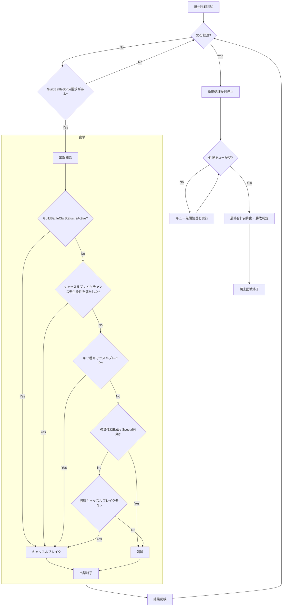
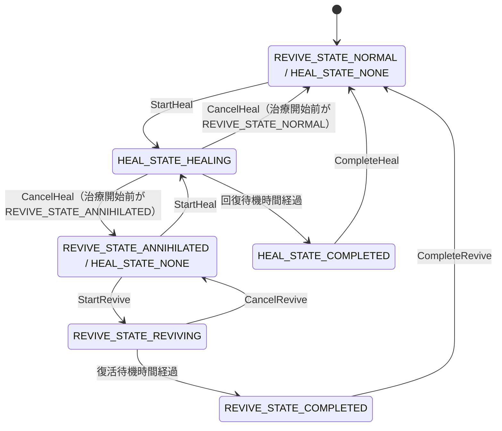
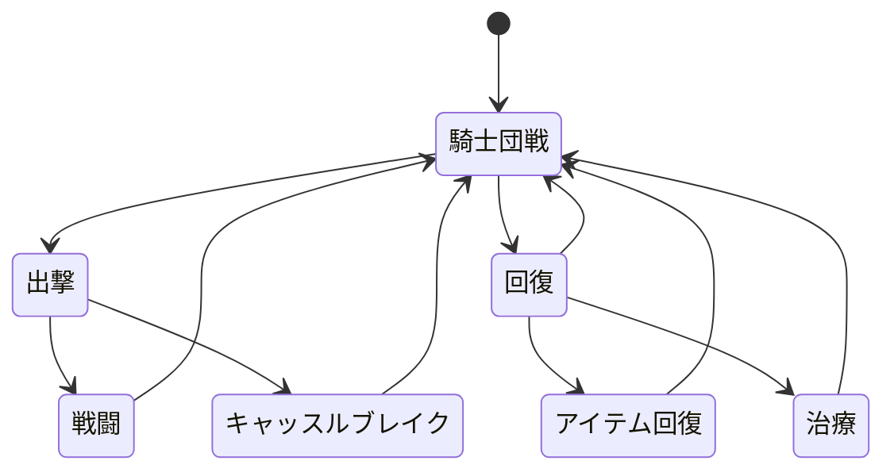

## フロー

### 騎士団戦

強襲無効Battle Specialは通常の確率による強襲キャッスルブレイク判定の直前だけで評価する. `CheckAssaultDisable=Yes`ではキャッスルブレイクへ進まず殲滅へ進む. `GuildBattleCbcStatus.IsActive=true`, キャッスルブレイクチャンス発生条件成立, キリ番キャッスルブレイクは従来どおり先に判定する.

GameServerは各Playerについて騎士団戦単位の`GuildBattlePlayerRuntimeState`を保持し, 開戦時に`attack_count=0`, `acquired_score=0`で初期化する. 出撃可否・RequestSequence検証を通過して当該出撃の実行が確定した時点で`attack_count`を1増加し, 加算後の値を当該出撃のEXTERLIZE補正へ使用する. 結果スコア確定後, 当該出撃でPlayerが取得したスコアを`acquired_score`へ加算する.

## 遷移

### 状態

出撃待機は上記のプレイヤー状態とは別の独立タイマーとして保持する. 出撃処理が成功した時点でタイマーを設定し, 0より大きい間は出撃のみ不可とする. 治療・復活・タクティクス等の状態とは併存できる.
出撃要求送信後から結果応答を受信するまではClientが通信中として追加操作送信を抑止する. GameServerはこの通信待ちを独立したプレイヤー状態として保持しない.

### UI

