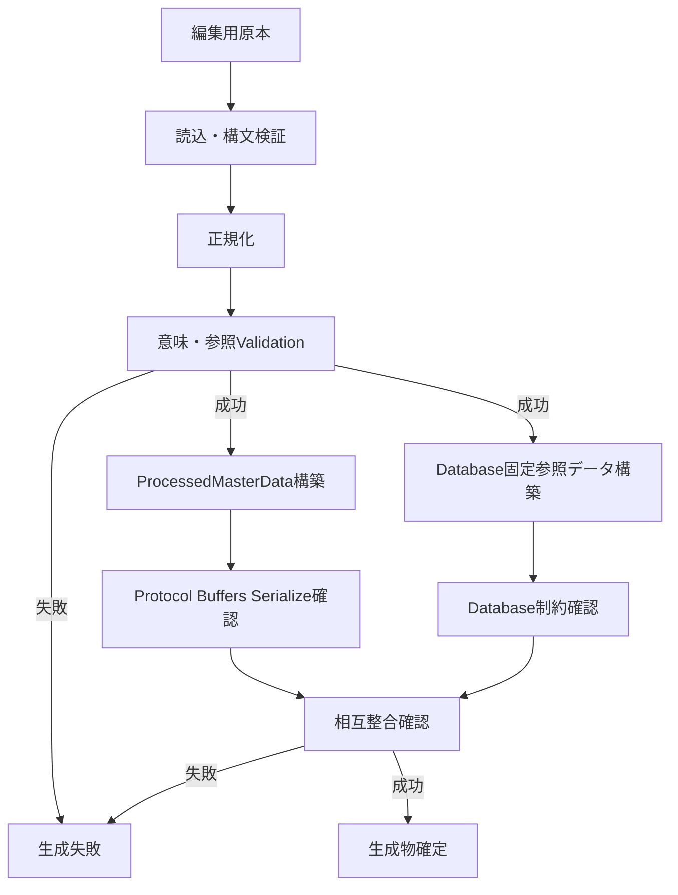

# マスターデータ生成設計

## 目的

本書はゲームで使用する固定マスターデータを, 編集用の原本から実行時データへ変換する手順とValidation方針を定義する.

加工済みマスターデータの構造は「[マスターデータ](master_data.md)」を正本とする.
論理型・Enumは「[型定義](../shared/types.md)」を正本とする.
Database上の固定参照テーブルは「[Database設計](../server/data_base.md)」を正本とする.

## 対象データ

`ProcessedMasterData`へ含める対象は以下4系統だけとする.

* Character.
* Skill.
* Ability.
* Tactics.

以下は`ProcessedMasterData`へ含めない.

* Player.
* Account.
* Guild.
* Guild所属.
* Guild役職.
* GuildBattle実行時状態.
* ArenaParty.
* GuildBattleParty.

`FORMATION` / `FORMATION_POSITION`および`ITEM`はDatabase上の固定参照データとして扱い, `ProcessedMasterData`へ含めない.

## 原本

元データの編集形式は仕様書に具体的な形式を記載しない方針とする. 未定義のため選定待ちと扱わない.
CSV, JSON, Spreadsheet等のいずれを使用する場合でも, 直接実行時構造として読み込まず, 共通のValidation・変換処理を通して出力する.

編集用原本を人が変更する対象とし, 生成済みProtocol BuffersバイナリおよびDatabase固定参照行を手編集して原本との差異を作らない.

## 生成物

生成処理は同一入力から最低限以下を生成する.

1. `ProcessedMasterData` Protocol Buffersバイナリ.
2. Character / Skill / Ability / TacticsのDatabase固定参照データ.
3. `FORMATION` / `FORMATION_POSITION` / `ITEM`のDatabase固定参照データ.
4. Validation結果.

Character / Skill / Ability / Tacticsについて, Protocol Buffers用データとDatabase用データを別々の原本から生成しない.
同一の正規化済み入力から両方を生成し, 内容差異を防止する.

## 生成フロー

Validationが1件でも失敗した場合は生成物を正式成果物として扱わない.
警告だけで不正値を自動補正して出力しない.

## 正規化

生成結果の決定性を保つため, 同一入力から同一並び順を生成する.

### 共通

* IDで識別するトップレベルMasterDataはID昇順へ並べる.
* Characterの`skill_ids`, `ability_ids`, `tactics_ids`は原本でゲーム上の順序意味が定義されている場合を除き, 生成規則を固定する.
* Protocol Buffersのrepeated順序にゲーム上の意味があるデータは仕様の順序を維持する.
* 浮動小数点値は生成過程で不要な丸めを行わない.

### Tactics

同一Tactics内のDatabase `TACTICS_EFFECT`は`TACTICS_EFFECT.id`昇順へ並べる.
`TACTICS_STAGE_EFFECT.target_tactics_effect_id`が指す対象行を, 並べ替え後の0始まりIndexへ変換して`TacticsStageEffectData.effect_index`へ設定する.

`effects[effect_index].effect_id`とStage Effectの`effect_id`は一致必須とする.
`effects[effect_index].target`とStage Effectの`target`は一致必須とする.

## 共通Validation

### ID

* 各Master種別内でIDを重複させない.
* 参照先IDは対象Masterまたは固定参照テーブルに存在する.
* システム予約IDと衝突する値を使用しない.

### 数値

* 論理型の許容範囲を満たす.
* Rate等で仕様上範囲が定義されている値は範囲外を拒否する.
* `u32`値へ小数値を入力しない.
* NaNおよびInfinityを通常のMaster効果値として生成しない.

### 文字列

* UTF-8として扱える値だけを許可する.
* 必須Name / Description等の空値可否は各Master構造とゲーム仕様に従う.

### Enum

* 型定義に存在しないEnum値を拒否する.
* 使用しないEnum Variantを原本へ残さない.
* Enum値と固有データの組み合わせをValidationする.

## Character Validation

最低限以下を確認する.

* `CharacterMasterData.id`が一意である.
* Rarityが有効なEnumである.
* CharacterAttributeが有効なEnumである.
* SpeedRankが有効なEnumである.
* BPが仕様範囲内である.
* `skill_ids`に最低1件の有効SkillIDが存在する.
* `ability_ids`の各IDが存在する.
* `tactics_ids`は0から2件で, 各IDが存在する.
* 同一Character内の参照ID重複を仕様上許可していない項目では重複を拒否する.

Characterが参照するSkill / Ability / Tacticsの存在確認は4系統をすべて読み込んだ後に行う.

## Skill Validation

`SkillEffectID`と固有データの組み合わせをValidationする.

最低限以下を確認する.

* `target_side`が有効な`SkillTargetSide`である.
* `SKILL_EFFECT_ATTACK`では`damage_value_type`が有効な`SkillDamageValueType`である. `SKILL_DAMAGE_VALUE_TYPE_FIXED`では`correction_value`を250以上99,999以下とし, 範囲外は生成エラーとする.
* `SKILL_EFFECT_HEAL`では`effect_data.heal`を使用し, `correction_value`を回復量として使用しない. `can_heal_incapacitated=true`はHP0専用回復, `false`はHP1以上専用回復として扱う.
* 状態異常付与Skillでは`effect_data.status_abnormality`を使用する. `SkillStatusAbnormalityData.application_rate`は確率値として`0.0 <= application_rate <= 1.0`だけを許可する.
* BUFF / DEBUFFでは`effect_data.stat_correction`を使用する.
* Random AttackでHit数が必要な場合は`effect_data.random_attack.hit_count`を使用する.
* `SKILL_TARGET_CONDITION_STATUS_ABNORMALITY`では対象StatusAbnormalityIDを設定する.
* `max_activation_count`が仕様と一致する.
* BUFF / DEBUFFは`max_activation_count=1`とする.
* 回数無制限は`u32::MAX`を使用する.

`oneof effect_data`にEffectIDと無関係なVariantが設定されている場合は生成エラーとする.

`SkillEffectID × SkillTargetRange`は以下だけを許可し, 表にない組み合わせは生成エラーとする.

| SkillEffectID | 許可するSkillTargetRange |
|---|---|
| `SKILL_EFFECT_BUFF` | `SKILL_TARGET_RANGE_ALL`, `SKILL_TARGET_RANGE_SINGLE` |
| `SKILL_EFFECT_DEBUFF` | `SKILL_TARGET_RANGE_ALL`, `SKILL_TARGET_RANGE_SINGLE` |
| `SKILL_EFFECT_STATUS_ABNORMALITY` | `SKILL_TARGET_RANGE_ALL`, `SKILL_TARGET_RANGE_SINGLE` |
| `SKILL_EFFECT_HEAL` | `SKILL_TARGET_RANGE_ALL`, `SKILL_TARGET_RANGE_SINGLE` |
| `SKILL_EFFECT_ATTACK` | `SKILL_TARGET_RANGE_ALL`, `SKILL_TARGET_RANGE_RANDOM`, `SKILL_TARGET_RANGE_VERTICAL_COLUMN`, `SKILL_TARGET_RANGE_HORIZONTAL_ROW`, `SKILL_TARGET_RANGE_X_SHAPE`, `SKILL_TARGET_RANGE_CROSS_SHAPE` |

## Ability Validation

`AbilityEffectID`と`effect_data`の対応は「[マスターデータ](master_data.md)」をそのままValidation規則として使用する.

| AbilityEffectID | 必須effect_data |
|---|---|
| `ABILITY_EFFECT_BUFF` | `stat_correction` |
| `ABILITY_EFFECT_DEBUFF` | `stat_correction` |
| `ABILITY_EFFECT_AVOIDANCE` | `status_abnormality` |
| `ABILITY_EFFECT_COUNTER` | `no_parameter` |
| `ABILITY_EFFECT_AVOIDANCE_DISABLE` | `no_parameter` |
| `ABILITY_EFFECT_COUNTER_DISABLE` | `no_parameter` |
| `ABILITY_EFFECT_STATUS_ABNORMALITY_ATTACK` | `status_abnormality` |
| `ABILITY_EFFECT_DAMAGE_INCREASE` | `correction` |
| `ABILITY_EFFECT_FIXED_DAMAGE_INCREASE` | `correction` |
| `ABILITY_EFFECT_HEAL` | `correction` |
| `ABILITY_EFFECT_COVER` | `no_parameter` |
| `ABILITY_EFFECT_DRAW_AGGRO` | `no_parameter` |
| `ABILITY_EFFECT_PURSUIT` | `no_parameter` |
| `ABILITY_EFFECT_DEFENSE_IGNORE` | `no_parameter` |
| `ABILITY_EFFECT_TARGET_HP_LOW_PRIORITY` | `no_parameter` |
| `ABILITY_EFFECT_TARGET_DEFENSE_DOWN_PRIORITY` | `no_parameter` |
| `ABILITY_EFFECT_DRAW_AGGRO_IGNORE` | `no_parameter` |
| `ABILITY_EFFECT_AVOIDANCE_COUNTER` | `no_parameter` |
| `ABILITY_EFFECT_SURVIVE_AT_ONE_HP` | `no_parameter` |
| `ABILITY_EFFECT_INCAPACITATED_ALLY_COUNT_STAT_CORRECTION` | `incapacitated_ally_count_stat_correction` |
| `ABILITY_EFFECT_CASTLE_BREAK_DAMAGE_INCREASE` | `correction` |

`AbilityEffectID × AbilityConditionID × AbilityTarget`は「[アビリティ仕様](../../specification/game/ability.md)」の許可表だけを許可し, 表にない組み合わせは生成エラーとする.

追加Validationは以下とする.

* `ABILITY_EFFECT_AVOIDANCE`で攻撃回避を表す場合は`status`未設定を許可する.
* `ABILITY_EFFECT_AVOIDANCE`で状態異常回避を表す場合は`status`を設定する.
* `ABILITY_EFFECT_STATUS_ABNORMALITY_ATTACK`では`status`必須とする.
* `ABILITY_CONDITION_EVERY_N_TURNS`では`condition_value`と`turn_timing`を使用する.
* `ABILITY_CONDITION_HP_AT_OR_BELOW_THRESHOLD`, `ABILITY_CONDITION_ALLY_HP_AT_OR_BELOW_THRESHOLD_ATTACKED`, `ABILITY_CONDITION_TARGET_HP_AT_OR_BELOW_THRESHOLD_NORMAL_ATTACK`では`condition_value`を最大HP割合の整数Percentとして扱い, 1～100だけを許可する.
* `ABILITY_EFFECT_DAMAGE_INCREASE × ABILITY_CONDITION_SINGLE_TARGET_NORMAL_ATTACK`は`correction.correction_value=2.0`を必須とする.
* `ABILITY_EFFECT_CASTLE_BREAK_DAMAGE_INCREASE`は`correction.correction_value=2.0`を必須とする.
* `ABILITY_EFFECT_INCAPACITATED_ALLY_COUNT_STAT_CORRECTION`は`incapacitated_ally_count=0,1,2,3,4`を各1件必須とし, 重複・欠落を生成エラーとする. 攻撃補正を使用するAbilityでは`attack`, 防御補正を使用するAbilityでは`defense`が人数増加に対して単調非減少であることを確認する. 未使用側の値は0とする.
* `AbilityMasterData.activation_rate`は直接確率判定へ使用するため`0.0 <= activation_rate <= 1.0`だけを許可する.
* 発動条件で具体値を使用しない場合に, その値をゲーム効果へ流用しない.
* 同一Characterに同一AbilityEffectIDが複数装備可能になるような前提をMasterData生成側で作らない.

## Tactics Validation

### Effect Data

`TacticsEffectID`に応じて使用する値形式を確認する.

* `TACTICS_EFFECT_BP_RECOVERY`は`uint_value`を使用する.
* `TACTICS_EFFECT_HP_RECOVERY`は`hp_recovery`を使用する.
* `TACTICS_EFFECT_BATTLE_SPECIAL`は`battle_special`を使用する.
* その他のfloat補正値は対応する`correction_value`を使用する.

### Stage Effect

* `effect_index`は`effects[]`の範囲内とする.
* `effects[effect_index].effect_id == stage_effect.effect_id`を必須とする.
* `effects[effect_index].target == stage_effect.target`を必須とする.
* 整数効果には`increase_uint_value`を使用する.
* 浮動小数点効果には`increase_value`を使用する.
* Battle Specialには`battle_special_increase`を使用する.
* HP Recoveryの段階上昇値は`increase_value`を`recovery_rate`へ加算する.

### End Type

* `TACTICS_END_TYPE_DURATION`では`duration_seconds`を使用する.
* `TACTICS_END_TYPE_COUNT`では`effect_count`と`count_consume_trigger`を使用する.
* BP RecoveryおよびHP Recoveryの即時回復Tacticsは`TACTICS_END_TYPE_ON_ACTIVATION`だけを許可する.
* End Typeで使用しないフィールドをゲーム処理へ反映しない.

### Battle Special

* `special_type`が有効な`TacticsBattleSpecialType`である.
* Battle Specialの効果対象は外側の`TacticsEffectData.target`だけを使用し, Battle Special専用の別Target値は保持しない.
* `TacticsBattleSpecialType × TacticsTarget × TacticsBattleSpecialTrigger × TacticsEndType × TacticsUseCondition × 非0Parameters`は「[タクティクス仕様のBattle Special MasterData組み合わせ規則](../../specification/game/tactics.md#battle-special-masterdata組み合わせ規則)」の表と完全一致することを必須とする. 表にない組み合わせ, 許可されていないParameterの非0値, EndType/UseCondition不一致は生成エラーとする.
* `ERASE`等の真偽挙動だけで成立するTypeは表で許可Parameterが「なし」とされているため, 全Parameterを0とする.
* `TacticsMasterData.use_condition`が有効な`TacticsUseCondition`である. `RESURRECTION`を1件でも含むTacticsは`ALL_ANNIHILATED`, 含まないTacticsは`NONE`とする.
* `REVIVE` / `RESURRECTION`で使用する`TacticsBattleSpecialParameters.revive_rate`は直接確率判定へ使用するため`0.0 <= revive_rate <= 1.0`だけを許可する.

具体的な数値式が仕様上未確定の効果について, Pipeline側で独自の値変換を行わない.

## Formation / Item

`FORMATION`, `FORMATION_POSITION`, `ITEM`は`ProcessedMasterData`へ含めずDatabase固定参照データとして生成する.

### Formation

最低限以下を確認する.

* FormationIDが一意である.
* Positionの内部識別値が対象Formation内で一意である.
* FormationConditionIDが有効である.
* 条件付き補正はCondition一致時だけ適用される形式で保存する.

### Item

最低限以下を確認する.

* ItemIDが一意である.
* Itemの固定効果値が仕様上の論理型範囲を満たす.
* Player所持数等の可変値を固定Masterへ含めない.

## Database生成

Character / Skill / Ability / TacticsのDatabase固定参照データは`ProcessedMasterData`と同一の正規化済み入力から生成する.

Database側では`oneof`に相当する効果詳細をテーブルへ展開する.
使用しない詳細列・詳細行はDatabase設計に従いNULLまたは未作成とする.

生成時はDatabaseの外部キーと一意制約を有効にした状態で投入確認を行う.
外部キー制約を無効化して不正参照を通過させない.

## ProcessedMasterData生成

Validation完了後に`ProcessedMasterData`を構築してProtocol BuffersでSerializeする.

以下を確認する.

* `characters`, `skills`, `abilities`, `tactics`だけを含む.
* Player / Guild等の可変データを含まない.
* `FORMATION` / `ITEM`を含まない.
* `oneof`は各Effectに対応する1 Variantだけを設定する.
* repeated要素の順序を生成規則どおり固定する.
* Serialize後にDeserializeし, 論理データが一致する.

## ProcessedMasterDataとDatabaseの整合確認

Character / Skill / Ability / TacticsはProtocol BuffersとDatabaseの双方へ展開されるため, 生成処理内で相互確認する.

最低限以下を比較する.

* ID件数.
* 各IDの存在.
* Name / Description.
* 基礎能力値.
* EffectID.
* Activation Rate.
* Effect固有値.
* CharacterからSkill / Ability / Tacticsへの関連.
* Tactics EffectとStage Effectの対応.

比較不一致がある場合は生成失敗とする.
どちらか一方だけを成功成果物として配布しない.

## Version

GuildBattle Replayでは`Version`がゲームロジックとMasterDataの組み合わせを一意に識別する.
MasterData変更を実際のゲーム挙動へ反映する場合は, 対応するVersionを更新する.

本プロジェクトでは複数世代間のMasterData互換変換を必須としない.
Replayを再生する場合はReplayに記録されたVersionに対応するゲームロジックとMasterDataを使用する.

## 反映手順

通常の反映手順は以下とする.

1. 編集用原本を変更する.
2. Pipelineを実行する.
3. 全Validationを通過させる.
4. ProcessedMasterDataを生成する.
5. Database固定参照データを生成する.
6. ProcessedMasterDataとDatabaseデータの相互整合を確認する.
7. 「[テスト方針](../test/test_policy.md)」のMasterData Validationテストを実行する.
8. Versionを確定する.
9. ServerへDatabase固定参照データを反映する.
10. Client / GameServerが使用するProcessedMasterDataを同一Versionとして反映する.

一方だけの反映に成功した状態では, ClientとGameServerの同一Versionを必要とするArena・騎士団戦等の処理を開始しない. ClientがServerへ接続せずに遊べる範囲は「[クライアント仕様](../client/client.md)」に従い, 本制限の対象としない.

## 失敗時

Pipeline失敗時は生成途中の成果物を採用しない.
前回正常生成物を保持している場合はそのまま維持する.

Database反映途中に失敗した場合は, 部分反映のままDatabase固定参照データに依存するServer側処理を開始せず, 対象Versionの固定参照データ一式が整合した状態へ戻してから再実行する. Clientのログイン・Server未接続時の動作は「[クライアント仕様](../client/client.md)」を正とし, タイトルからホームへの遷移のみ可能とする.

原本を修正せず生成済みProtocol BuffersやDatabaseだけを手修正して解決しない.

## 実データの取扱い

本リポジトリにはMasterData実データを配置しない方針を維持する.
生成Pipelineのコード, Schema, Validation規則は配置してよい.
実データを配置しないこと自体を仕様未定義とは扱わない.

画像およびUVデータはClient側資産として扱い, Server用MasterData Pipelineの対象外とする.
