## フロー

### 騎士団戦

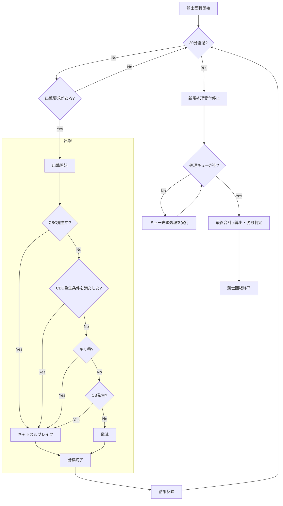

## 遷移

### 状態

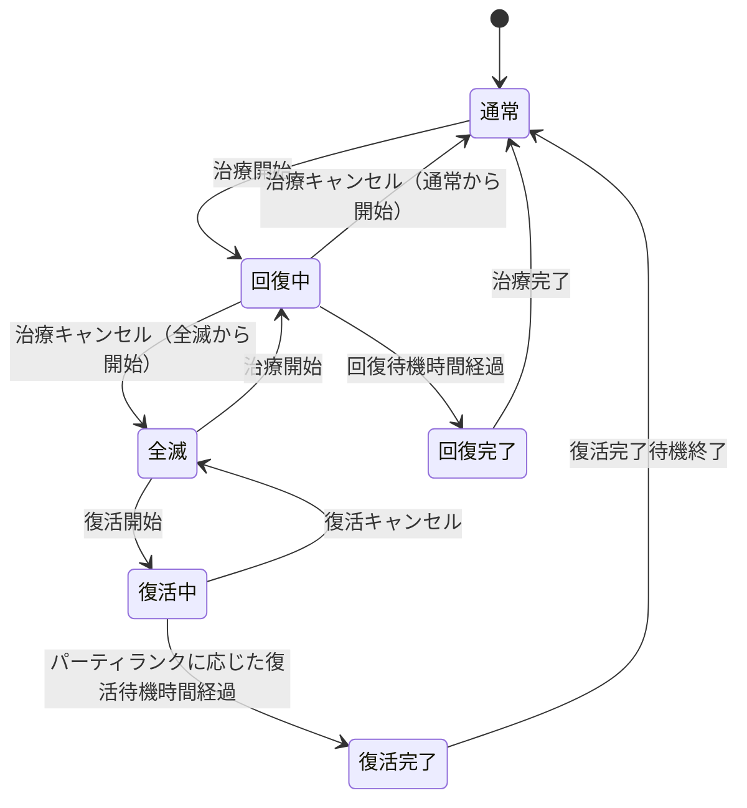

出撃待機は上記のプレイヤー状態とは別の独立タイマーとして保持する. 出撃処理が成功した時点でタイマーを設定し, 0より大きい間は出撃のみ不可とする. 治療・復活・タクティクス等の状態とは併存できる.
出撃要求送信後から結果応答を受信するまではClientが通信中として追加操作送信を抑止する. GameServerはこの通信待ちを独立したプレイヤー状態として保持しない.

### UI

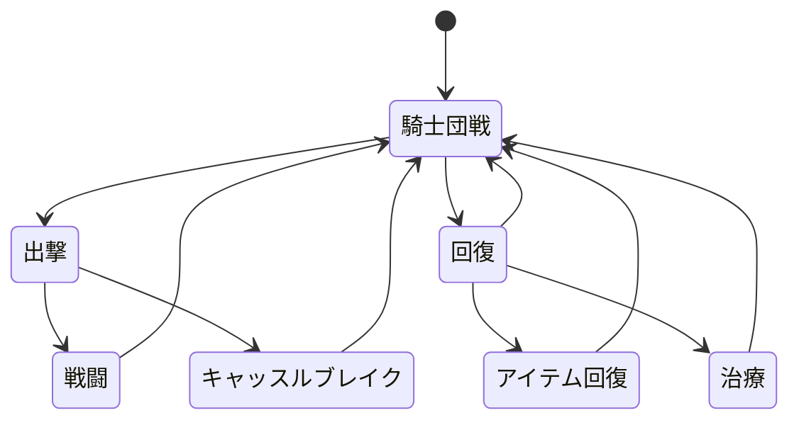

## シーケンス

騎士団戦参加時, GameServerは`GuildBattleID`単位で`PlayerID -> RequestSequence`マップを作成する. 初期値は0で, 参加成功時に騎士団戦本体PRNGを1回消費して`next_bounded(1,000,000,000) + 1`を求め, `RequestSequence`として割り当てる. 他プレイヤーとの`RequestSequence`重複は許可する. 参加後の要求は保持値と一致する`RequestSequence`のみ処理し, 成功するたびに1加算した`NextRequestSequence`をClientへ返す. 失敗時は加算しない. JoinによるPRNG消費もリプレイ再現対象とする.

相手プレイヤーの重み付き抽選へ渡す候補PlayerIDはPlayerID昇順とする.

### 編成登録時

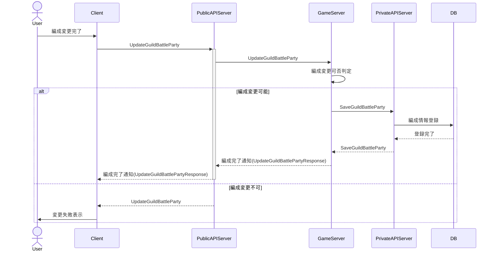

### 騎士団戦参加時

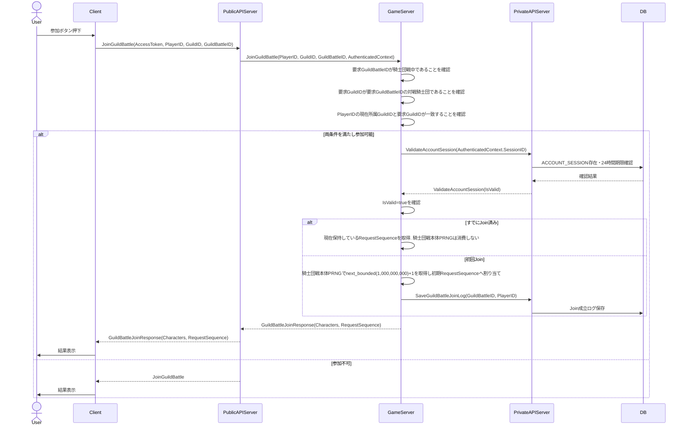

### 騎士団戦

#### 騎士団戦開戦前

騎士団戦開戦前処理は開戦5分前に開始する.
対象開始時刻の騎士団は, 対戦組み合わせ生成前にDatabaseの`GUILD.membership_locked=true`へ更新して加入・脱退を禁止し所属を固定する. 所属変更禁止状態の正本はDatabaseとする.
所属固定後に対戦組み合わせを生成する.
Kubernetes上で複数GameServerが稼働する場合, 対戦組み合わせ生成はLeader Electionで選出された1つのGameServerだけが行う.
生成後の各騎士団戦は`ClaimScheduledGuildBattles`で1つのGameServerへ割り当て, 以降は割当先GameServerだけが当該騎士団戦を処理する.

```mermaid
sequenceDiagram
    participant Bot
    participant LeaderGameServer
    participant GameServer
    participant PrivateAPIServer
    participant DB

    Note over LeaderGameServer,DB: 開戦5分前. Leader GameServerが対象開始時刻の騎士団戦開戦前処理を開始
    LeaderGameServer->>PrivateAPIServer: GetGuildsForBattleMatching(TargetDate, GuildBattleStartTime)
    PrivateAPIServer->>DB: 対象開始時刻のGuildID・所属人数一覧を取得
    DB-->>PrivateAPIServer: GuildBattleMatchCandidate[]
    PrivateAPIServer-->>LeaderGameServer: GetGuildsForBattleMatching
    LeaderGameServer->>PrivateAPIServer: SetGuildMembershipLock(対象GuildID[], true)
    PrivateAPIServer->>DB: GUILD.membership_locked = true
    Note over LeaderGameServer,DB: 対象開始時刻の騎士団の加入・脱退を禁止し所属を固定
    LeaderGameServer->>PrivateAPIServer: GetGuildsForBattleMatching(TargetDate, GuildBattleStartTime)
    PrivateAPIServer->>DB: ロック後のGuildID・所属人数一覧を再取得
    DB-->>PrivateAPIServer: GuildBattleMatchCandidate[]
    PrivateAPIServer-->>LeaderGameServer: GetGuildsForBattleMatching
    LeaderGameServer->>PrivateAPIServer: GetScheduledGuilds(TargetDate, GuildBattleStartTime)
    PrivateAPIServer->>DB: 同一日付・開始時刻の既存GUILD_BATTLEを取得
    DB-->>PrivateAPIServer: 既存ScheduledGuildBattle[]
    PrivateAPIServer-->>LeaderGameServer: GetScheduledGuilds
    alt 既存データあり
        LeaderGameServer->>LeaderGameServer: 既存ScheduledGuildBattle[]をそのまま使用
    else 既存データなし
        LeaderGameServer->>LeaderGameServer: 取得済みGuildBattleMatchCandidate[]から所属0人の騎士団を除外
        LeaderGameServer->>LeaderGameServer: GuildID昇順へ並べ替え
        LeaderGameServer->>LeaderGameServer: 共通内部API GenerateTimeBasedSeed でマッチング用Seedを生成
        LeaderGameServer->>LeaderGameServer: Seedを使用して騎士団一覧をシャッフルしペア生成
        LeaderGameServer->>LeaderGameServer: PairIndex=0からGuildBattleIDを生成
        LeaderGameServer->>PrivateAPIServer: SaveScheduledGuildBattles(TargetDate, StartTime, Battles[])
        PrivateAPIServer->>DB: GameServer生成済みGUILD_BATTLEをscheduledとして保存
        DB-->>PrivateAPIServer: 保存済みまたは既存ScheduledGuildBattle[]
        PrivateAPIServer-->>LeaderGameServer: SaveScheduledGuildBattles
    end
    Note over LeaderGameServer,DB: 0人で組み合わせ生成対象から除外された騎士団も所属変更禁止解除対象として保持

    GameServer->>PrivateAPIServer: ClaimScheduledGuildBattles(GameServerInstanceID, TargetDate, GuildBattleStartTime, 空き容量)
    PrivateAPIServer->>DB: 未割当scheduled騎士団戦を原子的にClaim
    DB-->>PrivateAPIServer: Claim済みScheduledGuildBattle[]
    PrivateAPIServer-->>GameServer: ClaimScheduledGuildBattles

    loop Claimした騎士団戦すべて
        loop 対戦する2騎士団
                GameServer->>PrivateAPIServer: GetGuildData(GuildID)
                PrivateAPIServer->>DB: 騎士団レベル情報要求
                DB-->>PrivateAPIServer: 騎士団レベル情報返答
                PrivateAPIServer-->>GameServer: GetGuildData
                GameServer->>GameServer: 騎士団レベル情報保管

                GameServer->>PrivateAPIServer: GetGuildMembers(GuildID)
                PrivateAPIServer->>DB: 所属PlayerID一覧要求
                DB-->>PrivateAPIServer: 所属PlayerID一覧返答
                PrivateAPIServer-->>GameServer: GetGuildMembers

                loop 所属しているメンバー全員
                    GameServer->>PrivateAPIServer: GetGuildBattleFormation(PlayerID)
                    PrivateAPIServer->>DB: 最大BP・編成情報要求
                    DB-->>PrivateAPIServer: 最大BP・編成情報返答
                    PrivateAPIServer-->>GameServer: GetGuildBattleFormation

                    GameServer->>PrivateAPIServer: GetPlayerItems(PlayerID)
                    PrivateAPIServer->>DB: PLAYER_ITEM要求
                    DB-->>PrivateAPIServer: PLAYER_ITEM返答
                    PrivateAPIServer-->>GameServer: GetPlayerItems

                    alt 取得成功
                        GameServer->>GameServer: 最大BP・編成・アイテム情報保管
                    else 処理失敗
                        GameServer->>GameServer: 当該GuildBattleIDをPreload失敗として記録
                        GameServer->>GameServer: エラーログ追記
                        GameServer->>PrivateAPIServer: SaveErrorLog(GuildBattleID)
                        PrivateAPIServer->>DB: エラーログ保存
                    end
                end
            end

            alt いずれかのPlayerでPreload失敗
                GameServer->>PrivateAPIServer: UpdateGuildBattleStatus(GuildBattleID, preload_failed)
                PrivateAPIServer->>DB: GUILD_BATTLE.status = preload_failed
                opt DiscordNotificationEnabled=true
                    GameServer->>Bot: Preload失敗通知
                end
                Note over GameServer: 当該1対戦だけ開戦しない. 他の騎士団戦は継続. 以後は運営判断
            else Preload成功
                GameServer->>GameServer: InitialSeed = 固定値 XOR GuildBattleID
                Note over GameServer: 開戦前データ処理終了. 所属変更禁止は開戦前処理開始時点から継続中
                Note over GameServer: 開戦時刻到達
                GameServer->>GameServer: 開戦時に保持する騎士団戦データを確定しGuildBattleInitialSnapshotを生成
                GameServer->>PrivateAPIServer: SaveGuildBattleCreateLog(GuildBattleID, InitialSeed, GuildID[2], InitialSnapshot, Version)
                PrivateAPIServer->>DB: リプレイ作成ログ・開戦時スナップショット保存
                GameServer->>PrivateAPIServer: UpdateGuildBattleStatus(GuildBattleID, in_progress)
                PrivateAPIServer->>DB: GUILD_BATTLE.status更新
            end
    end

    opt DiscordNotificationEnabled=true
        GameServer->>Bot: 処理終了通知
    end
```

GetGuildDataまたはGetGuildMembersを含む開戦前Preloadの必須データ取得に失敗した場合も, Player単位の取得失敗と同様に当該GuildBattleIDをPreload失敗として扱う.

`GUILD_BATTLE_STATUS_PRELOAD_FAILED`となった対戦は運営判断待ちとする. 問題解決後に運営が再抽籤を選択した場合, GameServerは対象GuildをGuildID昇順へ並べ, 共通時刻ベースSeedを新規生成してShuffleする. `PRELOAD_FAILED`のGuildBattleIDを昇順へ並べて新しいペアを割り当て, Private APIの`RematchPreloadFailedGuildBattles`へ保存を要求する. 保存後は`scheduled`かつ未Claimへ戻し, 通常のClaimと開戦前Preloadを再実行する. 運営が当該対戦を中止する場合は, 対象Guildについて`SetGuildMembershipLock(..., false)`を実行して所属変更禁止を解除する.

#### 騎士団戦中

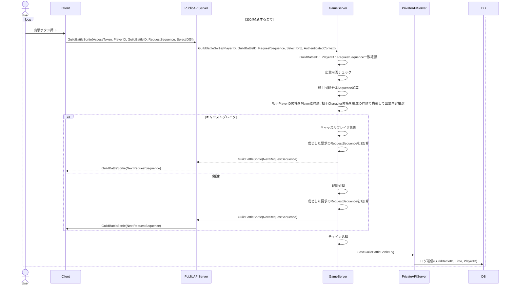

#### Battle Specialイベント処理

騎士団戦中は出撃判定, キャッスルブレイク判定, 戦闘開始, 迎撃, 敵全滅, スコア反映の各処理で有効な`TACTICS_EFFECT_BATTLE_SPECIAL`を評価する. `TacticsBattleSpecialType`ごとの具体効果は「[タクティクス仕様](../specification/tactics.md#特殊効果系列)」を正本とする. 騎士団全体効果は対象Guildの各出撃処理へ反映し, 対戦騎士団全体へのデバフは相手Guildの各出撃処理へ反映する.

#### 要求処理順

GameServerが受信するあらゆる要求は先に到達した順に処理する. GameServer受信時刻が異なる要求は受信時刻の早い要求を先に処理する. GameServer上で完全に同時として扱われる要求同士の順序は処理系定義とし, 疑似乱数による順序決定は行わない.

出撃要求についても同じ規則を使用する. Clientは出撃要求送信後から処理結果応答受信まで通信中として追加操作送信を抑止するため, GameServer側に出撃処理中・処理待ちを表す独立状態は持たせない.

#### 再接続・状態復元

`GetGuildBattleStatus`は再接続用の状態復元APIとして扱う.
ClientはAccessToken, PlayerID, GuildBattleIDだけを送信し, GameServerは現在のRequestSequenceを要求しない.
GameServerは現在HP, BP, TP, 治療・復活状態と残り時間, 出撃待機時間, タクティクス状態, アイテム残数, 両騎士団スコア, チェイン, CBC状態, 現在RequestSequenceを返す.
`GetGuildBattleStatus`の実行ではRequestSequenceを加算しない.
CharacterID, Follower, MainSkill, Ability, FormationID等の静的な編成構成はClientが編成確定時からローカルに保持し, 再接続時もそのローカル情報から復元する. `GetGuildBattleStatus`では静的な編成構成を再送しない.

##### タクティクス使用時

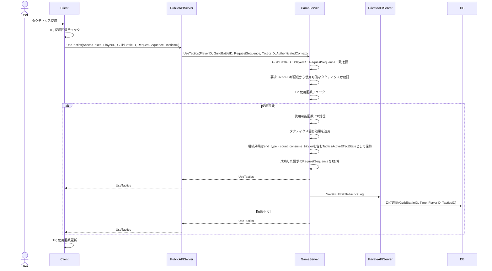

##### 回復アイテム使用時

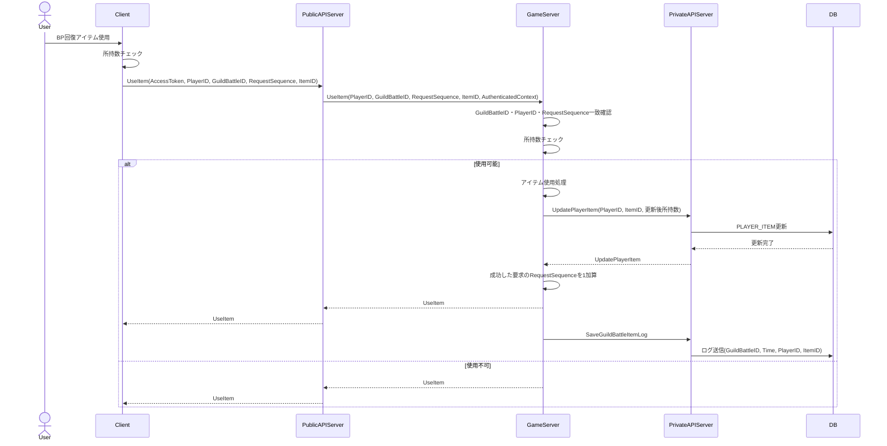

##### 治療時

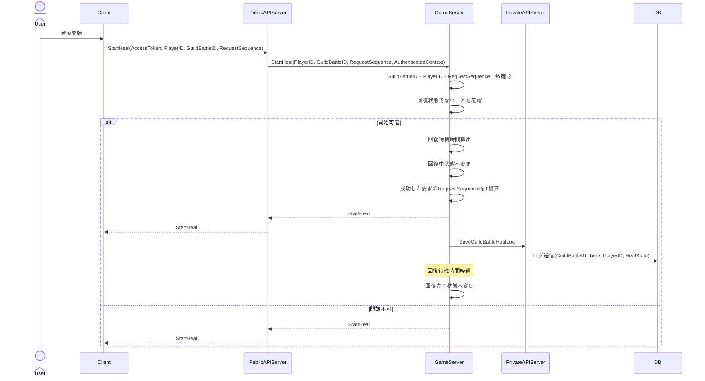

##### 治療キャンセル

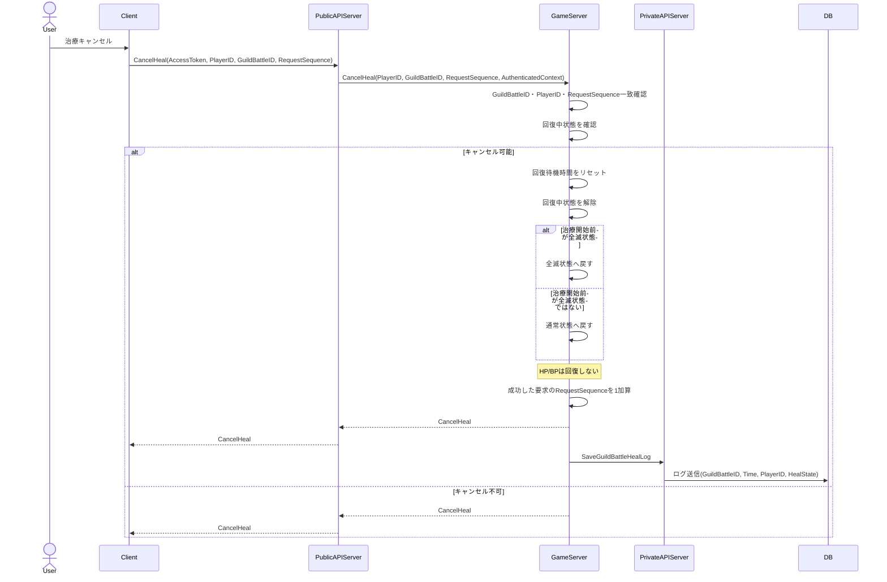

##### 治療完了状態解除

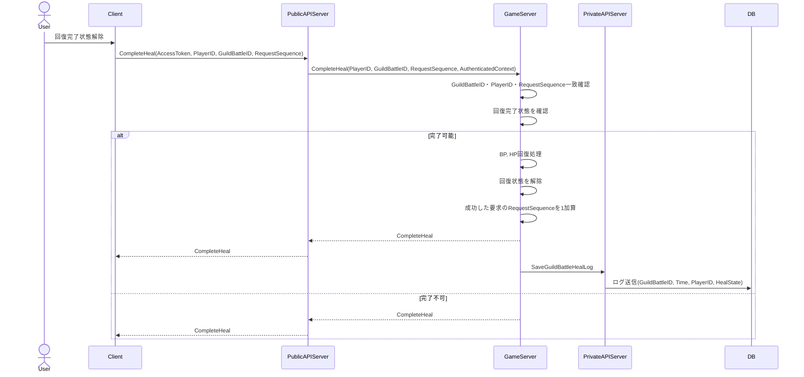

##### 復活

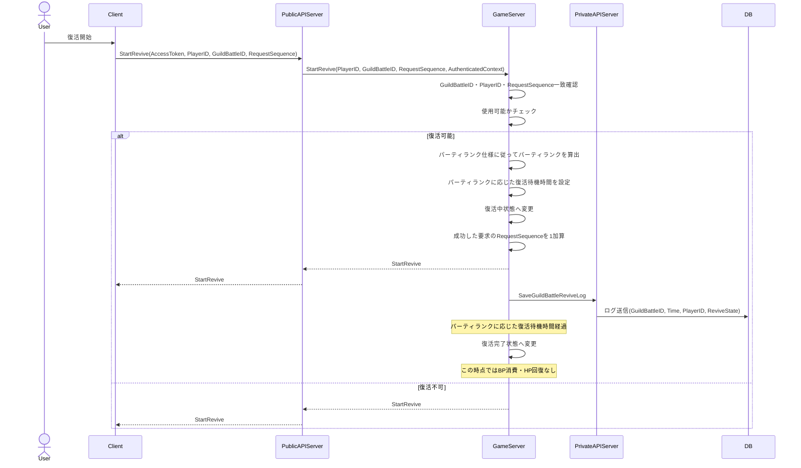

##### 復活キャンセル

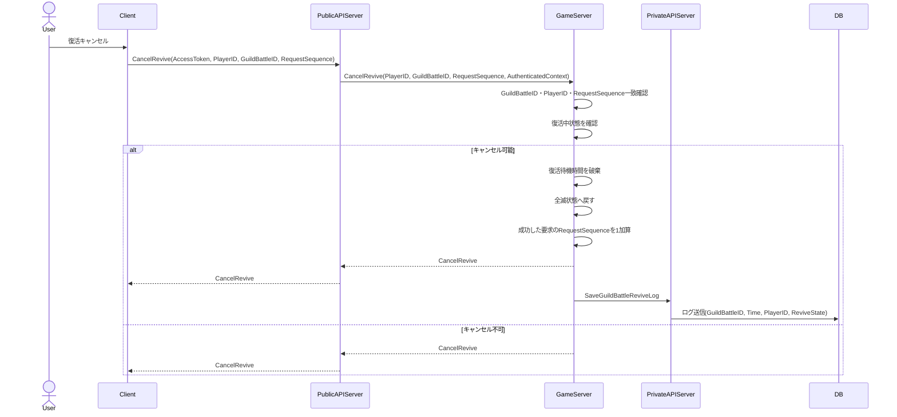

##### 復活完了状態解除

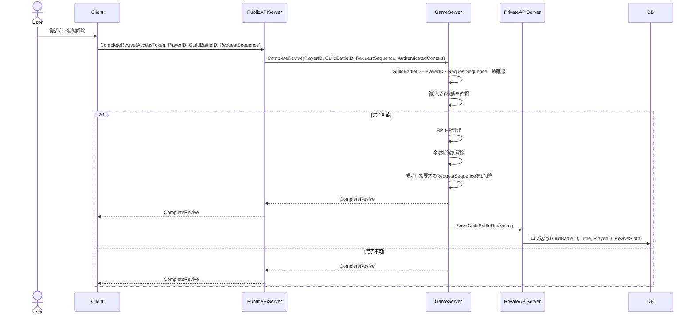

### Database送信失敗時

騎士団戦中にDatabaseへの送信が失敗した場合は, 同一送信を1回だけ再試行する. 再試行も失敗した場合, GameServerは当該騎士団戦についてDB障害発生状態へ移行する.

DB障害発生状態では, それ以降の騎士団戦中Database送信を行わず, 本来送信するデータをGameServerローカルのファイルへ保存する.
保存形式はUTF-8 JSONとし, 保存先はGameServerプロセスのカレントディレクトリ直下とする.
ローカルファイルはGameServer再起動後も保持する.
騎士団戦終了時にローカル保存したデータをDatabaseへ一括送信する.
一括送信に失敗した場合はローカルファイルを残し, 一括送信に成功した場合は対応するローカルファイルを削除する.

騎士団戦最終結果の保存は下記終了シーケンスの専用規則を使用する.

#### 騎士団戦終了時

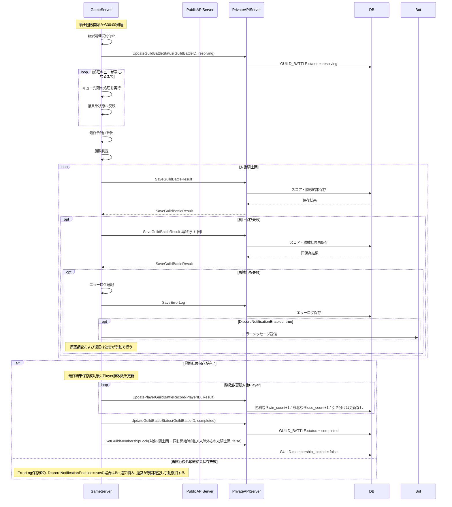

