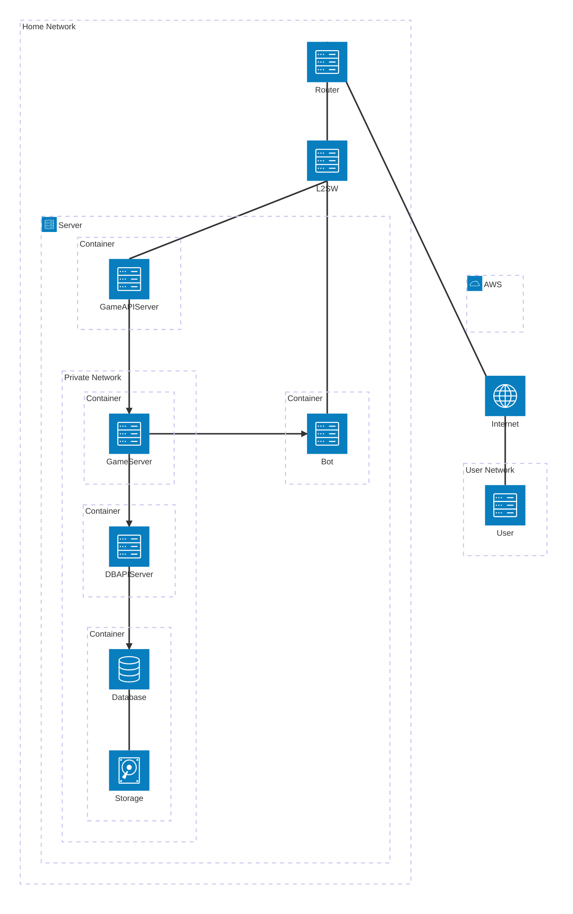

## ネットワーク図

### テスト環境

### 通信暗号化要件

* `AccessToken`を送受信するPublicAPI通信はTLSを必須とする. AccessTokenを平文transportで送信しない.
* `SessionID`を送受信するPublicAPI通信についてTLSを必須とするかは未確定とする. 性能要件を含めて別途決定するまで, 平文送信を許可する仕様とはしない.
* TLSは接続単位の暗号化であり, AccessTokenフィールドだけを個別に暗号化する方式とはしない.
* Botから`IssueAccessToken`を許可する認証方式はStartup Token廃止後の方式が未確定である.

### 本番環境
