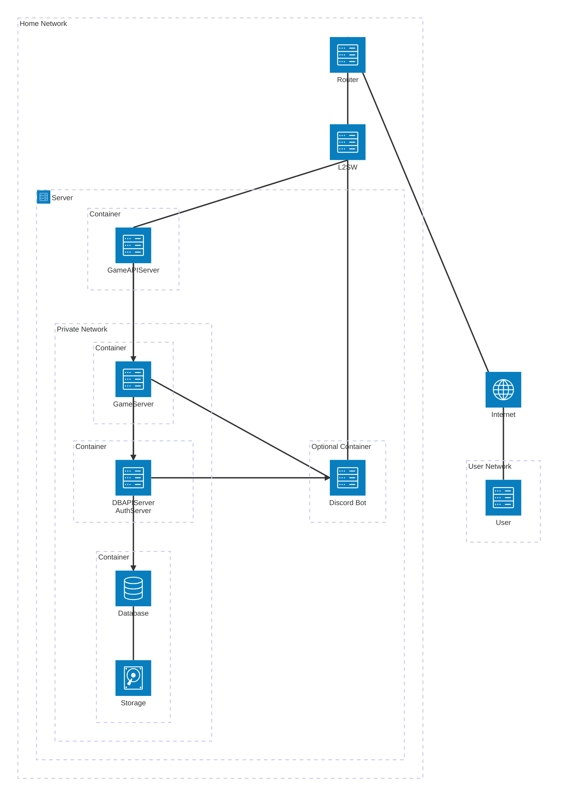
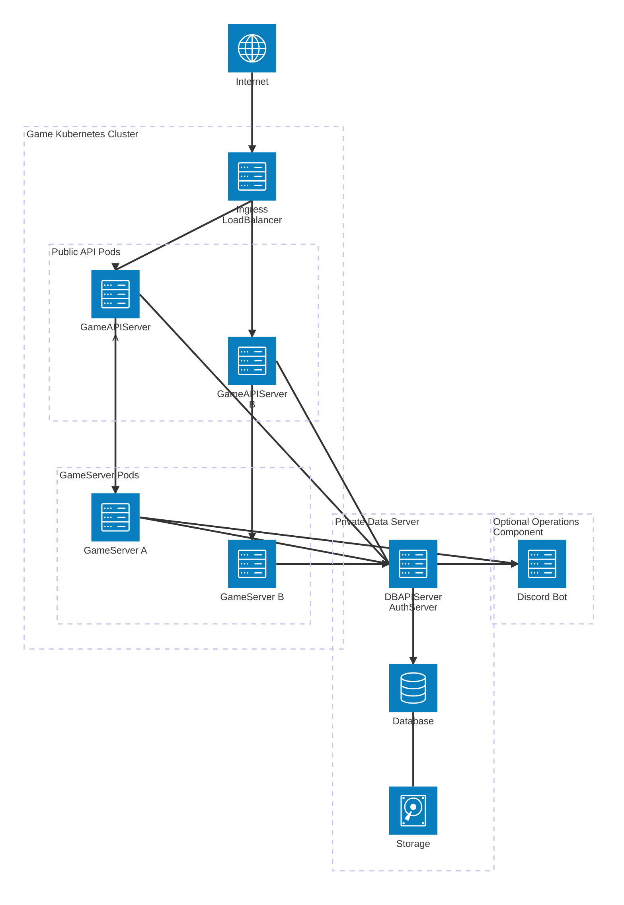

## ネットワーク図

### テスト環境

### 通信暗号化要件

* ClientとPublic API Server間の通信はTLS 1.3を必須とする. `LoginID`, `Password`, `AccessToken`, `RefreshToken`, `DiscordAuthorizationToken`を平文transportで送信しない.
* Public API Serverは接続を可能な限り再利用し, API要求ごとにTLS接続を新規作成する方式とはしない.
* Public API ServerとGameServer間の通信はmTLSを必須とする. 双方は信頼済みCAによる相手証明書を検証し, 証明書検証に失敗した接続を受け付けない.
* Public API ServerとPrivate API Server間の通信はmTLSを必須とする. 双方は信頼済みCAによる相手証明書を検証し, 証明書検証に失敗した接続を受け付けない.
* GameServerとPrivate API Server間の通信はmTLSを必須とする. 双方は信頼済みCAによる相手証明書を検証し, 証明書検証に失敗した接続を受け付けない.
* `DiscordNotificationEnabled=true`の場合, GameServerまたはPrivate API ServerからDiscord Botへ送信する運営通知通信はmTLSを必須とする. Discord Botは通知送信元のService Identityを検証する.
* mTLS証明書はPublic API Server, GameServer, Private API Serverを識別可能なService Identityを持つ. 接続先Serverは証明書のService Identityに基づき呼び出し可能なAPIを制限する.
* Databaseへ直接接続できるのはPrivate API Serverだけとする. Public API ServerおよびGameServerからDatabaseへ直接接続しない.
* 認証用秘密鍵, Database認証情報, Discord Bot Token, TLS秘密鍵等の秘密情報をソースコードおよび公開リポジトリへ保存しない.
* AccessToken署名用秘密鍵はPrivate API Serverだけが保持する. DiscordAuthorizationToken署名用秘密鍵はDiscord Botだけが保持する. Public API Serverは各Tokenの検証用公開鍵だけを保持する.
* Discord Bot連携はOptionとする. `DiscordAuthorizationRequired`と`DiscordNotificationEnabled`は独立して設定する. 現在の運用では`DiscordAuthorizationRequired=true`とする.

### 本番環境

Public API ServerとGameServerはKubernetes上で稼働し, 負荷に応じて水平スケール可能とする.
Private API ServerとDatabaseはKubernetes上のPublic API ServerおよびGameServerとは分離した単一Server上で稼働する.

* Public API Serverは認証状態およびゲーム状態を正本として保持しないstateless構成とする. Podが削除されても永続状態を失わない.
* GameServerは進行中のゲーム状態をメモリ上に保持するstateful構成とする. 騎士団戦は`GuildBattleID`単位で1つのGameServerへ割り当て, 同一騎士団戦の処理を複数GameServerで同時に行わない.
* Public API Serverは`GuildBattleID -> GameServerInstanceID`を使用して騎士団戦要求を所有GameServerへ中継する. 本番環境では`GameServerInstanceID`にKubernetes Pod UIDを使用し, Public API ServerはEndpointSliceをwatchしてPod UIDから接続先Endpointを解決する. 通常のService Load Balancingを騎士団戦要求の所有GameServer選択には使用しない. 詳細は「[ゲームサーバー](game_server.md)」を参照する.
* KubernetesではNetworkPolicyを使用し, Internetから到達可能な対象をIngress/Public API Serverだけに制限する. GameServer, Private API Server, DatabaseをInternetへ直接公開しない. Discord BotはDiscordとの通信に必要な外向き通信と, GameServerおよびPrivate API Serverからの運営通知受信に必要な内部通信だけを許可する.
* Discord Botの本番配置先は本仕様では固定しない. Discordへ接続可能で, GameServerおよびPrivate API Serverからの運営通知を受信可能な運営管理下環境へ配置する.
* Public API ServerのKubernetes ServiceAccountには, GameServer用EndpointSliceの`get`, `list`, `watch`に必要な最小権限だけを付与する.
* Public API Serverの水平スケールは通常のreplica増減を許可する. Public APIのApplication Level Rate Limitカウンタを各Podのローカルメモリだけで独立管理しない. 複数Pod間で同一カウント単位の制限結果が共有される構成とする.
* GameServerのscale downは進行中騎士団戦を保持していないInstanceだけを対象とする. CPU使用率だけを条件として進行中騎士団戦を保持するPodを削除しない.
* Private API ServerおよびDatabaseは単一Serverでのみ稼働するため, 本構成では単一障害点となる.
