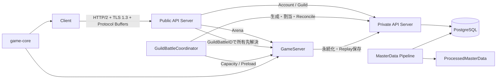

# プログラミング設計

## 結論

現行仕様から実装上の責務・状態・処理順まで確定できる範囲を、`design/programming/`以下へ整理します。

本書群では、ゲーム仕様を追加しません。仕様で明示されていない値・挙動・通信Path・Framework構成は補完せず、実装上必要な境界だけを定義します。ClientのRust/WASM・WebGL 2・Web Audio・OPFSの選定事項は`client/client.md`へ反映し, ライブラリ採用の未検証条件は維持します。Public API通信方式は既存のHTTP/2 over TLS 1.3・Protocol Buffersを正とし, 騎士団戦通知にはHTTP/2 Response streamを使用します。WebSocketは採用しません。

## 設計原則

1. ゲーム計算結果の正本はGameServerです。
2. Account / Guild / Database永続状態の正本はPrivate API Server経由のPostgreSQLです。
3. Databaseへ直接接続するApplication ComponentはPrivate API Serverだけです。
4. Public API ServerはstatelessなEdge APIとし、Domain Logicを保持しません。
5. GuildBattleCoordinatorは騎士団戦のControl Path専用です。
6. ClientとGameServerで共有する戦闘計算とPRNGは`game-core`へ置きます。
7. Protocol Buffers生成型は`protocol`、論理型は`common-types`へ分離します。
8. GameServerの騎士団戦処理スレッドから、Database、ファイル、Telemetryの同期I/Oを分離します。
9. ReplayはSystem Logと別経路とし、成立した操作の順序を保持します。
10. 現仕様が未定義の事項は`undecided.md`で明示し、実装側で挙動を決めません。

## 文書構成

```text
design/programming/
├── README.md
├── architecture.md
├── directory_structure.md
├── implementation_rules.md
├── undecided.md
├── client/
│   └── client.md
├── game/
│   ├── game_core.md
│   ├── battle_runtime.md
│   ├── pseudorandom.md
│   ├── tactics_runtime.md
│   └── master_data_pipeline.md
├── server/
│   ├── api_boundary.md
│   ├── public_api.md
│   ├── private_api.md
│   ├── auth_session.md
│   ├── arena.md
│   ├── game_server.md
│   ├── guild_battle_runtime.md
│   ├── guild_battle_coordinator.md
│   ├── persistence.md
│   └── logging_recovery.md
├── shared/
│   ├── shared_crates.md
│   ├── types.md
│   └── error_model.md
└── test/
    ├── test_design.md
    └── traceability.md
```

## 全体コンポーネント図



## 設計の確定度

| 区分 | 扱い |
|---|---|
| 仕様に型名・API名・状態名が明示されている | その名称を使用します |
| 仕様の責務から実装境界を分ける必要がある | 「論理Module」「論理Service」として記載します |
| 具体的なRust型名・関数名が仕様にない | 原則として固定しません |
| 仕様に未定義・固定しないとある | 設計対象外として残します |

## 情報源

現行添付資料の`specification/`および`design/`配下を使用しています。特に以下を設計境界の正本として参照しています。

- `design/server/public_api_responsibility.md`
- `design/server/private_api.md`
- `design/server/game_server.md`
- `design/server/guild_battle.md`
- `design/server/guild_battle_coordinator.md`
- `design/server/guild_battle_lifecycle.md`
- `design/server/data_base.md`
- `design/server/session.md`
- `design/shared/types.md`
- `design/game/battle.md`
- `design/game/guild_battle.md`
- `design/game/master_data.md`
- `design/game/master_data_pipeline.md`
- `design/game/pseudorandom.md`
- `design/system/public_api.proto`
- `design/system/guild_battle_replay.proto`
- `design/system/log.md`
- `design/system/network.md`
- `design/system/rust_dependencies.md`
- `design/test/test_policy.md`
- `specification/game/`配下
- 添付`rust_wasm_png_hca_library_selection(1).md`（2026-10-09）, 第1～7節（Client選定の追加根拠）.
