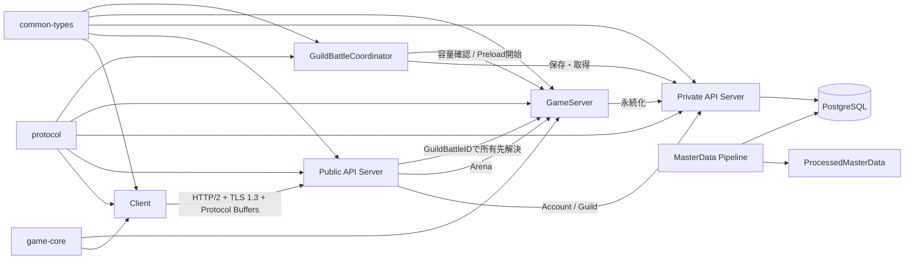
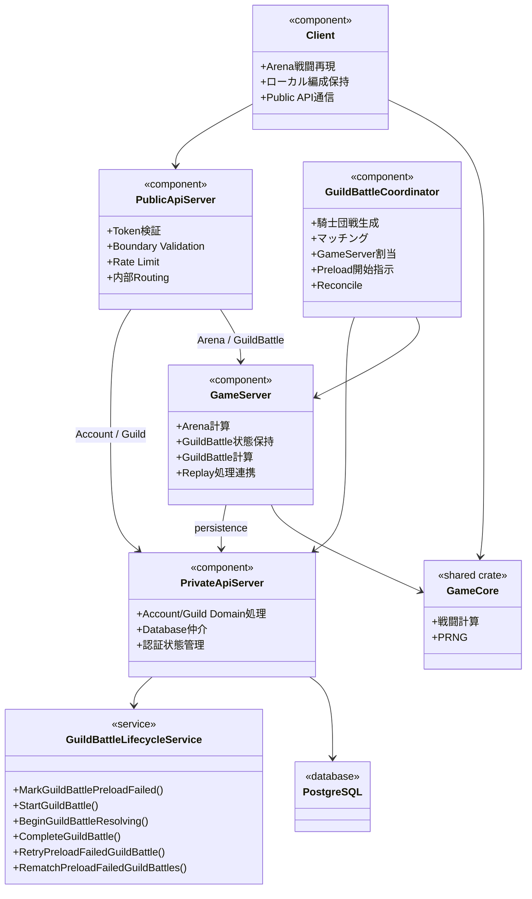
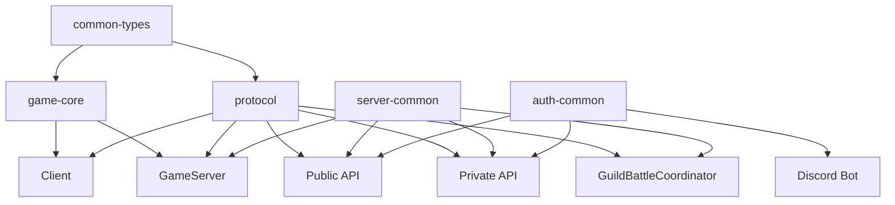

# プログラミング大枠設計

## 目的

本書群は、`specification/`および`design/`配下で明示されている仕様・設計だけを根拠として、実装開始前に必要なプログラム構造の大枠を整理する。

詳細なクラス設計、関数シグネチャ、未確定仕様の補完は行わない。

## 設計方針

1. ゲーム計算の正本はGameServerとする。
2. Account / GuildおよびDatabase上の永続状態はPrivate API Serverを経由して扱う。
3. Databaseへ直接接続できるApplication ComponentはPrivate API Serverだけとする。
4. Public API ServerはstatelessなEdge APIとし、Domain ruleを保持しない。
5. GuildBattleCoordinatorは騎士団戦のControl Pathだけを担当し、通常ゲーム要求の経路には入らない。
6. ClientとGameServerで共有する戦闘計算・PRNGは`game-core`へ集約する。
7. 通信型は`protocol`、共通論理型は`common-types`へ分離する。
8. GuildBattle ReplayとSystem Logは別経路で処理する。
9. 未確定事項は本設計で固定しない。

## 文書構成

```text
design/programming/
├── README.md
├── architecture.md
├── directory_structure.md
├── undecided.md
├── client/
│   └── client.md
├── game/
│   ├── game_core.md
│   └── master_data_pipeline.md
├── server/
│   ├── public_api.md
│   ├── private_api.md
│   ├── game_server.md
│   ├── guild_battle_coordinator.md
│   └── persistence.md
├── shared/
│   └── shared_crates.md
└── test/
    └── test_design.md
```

## 全体像



## 論理クラス図

以下は実装型名を確定する図ではなく、既存資料で定義済みのComponent / Service / APIの責務境界を表す。



## 依存方向



`game-core`は外部I/Oへ依存させず、Client / GameServer側から利用する方向とする。

## 詳細文書

- [全体アーキテクチャ](architecture.md)
- [実装ディレクトリ構造](directory_structure.md)
- [Client](client/client.md)
- [game-core](game/game_core.md)
- [MasterData Pipeline](game/master_data_pipeline.md)
- [Public API Server](server/public_api.md)
- [Private API Server](server/private_api.md)
- [GameServer](server/game_server.md)
- [GuildBattleCoordinator](server/guild_battle_coordinator.md)
- [永続化境界](server/persistence.md)
- [共有crate](shared/shared_crates.md)
- [テスト構造](test/test_design.md)
- [未確定事項](undecided.md)

## 情報源

### 添付資料

- `design/system/network.md`
- `design/system/rust_dependencies.md`
- `design/server/public_api_responsibility.md`
- `design/server/private_api.md`
- `design/server/game_server.md`
- `design/server/guild_battle_coordinator.md`
- `design/server/guild_battle_lifecycle.md`
- `design/server/data_base.md`
- `design/client/client.md`
- `design/game/master_data_pipeline.md`
- `design/game/pseudorandom.md`
- `design/system/log.md`
- `design/test/test_policy.md`
- `design/shared/types.md`
- `design/shared/common_data_struct.md`
- `design/system/public_api.proto`
- `design/system/guild_battle_replay.proto`
- `specification/game/`配下の各ゲーム仕様

外部情報は本プログラミング設計の根拠として使用していない。
