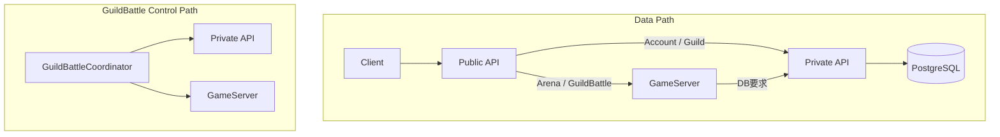
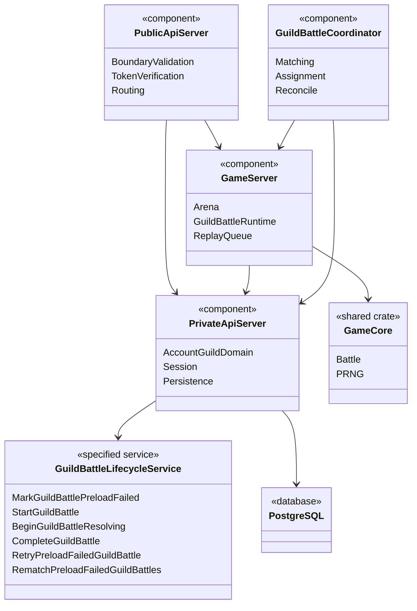
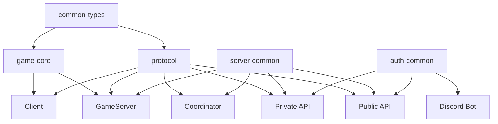

# 全体アーキテクチャ

## 結論

実装は`Client`、`Public API Server`、`Private API Server`、`GameServer`、`GuildBattleCoordinator`、`Discord Bot`、`PostgreSQL`、`MasterData Pipeline`、共有内部crateへ分離します。

責務分離の基準は「どのComponentが状態の正本を所有するか」です。

## 正本の配置

| 対象 | 正本 |
|---|---|
| Account / Session | Private API Server + PostgreSQL |
| Guild / Membership / Role | Private API Server + PostgreSQL |
| Arena戦闘結果 | GameServer |
| Arena保存編成 | PostgreSQL。GameServerはPrivate API経由で取得します |
| GuildBattle永続Lifecycle | Private API Serverの`GuildBattleLifecycleService` + PostgreSQL |
| GuildBattle実行中状態 | 所有GameServerのMemory |
| GuildBattle割当 | `GUILD_BATTLE.game_server_instance_id` |
| GuildBattle Replay | Replay Event列。最初のCreate Eventに初期Snapshotを保持します |
| MasterData構造 | `design/game/master_data.md` |
| Public API wire schema | `design/system/public_api.proto` |

## Component責務

| Component | 主責務 | 明示的に持たない責務 |
|---|---|---|
| Client | UI、ローカル編成、認証状態、Arena再現、GuildBattle表示状態 | 戦闘結果の正本、RefreshToken平文参照 |
| Public API | TLS境界、deserialize、Boundary Validation、Token検証、Rate Limit、Cookie、Routing | Domain判定、DB transaction |
| Private API | Account/Guild Domain、Session、DB操作、GuildBattle Lifecycle | Arena抽選、戦闘計算、GuildBattleマッチング |
| GameServer | Arena、GuildBattle実行状態、戦闘計算、Replay生成 | GuildBattle生成・マッチング・自己割当 |
| Coordinator | GuildBattle生成、マッチング、GameServer選択、割当、Reconcile | 戦闘状態、RequestSequence、ReplayQueue |
| MasterData Pipeline | Parse、Normalize、Validate、生成、Cross Check | 未確定仕様の補完 |

## Data Path / Control Path

Coordinatorは通常のClient要求経路へ入りません。

## 論理クラス図

以下の名称のうち、仕様に実在する名称以外は責務を表す論理名です。

## 依存方向

上位Componentが下位の純粋ロジックへ依存し、純粋ロジックからHTTP、DB、Kubernetesへ依存させません。

## 情報源

- `design/server/public_api_responsibility.md`
- `design/server/private_api.md`
- `design/server/game_server.md`
- `design/server/guild_battle_coordinator.md`
- `design/server/guild_battle_lifecycle.md`
- `design/server/data_base.md`
- `design/system/network.md`
- `design/system/rust_dependencies.md`
