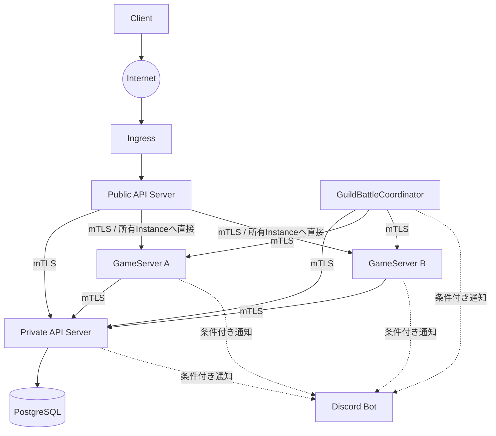
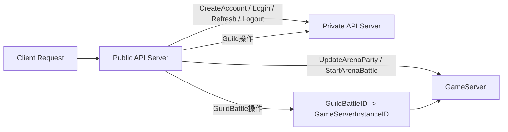
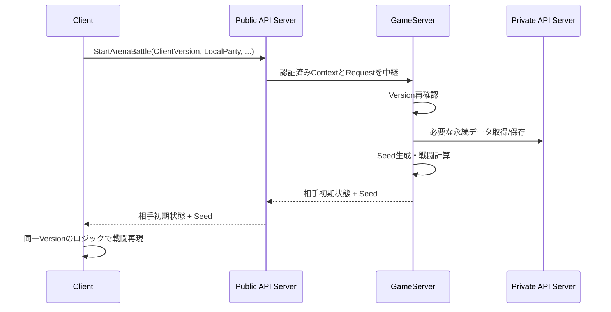
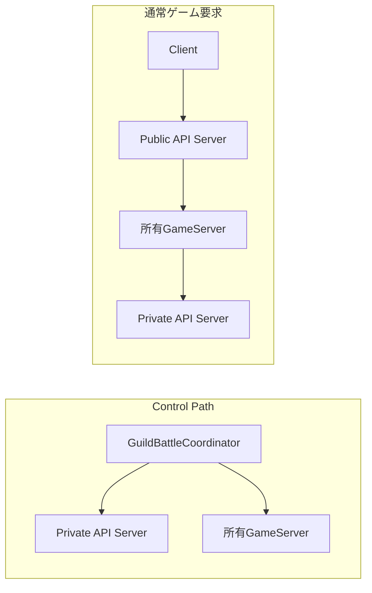
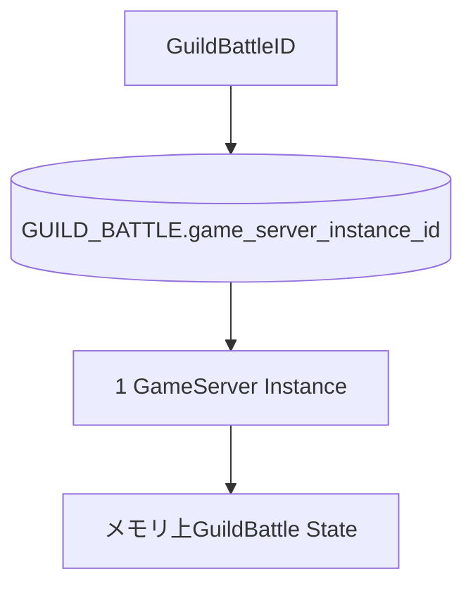

# 全体アーキテクチャ

## 結論

実装の大枠は、`Client`、`Public API Server`、`Private API Server`、`GameServer`、`GuildBattleCoordinator`、`PostgreSQL`、`MasterData Pipeline`、共有内部crateへ分離する。

ゲームルールの正本、永続状態の正本、外部公開境界を分離し、各Componentが別ComponentのDomain責務を代行しない構造とする。

## Component責務

| Component | 主責務 | 保持しない責務 |
|---|---|---|
| Client | UI、イベントキュー、ローカル編成、Arena再現 | 戦闘結果の正本 |
| Public API Server | Internet境界、認証済みContext生成、Boundary Validation、Rate Limit、Routing | Account/Guild/Arena/GuildBattleのDomain判定 |
| Private API Server | Account/Guild、認証状態、DB仲介、永続ライフサイクル | Arena抽選、戦闘計算、GuildBattleマッチング |
| GameServer | Arena計算、GuildBattle状態、戦闘計算、Replay連携 | GuildBattle生成・マッチング・未割当Battleの自己割当 |
| GuildBattleCoordinator | GuildBattle生成、マッチング、GameServer選択、割当、Preload開始 | 通常ゲーム要求、戦闘状態、RequestSequence、ReplayQueue |
| PostgreSQL | 永続データ | Application Domain Logic |
| MasterData Pipeline | Parse、Normalize、Validate、生成、整合確認 | 未確定値の補完 |

## Component関係図

## Public API Routing

## Arenaの正本と再現

Serverの計算結果を正本とし、成功レスポンスでは勝敗や最終HP等の戦闘結果そのものを返さない。

## GuildBattleのControl PathとData Path

Coordinatorは割当・Preload開始後の通常ゲーム要求経路には入らない。

## GuildBattle所有モデル

同一GuildBattleを複数GameServer間で共有メモリ同期する方式にはしない。

## 情報源

- `design/system/network.md`
- `design/server/public_api_responsibility.md`
- `design/server/private_api.md`
- `design/server/game_server.md`
- `design/server/guild_battle_coordinator.md`
- `design/client/client.md`
- `design/game/arina.md`
