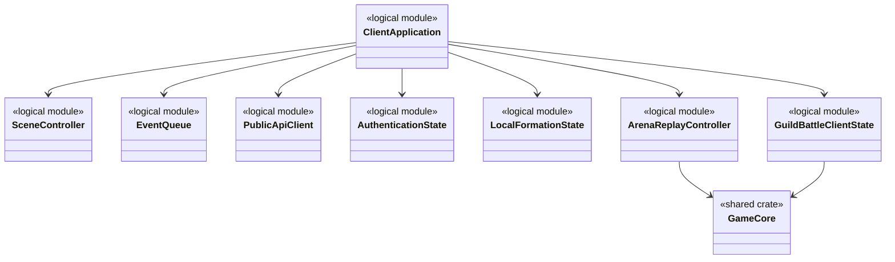
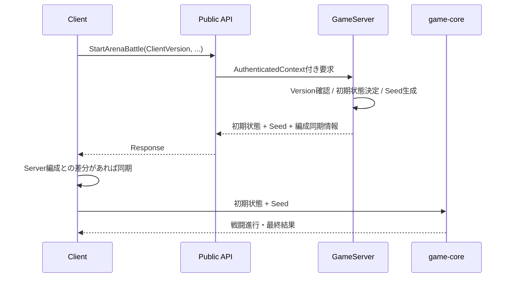
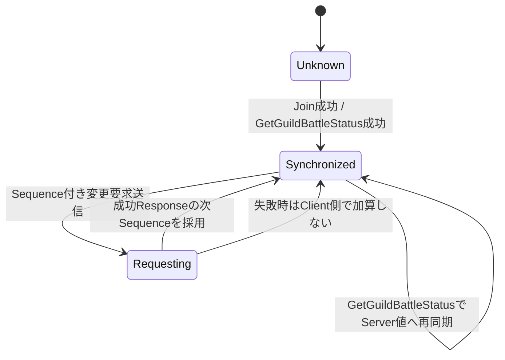

# Clientプログラミング設計

## 結論

Clientは、画面・入力・演出、Public API通信、認証状態、ログイン・サーバー未接続時のゲームプレイ制御、ローカル編成、キャラクター画像の割り当て、ArenaおよびGuildBattle殲滅戦闘再現、GuildBattle表示状態を担当します。

戦闘計算そのものはClient専用実装にせず、GameServerと同じ`game-core`とPRNG仕様を使用します。Serverが正本である状態をClient側で独自に確定しません。

## 論理構成

`logical module`は責務名であり、Rustの具体的な`struct`名を固定するものではありません。

## ログイン・サーバー未接続時

- ログインの可否やServerへの接続可否と、接続不要なゲームプレイの可否を分離します。
- Arena、GuildBattleおよび他のServer通信を必要とする処理は、ログインできない場合またはServerに接続できない場合に利用を制限します。
- Serverを正本とする処理の状態や戦闘結果は、未接続時のClientだけで確定しません。
- オフライン時に利用できる個別のゲーム機能および必要なローカルデータの範囲は未確定であり、具体的な機能一覧は本設計で追加しません。

## タイトル画面のキャラクター画像割り当て

- タイトル画面にキャッシュクリアとアセット追加の操作を提供します。
- アセット追加ではプレイヤーが選択した画像をゲーム内キャラクターへ割り当てます。
- 画像・UVデータはClient側資産とし、Server用`ProcessedMasterData`の対象へ追加しません。
- 保存先、保持期間、画像形式、上書き規則、キャッシュクリアの対象範囲は仕様未確定として扱います。

## 認証状態

Clientが扱う認証情報は以下です。

- `AccessToken`は通常Public APIのAuthorizationに使用します。
- `RefreshToken`はResponse Bodyへ返されず、`__Host-RefreshToken` HttpOnly CookieとしてPublic API Serverが設定します。
- RefreshTokenをClient JavaScriptから読み取る前提の実装にはしません。
- AccessToken失効後またはClient起動・再読込時のSession更新はRefresh APIを使用します。
- Logout後も発行済みAccessTokenは`exp`までは暗号学的には有効であるため、Client側だけでSession失効を正本化しません。

## Arena

Arena開始時、ClientはServerから返された初期状態とSeedを使用してローカルで戦闘を再現します。

### 編成同期

- Clientローカル編成とServer編成が一致する場合はその状態を使用します。
- 不一致の場合はServer編成を使用してArena戦闘を開始します。
- 戦闘計算結果をClientからServerへ正本として返す設計にはしません。
- `EnemyPlayerID`はランダム/フレンド共通でResponseから取得します。`BattleCharacterStatus.MaxHP`を使用し, 行動順でPlayerIDを使う際もClient側で相手IDを推定しません。

## GuildBattle

Clientが保持するGuildBattle状態は、画面表示および要求組み立てのためのClient側状態です。GameServerの状態を置き換える正本ではありません。

最低限、以下を追跡します。

- `GuildBattleID`
- 現在の`RequestSequence`
- Join時に同期した編成
- 現在HP、BP、最大BP、TP、最大TP
- Heal / Revive状態と残り時間
- 出撃待機状態
- Tactics使用回数および継続効果
- Item残数
- Guild Score、Chain、CBC状態

### 殲滅戦闘再現と騎士団情報通知

Arenaと同じ`game-core`・戦闘専用PRNGを使用して, 殲滅戦闘をGameServerと同じ入力で再計算します。`GuildBattleAnnihilationResponse`には戦闘開始時点の`OwnCharacters`/`EnemyCharacters`（最大HP含む）, `EnemyPlayerID`, `EnemyFormationID`, `BattleTacticsEffects`, `Seed`を含めます。自分のPlayerIDはJoin済みの本人PlayerIDを使用します。Own FormationはJoin時に同期済みの構成を使用します。相手の継続効果は, `EnemyTacticsID[]`ではなく`BattleTacticsEffects`のSource/Targetおよび取得済みMasterDataで判定します。

Clientの直近表示HPや継続効果を戦闘入力として補わず, Responseに含む戦闘開始時点の入力を使用します。出撃Responseの`Score`はGameServerの正本であり, Clientが計算した最終HP・勝敗・スコアでGameServerの状態を上書きしません。演出はこの戦闘再現結果を使用します。キャッスルブレイクResponseの`EventType`はキリ番CB, 強襲CB, CBCを区別します。

騎士団戦参加後に`SubscribeGuildBattleUpdates`で通知ストリームを開きます。初回および出撃後に届く`GuildBattleScoreUpdate`の`GuildBattleID`, `AllyScore`, `EnemyScore`, `Chain`を表示状態へ反映します。ここでの`Ally`は受信者の所属騎士団です。要求元の出撃結果Responseとスコア通知は別経路で受信します。通知では`RequestSequence`を加算しません。ストリーム切断・再接続時は`GetGuildBattleStatus`を先に呼び, 現在値とSequenceを正本へ同期してから再購読します。

### RequestSequence

- 初回Join成功時にGameServerから現在RequestSequenceを受け取ります。
- 成功した状態変更要求ではServerが進めたSequenceへ更新します。
- 失敗要求ではClientが推測でSequenceを進めません。
- 再接続時は`GetGuildBattleStatus`の現在RequestSequenceを正として再同期します。
- `GetGuildBattleStatus`自体はRequestSequenceを消費しません。

### 出撃後の通信待機

仕様上、Client側には出撃通信中の二重操作を抑止する状態がありますが、この状態をGameServerの永続または戦闘状態として扱いません。

## Tactics再現

ランダム要素を持つTacticsは、GameServerがGuildBattle本体PRNGから生成したSeedを起点としてTactics専用PRNGを使用します。Clientも同じSeedと対象順序を使用して同一結果を再現します。

Seedが`0`かどうかだけでランダム要素の有無を判定しません。ランダム利用有無はMasterDataを正とします。

## Scene / Event Queue

画面遷移と演出処理はゲーム計算から分離します。

- SceneはAPI要求・表示状態・入力を管理します。
- 戦闘演出は計算結果をEvent Queue等へ変換して再生します。
- 演出完了タイミングによって`game-core`の乱数消費順や計算結果を変えません。

## メリット・デメリット

### メリット

- ClientとGameServerのArena再現性を共有ロジックで検証できます。
- UI/演出と計算を分離できるため、演出変更が戦闘結果へ影響しません。
- Server通信を必要としないゲームプレイをログイン状態・接続状態から独立して扱えます。
- GuildBattle再接続時にServer状態へ戻せます。

### デメリット

- ClientとGameServerで同一Versionのロジック・MasterDataを揃える必要があります。
- Client側表示状態はServer正本と重複するため、再同期処理が必要です。
- オフラインで利用できるゲーム機能および追加画像の保存・復元要件が未確定のため、その部分の実装と検証を具体化できません。

## 情報源

- `design/client/client.md`
- `design/client/scene_transition.md`
- `design/game/master_data.md`
- `design/game/master_data_pipeline.md`
- `design/server/api_payload.md`
- `design/server/arina.md`
- `design/server/guild_battle.md`
- `design/game/arina.md`
- `design/game/guild_battle.md`
- `design/game/pseudorandom.md`
- `design/shared/common_data_struct.md`
- `design/test/test_policy.md`
