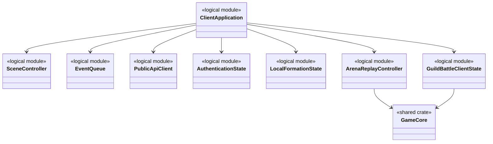
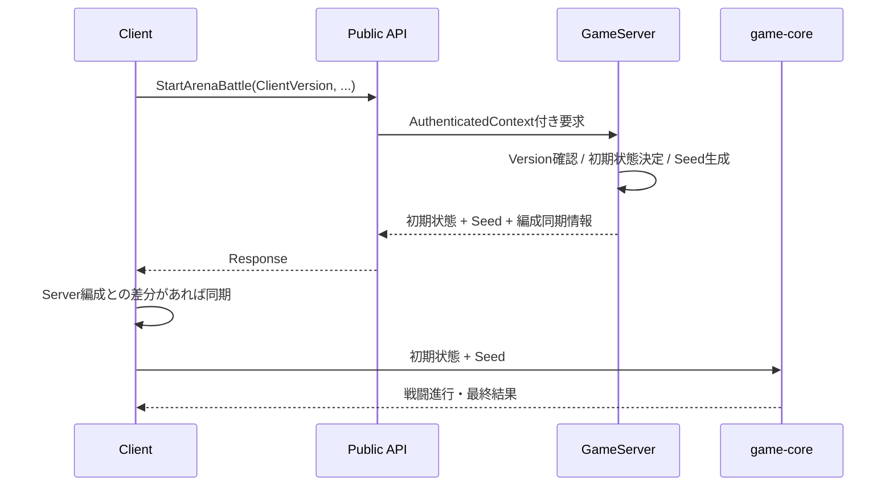
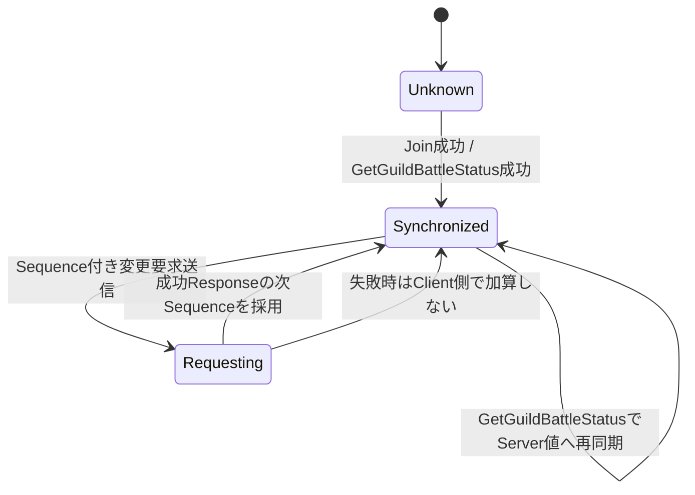

# Clientプログラミング設計

## 概要

Clientは、画面・入力・演出、Public API通信、認証状態、ログイン・サーバー未接続時のゲームプレイ制御、ローカル編成、キャラクター画像の割り当て、ArenaおよびGuildBattle殲滅戦闘再現、GuildBattle表示状態を担当します。

戦闘計算そのものはClient専用実装にせず、GameServerと同じ`game-core`とPRNG仕様を使用します。Serverが正本である状態をClient側で独自に確定しません。

## 論理構成



`logical module`は責務名であり、Rustの具体的な`struct`名を固定するものではありません。

## Web Client実行方式とブラウザ境界

- ClientはRust/WASM（`wasm32-unknown-unknown`）を対象とし, iPhone Safari/PWAおよびAndroid Chrome/PWA上で動作させます。初期プロトタイプはLAN内ローカルWebサーバーからIPアドレス直指定で配信し, 正式公開先はVercel／GitHub Pagesのどちらか未決定です。最小対応ブラウザはiOS Safari 16.3, Android Chrome 120です。対応OSの最小バージョンは未確定です。
- ブラウザとの接続には`wasm-bindgen`, `web-sys`, `js-sys`, `wasm-bindgen-futures`を使用します。Browser APIのPromiseは`wasm-bindgen-futures`を用いてRustの`Future`と連携させます。
- 描画基盤として汎用2Dエンジンを追加せず, WebGL 2を`web-sys`経由で使用する独自スプライトバッチレンダラーとします。UI Frameworkも使用しません。
- 戦闘計算は`game-core`、Protocol Buffers生成型は`protocol`、符号化・復号は`prost`を使用する。
- ClientとPublic API Server間の通信方式はHTTP/2 over TLS 1.3, API PayloadはProtocol Buffersとします。`SubscribeGuildBattleUpdates`はHTTP/2 Response streamを使用し, `GuildBattleScoreUpdate`をProtocol Buffers varint長prefix付きで受信します。WebSocketはPublic API通信方式として採用しません。ブラウザ標準の`fetch()`およびResponse Bodyの`ReadableStream`を使用し, `web-sys`等を経由してRust/WASMと接続します。HTTP/2/TLS 1.3はブラウザとServerのネゴシエーションに依存し, 実接続で検証します。

### 描画パイプライン

```text
OPFSのPNG → File / Blob → createImageBitmap() → WebGL 2 texImage2D()
            → 不要なImageBitmapをclose() → スプライトバッチ描画
```

- ブラウザでPNGをデコードし, 必要な画像をGPUへアップロードします。すべての展開済み画像をWASMヒープへ保持しません。
- 描画順とブレンド状態を保持しつつバッチ化し, draw callやJS/WASM境界の往復を削減します。テクスチャ共有・アトラス化・インスタンシング等の適用範囲は実測結果に基づき決定します。
- 使用終了時には`ImageBitmap.close()`と`deleteTexture()`によって不要な資源を解放します。
- GPUテクスチャ, WASMヒープ, ブラウザ内の一時メモリを別々に把握します。WebGL 2とCanvas 2Dの比較優位やFPS値は現時点で保証しません。

### HCAデコード・音声パイプライン

- HCAデコード候補は`cridecoder`（`0.3.6`）とする。`default-features = false`を指定し, 不要なPythonバインディングを有効化しません。
- HCAからPCMへ変換した音声をWeb Audio APIへ渡します。短いSE/ボイスでは必要に応じて全体を`AudioBuffer`へデコードして再利用します。
- 長いBGM/ボイスはOPFSから必要な圧縮ブロックを読み, 小容量PCMバッファへ逐次デコードします。`AudioWorkletNode`へ`MessagePort`経由でPCMチャンクを供給し, `AudioWorkletProcessor`の小容量キューから再生します。
- `AudioWorkletProcessor.process()`内でHCAデコードや大容量のメモリ確保を行いません。制御側または専用Workerが先読みし, 音声出力側と役割を分離します。
- HCAはサンプリングレート22,050Hz, 暗号化なしとし, 一部音源でループします。SEの同時再生上限は5音です。音源のループ区間, チャンネル数は個別ファイルで確認します。PCM先読み量は, デコード時間・OPFS読み出し遅延・音声処理のスケジューリング遅延が未計測のため最適値を算出できず, 実機計測で決定します。`SharedArrayBuffer`を利用する方式は初期実装では採用しません。
- HCAのiPhone Safari/WASMでのコンパイル・正しい再生・ピークメモリは未検証です。`cridecoder`は検証合格を最終採用条件とする候補であり, 動作確認済みとは記載しません。

### OPFSアセット管理

- タイトル画面の「アセットの追加」から専用シーンへ遷移し, ユーザーが選んだPNG/HCAを取り込みOPFSへ保存します。端末別ファイル選択方式と元ファイル削除を伴う移動の可否は未確定です。GameServerからPNG/HCAファイル本体は配信しませんが, ファイル名SHA-256を第1キー, 内容SHA-256を第2キー, 対応配置先パスを値とする二段辞書はServerから配布されます。
- OPFSのアセットバージョンにはセマンティックバージョニングを使用し, バージョン別ディレクトリを設けます。新バージョンを検証してから使用先を切り替え, 取り込み中断から回復できる状態を保持します。アプリ独自の容量・保存期間・画像解像度上限は設けず, ブラウザ固有quotaや退避・削除条件は別途検証します。
- OPFSの初期実装は非同期APIを使用します。`FileSystemSyncAccessHandle`はDedicated Worker上で必要なランダムアクセスを計測し, 性能向上が実装・互換性・安定性上の負担を上回る場合のみ採用する条件付き候補です。採否は未確定です。
- 圧縮HCAファイル全体と全体PCMを同時に常駐させません。デコード済みPCM, GPU資源, WASMメモリは用途別に管理し, 不要な`AudioBuffer`の参照を解除します。
- アセット取り込み時は選択されたディレクトリの配下を再帰的に探索し, 対象となるPNG/HCAファイルについて拡張子を含むファイル名をUTF-8でバイト列化し, SHA-256ハッシュ値を算出する. 英字の大小文字は区別する. Server配布辞書はファイル名SHA-256をキー, 内容SHA-256をキー・対応配置先パスを値とする辞書を値に持つ二段辞書とする. ファイル名SHA-256に対応する二段目の辞書が1件だけの場合はファイル内容のSHA-256算出を省略し, そのエントリの配置先パスを採用する. 二段目に複数の候補がある場合はファイル内容のSHA-256を算出し, 二段目の辞書のキーと照合して配置先を特定する. これ以外のハッシュ衝突に対する判定・回避処理は設けない. Unicode正規化の扱いは未確定とする.
- PNG/HCA本体とキャラクター画像割当情報はOPFSへ保存します。ファイル名のSHA-256ハッシュ値とServer配布辞書を対応させて自動割当し, 保存済み情報をOPFSから復元します。Clientの自動削除は行わず, ユーザーがOPFSを明示的に消した場合に削除します（ブラウザのquota/ストレージ消去を除きます）。キャッシュクリアはOPFSの`cache`フォルダのファイルだけを対象とします。辞書取得API・配布時期・シリアライズ形式, ファイル名ハッシュのUnicode正規化, 同名ファイルの上書き規則は未確定です。

### 依存・ビルド・検証条件

- Client用ブラウザ連携の選定crateは`wasm-bindgen`, `web-sys`, `js-sys`, `wasm-bindgen-futures`および採用検証を要する`cridecoder`です。`web-sys`は使用API単位でfeaturesを指定します。
- 描画用の`image`, `png`, `pix`, `wgpu`, `glow`, 汎用2Dゲームエンジン, オーディオ出力専用Rustライブラリは採用しません。
- `Cargo.lock`を保存して依存を固定し, `cargo tree --target wasm32-unknown-unknown`で推移的依存を確認します。`cargo build --target wasm32-unknown-unknown --release --locked`でビルドを検証します。
- Release設定候補は`opt-level = 3`, `lto = "fat"`, `codegen-units = 1`, `panic = "abort"`, `strip = "symbols"`とする。`opt-level = "z"`との圧縮後WASMサイズ・HCAデコード時間・初回ロード時間の比較を行い, 本番設定の最終値は検証後に定めます。
- 実機では40キャラクターと代表的エフェクトの描画, iOS長時間動作, 最大同時SE5, BGM逐次再生, HCAループ・再生遅延・欠音, 依存ライセンスを検証します。目標閾値はGPU負荷80%以下, 実行時メモリ2GB以下, FPS30以上, WASMサイズ500MB以下です。測定方法・対象機種・メモリの対象範囲・WASM圧縮前後は未確定で, 実測結果は未記録です。

## ログイン・サーバー未接続時

- ログイン不可またはServer未接続の場合, タイトルからホームへ遷移することだけを許可し, その他の機能は利用できません。
- Server接続と必要な認証が復帰した場合は, 接続可能状態と同じ機能を使用可能に戻します。
- Serverを正本とする処理の状態や戦闘結果は、未接続時のClientだけで確定しません。

## タイトル画面のキャラクター画像割り当て

- タイトル画面にキャッシュクリアとアセット追加の操作を提供します。
- アセット追加ではプレイヤーが選択した画像をゲーム内キャラクターへ割り当てます。
- 画像・UVデータはClient側資産とし、Server用`ProcessedMasterData`の対象へ追加しません。
- PNG以外の画像は受け付けません。画像・音声本体とキャラクター割当情報の永続化先はOPFSとし, Server配布のファイル名SHA-256ハッシュ辞書を使用した自動配置と保存情報の復元を行います。
- アプリ独自の容量・解像度・保持期間上限と自動削除は設けません。キャッシュクリアはOPFS内の`cache`フォルダのみ対象とします。

## 認証状態

Clientが扱う認証情報は以下です。

- `AccessToken`は通常Public APIのAuthorizationに使用します。
- `RefreshToken`はResponse Bodyへ返されず、`__Host-RefreshToken` HttpOnly CookieとしてPublic API Serverが設定します。
- RefreshTokenをClient JavaScriptから読み取る前提の実装にはしません。
- AccessToken失効後またはClient起動・再読込時のSession更新はRefresh APIを使用します。
- Logout後も発行済みAccessTokenは`exp`までは暗号学的には有効であるため、Client側だけでSession失効を正本化しません。

## Arena

Arena開始時、ClientはServerから返された初期状態とSeedを使用してローカルで戦闘を再現します。



### 編成同期

- Clientローカル編成とServer編成が一致する場合はその状態を使用します。
- 不一致の場合はServer編成を使用してArena戦闘を開始します。
- 戦闘計算結果をClientからServerへ正本として返す設計にはしません。
- `EnemyPlayerID`はランダム/フレンド共通でResponseから取得します。`BattleCharacterStatus.MaxHP`を使用し, 行動順でPlayerIDを使う際もClient側で相手IDを推定しません。

## GuildBattle

Clientが保持するGuildBattle状態は、画面表示および要求組み立てのためのClient側状態です。GameServerの状態を置き換える正本ではありません。

最低限、以下を追跡します。

- `GuildBattleID`
- 現在の`RequestSequence`
- Join時に同期した編成
- 現在HP、BP、最大BP、TP、最大TP
- Heal / Revive状態と残り時間
- 出撃待機状態
- Tactics使用回数および継続効果
- Item残数
- Guild Score、Chain、CBC状態

### 殲滅戦闘再現と騎士団情報通知

Arenaと同じ`game-core`・戦闘専用PRNGを使用して, 殲滅戦闘をGameServerと同じ入力で再計算します。`GuildBattleAnnihilationResponse`には戦闘開始時点の`OwnCharacters`/`EnemyCharacters`（最大HP含む）, `EnemyPlayerID`, `EnemyFormationID`, `BattleTacticsEffects`, `Seed`を含めます。自分のPlayerIDはJoin済みの本人PlayerIDを使用します。Own FormationはJoin時に同期済みの構成を使用します。相手の継続効果は, `EnemyTacticsID[]`ではなく`BattleTacticsEffects`のSource/Targetおよび取得済みMasterDataで判定します。

Clientの直近表示HPや継続効果を戦闘入力として補わず, Responseに含む戦闘開始時点の入力を使用します。出撃Responseの`Score`はGameServerの正本であり, Clientが計算した最終HP・勝敗・スコアでGameServerの状態を上書きしません。演出はこの戦闘再現結果を使用します。キャッスルブレイクResponseの`EventType`はキリ番CB, 強襲CB, CBCを区別します。

騎士団戦参加後に`SubscribeGuildBattleUpdates`で通知ストリームを開きます。初回および出撃後に届く`GuildBattleScoreUpdate`の`GuildBattleID`, `AllyScore`, `EnemyScore`, `Chain`, `ChainRemainingMilliseconds`を表示状態へ反映します。チェイン残り時間は受信時点のGameServerスナップショット（ミリ秒）であり, Clientは表示用のカウントダウンを行います。時間切れのみを契機とするServer通知はありません。ここでの`Ally`は受信者の所属騎士団です。要求元の出撃結果Responseとスコア通知は別経路で受信します。通知では`RequestSequence`を加算しません。開戦30:00でストリームを終了します（当該Playerの受付済み処理がキュー待ちなら完了後に終了）。ストリーム切断・再接続時は`GetGuildBattleStatus`を先に呼び, 現在値とSequenceを正本へ同期してから再購読します。

### RequestSequence



- 初回Join成功時にGameServerから現在RequestSequenceを受け取ります。
- 成功した状態変更要求ではServerが進めたSequenceへ更新します。
- 失敗要求ではClientが推測でSequenceを進めません。
- 再接続時は`GetGuildBattleStatus`の現在RequestSequenceを正として再同期します。
- `GetGuildBattleStatus`自体はRequestSequenceを消費しません。

### 出撃後の通信待機

仕様上、Client側には出撃通信中の二重操作を抑止する状態がありますが、この状態をGameServerの永続または戦闘状態として扱いません。

## Tactics再現

ランダム要素を持つTacticsは、GameServerがGuildBattle本体PRNGから生成したSeedを起点としてTactics専用PRNGを使用します。Clientも同じSeedと対象順序を使用して同一結果を再現します。

Seedが`0`かどうかだけでランダム要素の有無を判定しません。ランダム利用有無はMasterDataを正とします。

## Scene / Event Queue

画面遷移と演出処理はゲーム計算から分離します。

- SceneはAPI要求・表示状態・入力を管理します。
- 戦闘演出は計算結果をEvent Queue等へ変換して再生します。
- 演出完了タイミングによって`game-core`の乱数消費順や計算結果を変えません。

## Web Public API実装・配置制約

- 既存の`web-sys`, `wasm-bindgen-futures`, `js-sys`からブラウザ標準`fetch()`を呼び出し, `prost`/`protocol`でRequest/ResponseのProtocol Buffersを処理します。`SubscribeGuildBattleUpdates`は`ReadableStream`を逐次読み, chunk境界を跨ぐvarint長prefixとMessageを復元します。HTTP/2/TLS 1.3はブラウザとServerによるネゴシエーションで, Client JavaScriptから強制しません。
- WebAssemblyおよびJavaScriptはブラウザ内で実行され, API要求にはブラウザのOrigin・CORS・Cookie制約が適用されます。WASM/JavaScript配布後の通信もPublic API Serverへ行い, GameServerへの直接接続へ変更しません。
- Refresh/LogoutなどCookieを必要とするCross-Origin要求は`credentials: include`とし, Server側は既存のOrigin検証, 許可Origin限定のCORS, `Access-Control-Allow-Credentials`を適用します。ただし`SameSite=Strict`はCross-Siteでは送信不可です。
- GitHub Pages標準`github.io`と別SiteのPublic APIを組み合わせた構成は既存Cookie規則と両立しません。同一Siteとなる配布用独自ドメイン等の配置案は検討対象で, 採用するドメイン名は未確定です。`__Host-RefreshToken`のHost-only/HttpOnly/Secure/Strict制約を緩和しません。
- 一般的なBrowser File Picker/`<input type="file">`から取り込み, OPFSへ保存できますが, OPFSはOSのファイル管理UIへ通常のディレクトリとして公開されません。元ファイルの削除を伴う移動やディレクトリ一括選択は端末別の対応を確認する必要があります。
- `cridecoder`の採否は`wasm32-unknown-unknown`ビルド、iPhone Safariでの22,050Hz非暗号化HCA・ループ再生・SE5音同時再生・長時間再生時の欠音・メモリ、および依存ライセンス検証の結果で決定します。

### 外部情報源

- MDN WebAssembly concepts: https://developer.mozilla.org/en-US/docs/WebAssembly/Guides/Concepts
- MDN CORS: https://developer.mozilla.org/en-US/docs/Web/HTTP/Guides/CORS
- MDN Fetch API: https://developer.mozilla.org/en-US/docs/Web/API/Fetch_API/Using_Fetch
- MDN Cookie: https://developer.mozilla.org/en-US/docs/Web/HTTP/Reference/Headers/Set-Cookie
- WebKit OPFS: https://webkit.org/blog/12257/the-file-system-access-api-with-origin-private-file-system/
- MDN FileSystemSyncAccessHandle: https://developer.mozilla.org/en-US/docs/Web/API/FileSystemSyncAccessHandle
- MDN `webkitdirectory`: https://developer.mozilla.org/en-US/docs/Web/API/HTMLInputElement/webkitdirectory
- GitHub Pages custom domain: https://docs.github.com/en/pages/configuring-a-custom-domain-for-your-github-pages-site
- cridecoder公式: https://github.com/seiunx-dev/cridecoder

## 制約

- ClientとGameServerで戦闘ロジック・MasterDataのVersionを一致させる。
- Server正本の状態とClientの表示状態は再同期する。
- OPFSの保存容量・データ保持はブラウザの制限に従う。
- アセット取り込みとHCA/WASMの動作性能は対象実機で検証する。
- `SameSite=Strict` Cookieを使用するため, Client配布先とPublic APIのSite構成が認証条件を満たす必要がある。

## 参照資料

- `design/client/client.md`
- `design/client/scene_transition.md`
- `design/game/master_data.md`
- `design/game/master_data_pipeline.md`
- `design/server/api_payload.md`
- `design/server/arina.md`
- `design/server/guild_battle.md`
- `design/game/arina.md`
- `design/game/guild_battle.md`
- `design/game/pseudorandom.md`
- `design/shared/common_data_struct.md`
- `design/test/test_policy.md`
- 添付`rust_wasm_png_hca_library_selection(1).md`（2026-10-09）, 第1～7節.
- `design/system/network.md`.
- `design/system/rust_dependencies.md`.
