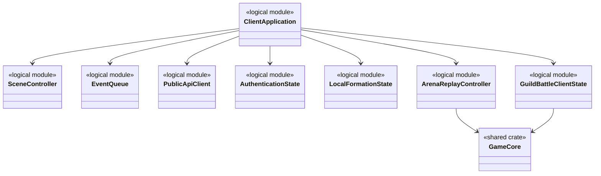
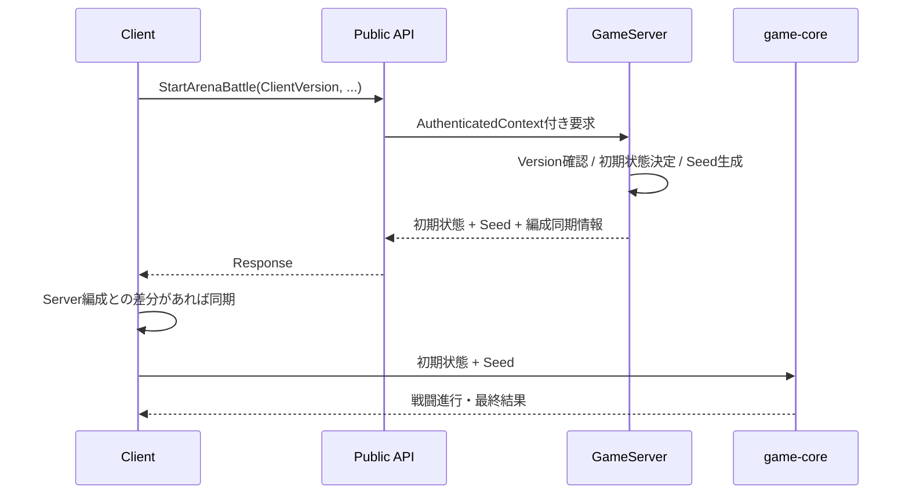
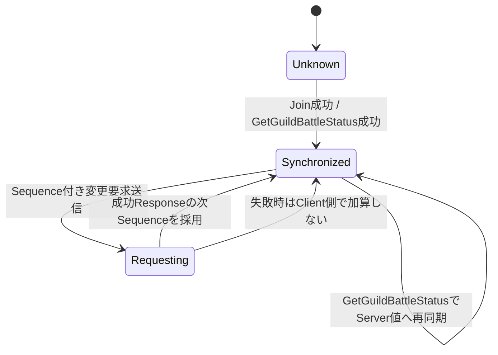

# Clientプログラミング設計

## 結論

Clientは、画面・入力・演出、Public API通信、認証状態、ログイン・サーバー未接続時のゲームプレイ制御、ローカル編成、キャラクター画像の割り当て、ArenaおよびGuildBattle殲滅戦闘再現、GuildBattle表示状態を担当します。

戦闘計算そのものはClient専用実装にせず、GameServerと同じ`game-core`とPRNG仕様を使用します。Serverが正本である状態をClient側で独自に確定しません。

## 論理構成



`logical module`は責務名であり、Rustの具体的な`struct`名を固定するものではありません。

## Web Client実行方式とブラウザ境界

- ClientはRust/WASM（`wasm32-unknown-unknown`）を対象とし, iPhone Safari/PWAおよびAndroid Chrome/PWA上で動作させます。
- ブラウザとの接続には`wasm-bindgen`, `web-sys`, `js-sys`, `wasm-bindgen-futures`を使用します。Browser APIのPromiseは`wasm-bindgen-futures`を用いてRustの`Future`と連携させます。
- 描画基盤として汎用2Dエンジンを追加せず, WebGL 2を`web-sys`経由で使用する独自スプライトバッチレンダラーとします。
- Rust側の共有`game-core`および既存のProtocol Buffers生成型`protocol`の責務は維持します。既存の`prost`とこれらの内部crateは, 選定資料の「5クレート」に含まれないため削除しません。
- ClientとPublic API Server間の通信方式はHTTP/2 over TLS 1.3, API PayloadはProtocol Buffersとします。`SubscribeGuildBattleUpdates`はHTTP/2 Response streamを使用し, `GuildBattleScoreUpdate`をProtocol Buffers varint長prefix付きで受信します。WebSocketはPublic API通信方式として採用しません。ブラウザ側でこの通信仕様を利用する具体的なAPI・ライブラリは未確定です。

### 描画パイプライン

```text
OPFSのPNG → File / Blob → createImageBitmap() → WebGL 2 texImage2D()
            → 不要なImageBitmapをclose() → スプライトバッチ描画
```

- ブラウザでPNGをデコードし, 必要な画像をGPUへアップロードします。すべての展開済み画像をWASMヒープへ保持しません。
- 描画順とブレンド状態を保持しつつバッチ化し, draw callやJS/WASM境界の往復を削減します。テクスチャ共有・アトラス化・インスタンシング等の適用範囲は実測結果に基づき決定します。
- 使用終了時には`ImageBitmap.close()`と`deleteTexture()`によって不要な資源を解放します。
- GPUテクスチャ, WASMヒープ, ブラウザ内の一時メモリを別々に把握します。WebGL 2とCanvas 2Dの比較優位やFPS値は現時点で保証しません。

### HCAデコード・音声パイプライン

- HCAデコード候補は`cridecoder`（選定資料に記載された`0.3.6`）です。`default-features = false`を指定し, 不要なPythonバインディングを有効化しません。
- HCAからPCMへ変換した音声をWeb Audio APIへ渡します。短いSE/ボイスでは必要に応じて全体を`AudioBuffer`へデコードして再利用します。
- 長いBGM/ボイスはOPFSから必要な圧縮ブロックを読み, 小容量PCMバッファへ逐次デコードします。`AudioWorkletNode`へ`MessagePort`経由でPCMチャンクを供給し, `AudioWorkletProcessor`の小容量キューから再生します。
- `AudioWorkletProcessor.process()`内でHCAデコードや大容量のメモリ確保を行いません。制御側または専用Workerが先読みし, 音声出力側と役割を分離します。
- 先読みPCM量は固定せず実機計測で決定します。`SharedArrayBuffer`を利用する方式は初期実装では採用しません。
- HCAのiPhone Safari/WASMでのコンパイル・正しい再生・ピークメモリは未検証です。`cridecoder`は検証合格を最終採用条件とする候補であり, 動作確認済みとは記載しません。

### OPFSアセット管理

- ユーザーの初回フォルダ選択により取得したPNG/HCAファイルをOPFSへコピーします。元フォルダへの恒久的なアクセスや監視は行いません。GameServerから画像・音声アセットを配信しません。
- OPFSにバージョン別ディレクトリを設けます。新バージョンを検証してから使用先を切り替え, 取り込み中断から回復できる状態を保持します。
- `FileSystemSyncAccessHandle`はDedicated Worker上のOPFSランダムアクセスが必要な場合に検討する候補であり, 現時点では採用確定ではありません。不要なら非同期APIを使用します。
- 圧縮HCAファイル全体と全体PCMを同時に常駐させません。デコード済みPCM, GPU資源, WASMメモリは用途別に管理し, 不要な`AudioBuffer`の参照を解除します。
- OPFSへの**画像/音声ファイル本体**の保存は選定済みです。キャラクター画像の**割当情報**の保存先・保持期間・復元ルール, ファイルの上書き/削除規則, キャッシュクリア対象は引き続き未確定です。

### 依存・ビルド・検証条件

- Client用ブラウザ連携の選定crateは`wasm-bindgen`, `web-sys`, `js-sys`, `wasm-bindgen-futures`および採用検証を要する`cridecoder`です。`web-sys`は使用API単位でfeaturesを指定します。
- 描画用の`image`, `png`, `pix`, `wgpu`, `glow`, 汎用2Dゲームエンジン, オーディオ出力専用Rustライブラリは採用しません。
- `Cargo.lock`を保存して依存を固定し, `cargo tree --target wasm32-unknown-unknown`で推移的依存を確認します。`cargo build --target wasm32-unknown-unknown --release --locked`でビルドを検証します。
- 選定資料にある`opt-level = 3`, `lto = "fat"`, `codegen-units = 1`, `panic = "abort"`, `strip = "symbols"`は計測用のRelease設定案です。`opt-level = "z"`との圧縮後WASMサイズ・HCAデコード時間・初回ロード時間の比較を行い, 本番設定の最終値は検証後に定めます。
- 実機では40キャラクターと代表的エフェクトの描画, iOS長時間動作, 同時SE, BGM逐次再生, HCAループ・チャンネル数・サンプリングレート・暗号化有無・再生遅延・欠音, 依存のライセンス確認を実施します。合格閾値および検証結果は未定義・未記録です。

## ログイン・サーバー未接続時

- ログインの可否やServerへの接続可否と、接続不要なゲームプレイの可否を分離します。
- Arena、GuildBattleおよび他のServer通信を必要とする処理は、ログインできない場合またはServerに接続できない場合に利用を制限します。
- Serverを正本とする処理の状態や戦闘結果は、未接続時のClientだけで確定しません。
- オフライン時に利用できる個別のゲーム機能および必要なローカルデータの範囲は未確定であり、具体的な機能一覧は本設計で追加しません。

## タイトル画面のキャラクター画像割り当て

- タイトル画面にキャッシュクリアとアセット追加の操作を提供します。
- アセット追加ではプレイヤーが選択した画像をゲーム内キャラクターへ割り当てます。
- 画像・UVデータはClient側資産とし、Server用`ProcessedMasterData`の対象へ追加しません。
- PNG/HCAファイル本体の保存先はOPFSとし, 初回に選択したフォルダからコピーします。追加画像のうちPNG以外の対応形式, 容量・解像度制限, キャラクター割当情報の永続化・復元, 上書き・削除規則, キャッシュクリアの対象範囲は未確定です。

## 認証状態

Clientが扱う認証情報は以下です。

- `AccessToken`は通常Public APIのAuthorizationに使用します。
- `RefreshToken`はResponse Bodyへ返されず、`__Host-RefreshToken` HttpOnly CookieとしてPublic API Serverが設定します。
- RefreshTokenをClient JavaScriptから読み取る前提の実装にはしません。
- AccessToken失効後またはClient起動・再読込時のSession更新はRefresh APIを使用します。
- Logout後も発行済みAccessTokenは`exp`までは暗号学的には有効であるため、Client側だけでSession失効を正本化しません。

## Arena

Arena開始時、ClientはServerから返された初期状態とSeedを使用してローカルで戦闘を再現します。



### 編成同期

- Clientローカル編成とServer編成が一致する場合はその状態を使用します。
- 不一致の場合はServer編成を使用してArena戦闘を開始します。
- 戦闘計算結果をClientからServerへ正本として返す設計にはしません。
- `EnemyPlayerID`はランダム/フレンド共通でResponseから取得します。`BattleCharacterStatus.MaxHP`を使用し, 行動順でPlayerIDを使う際もClient側で相手IDを推定しません。

## GuildBattle

Clientが保持するGuildBattle状態は、画面表示および要求組み立てのためのClient側状態です。GameServerの状態を置き換える正本ではありません。

最低限、以下を追跡します。

- `GuildBattleID`
- 現在の`RequestSequence`
- Join時に同期した編成
- 現在HP、BP、最大BP、TP、最大TP
- Heal / Revive状態と残り時間
- 出撃待機状態
- Tactics使用回数および継続効果
- Item残数
- Guild Score、Chain、CBC状態

### 殲滅戦闘再現と騎士団情報通知

Arenaと同じ`game-core`・戦闘専用PRNGを使用して, 殲滅戦闘をGameServerと同じ入力で再計算します。`GuildBattleAnnihilationResponse`には戦闘開始時点の`OwnCharacters`/`EnemyCharacters`（最大HP含む）, `EnemyPlayerID`, `EnemyFormationID`, `BattleTacticsEffects`, `Seed`を含めます。自分のPlayerIDはJoin済みの本人PlayerIDを使用します。Own FormationはJoin時に同期済みの構成を使用します。相手の継続効果は, `EnemyTacticsID[]`ではなく`BattleTacticsEffects`のSource/Targetおよび取得済みMasterDataで判定します。

Clientの直近表示HPや継続効果を戦闘入力として補わず, Responseに含む戦闘開始時点の入力を使用します。出撃Responseの`Score`はGameServerの正本であり, Clientが計算した最終HP・勝敗・スコアでGameServerの状態を上書きしません。演出はこの戦闘再現結果を使用します。キャッスルブレイクResponseの`EventType`はキリ番CB, 強襲CB, CBCを区別します。

騎士団戦参加後に`SubscribeGuildBattleUpdates`で通知ストリームを開きます。初回および出撃後に届く`GuildBattleScoreUpdate`の`GuildBattleID`, `AllyScore`, `EnemyScore`, `Chain`, `ChainRemainingMilliseconds`を表示状態へ反映します。チェイン残り時間は受信時点のGameServerスナップショット（ミリ秒）であり, Clientは表示用のカウントダウンを行います。時間切れのみを契機とするServer通知はありません。ここでの`Ally`は受信者の所属騎士団です。要求元の出撃結果Responseとスコア通知は別経路で受信します。通知では`RequestSequence`を加算しません。開戦30:00でストリームを終了します（当該Playerの受付済み処理がキュー待ちなら完了後に終了）。ストリーム切断・再接続時は`GetGuildBattleStatus`を先に呼び, 現在値とSequenceを正本へ同期してから再購読します。

### RequestSequence



- 初回Join成功時にGameServerから現在RequestSequenceを受け取ります。
- 成功した状態変更要求ではServerが進めたSequenceへ更新します。
- 失敗要求ではClientが推測でSequenceを進めません。
- 再接続時は`GetGuildBattleStatus`の現在RequestSequenceを正として再同期します。
- `GetGuildBattleStatus`自体はRequestSequenceを消費しません。

### 出撃後の通信待機

仕様上、Client側には出撃通信中の二重操作を抑止する状態がありますが、この状態をGameServerの永続または戦闘状態として扱いません。

## Tactics再現

ランダム要素を持つTacticsは、GameServerがGuildBattle本体PRNGから生成したSeedを起点としてTactics専用PRNGを使用します。Clientも同じSeedと対象順序を使用して同一結果を再現します。

Seedが`0`かどうかだけでランダム要素の有無を判定しません。ランダム利用有無はMasterDataを正とします。

## Scene / Event Queue

画面遷移と演出処理はゲーム計算から分離します。

- SceneはAPI要求・表示状態・入力を管理します。
- 戦闘演出は計算結果をEvent Queue等へ変換して再生します。
- 演出完了タイミングによって`game-core`の乱数消費順や計算結果を変えません。

## メリット・デメリット

### メリット

- ClientとGameServerのArena再現性を共有ロジックで検証できます。
- UI/演出と計算を分離できるため、演出変更が戦闘結果へ影響しません。
- Server通信を必要としないゲームプレイをログイン状態・接続状態から独立して扱えます。
- GuildBattle再接続時にServer状態へ戻せます。

### デメリット

- ClientとGameServerで同一Versionのロジック・MasterDataを揃える必要があります。
- Client側表示状態はServer正本と重複するため、再同期処理が必要です。
- オフラインで利用できるゲーム機能, 画像のキャラクター割当情報の保存・復元規則やキャッシュクリアの対象範囲は未確定です。
- ブラウザごとのアセット取り込み可否・メモリ上限およびHCA/WASMの実機性能は未検証です。
- HTTP/2 over TLS 1.3のPublic APIおよびHTTP/2 Response streamをブラウザから利用する具体的な通信API・ライブラリは未確定です。

## 情報源

- `design/client/client.md`
- `design/client/scene_transition.md`
- `design/game/master_data.md`
- `design/game/master_data_pipeline.md`
- `design/server/api_payload.md`
- `design/server/arina.md`
- `design/server/guild_battle.md`
- `design/game/arina.md`
- `design/game/guild_battle.md`
- `design/game/pseudorandom.md`
- `design/shared/common_data_struct.md`
- `design/test/test_policy.md`
- 添付`rust_wasm_png_hca_library_selection(1).md`（2026-10-09）, 第1～7節.
- `design/system/network.md`（既存のPublic API通信方式）.
- `design/system/rust_dependencies.md`（Client依存の整理）.
