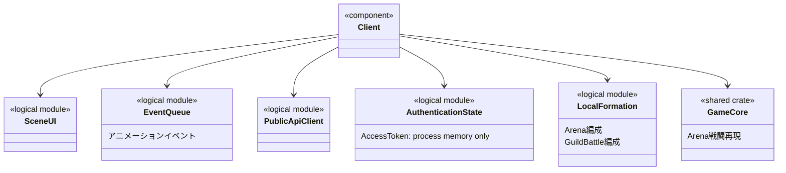
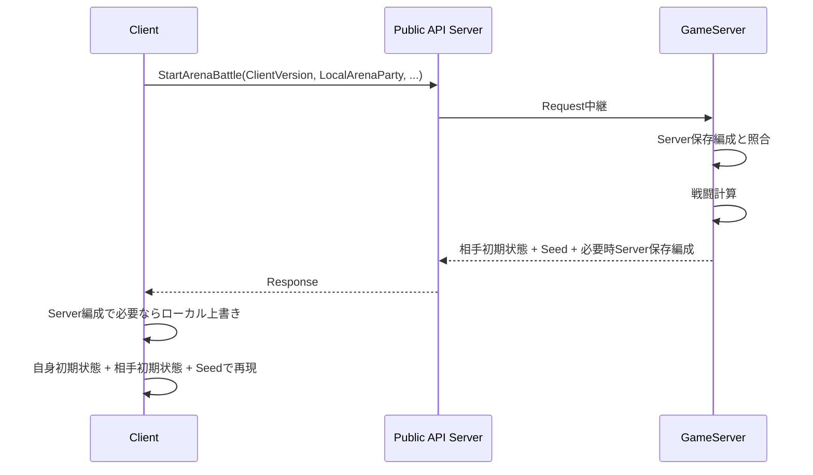

# Client大枠設計

## 結論

ClientはUI / Scene、イベントキュー、Public API通信、認証情報、ローカル編成、およびArena戦闘再現を主要責務とする。

Clientが戦闘結果の正本になることはない。

## 論理構成

```text
Client
├── Scene / UI
├── Event Queue / Animation
├── Public API Client
├── Authentication State
├── Local Formation
└── Arena Battle Reproduction
    └── game-core / PRNG
```

## 論理クラス図



図中の論理Module名は責務を示すための名称であり、具体的なClient Framework上のClass名を固定しない。

## Arena再現



## 認証情報

- AccessTokenはClientプロセスメモリ上だけに保持する。
- RefreshTokenはClient JavaScriptから読み取らず、`__Host-RefreshToken` HttpOnly Cookieを使用する。
- AccessTokenを保持していない起動時 / 再読み込み時は`RefreshAccessToken`を使用する。

## 未確定のため固定しない事項

- Native Client / Web Clientの選択
- Clientの具体的Framework
- Native Client以外を含む具体的HTTPライブラリ

## 情報源

- `design/client/client.md`
- `design/client/scene_transition.md`
- `design/game/arina.md`
- `design/system/rust_dependencies.md`
