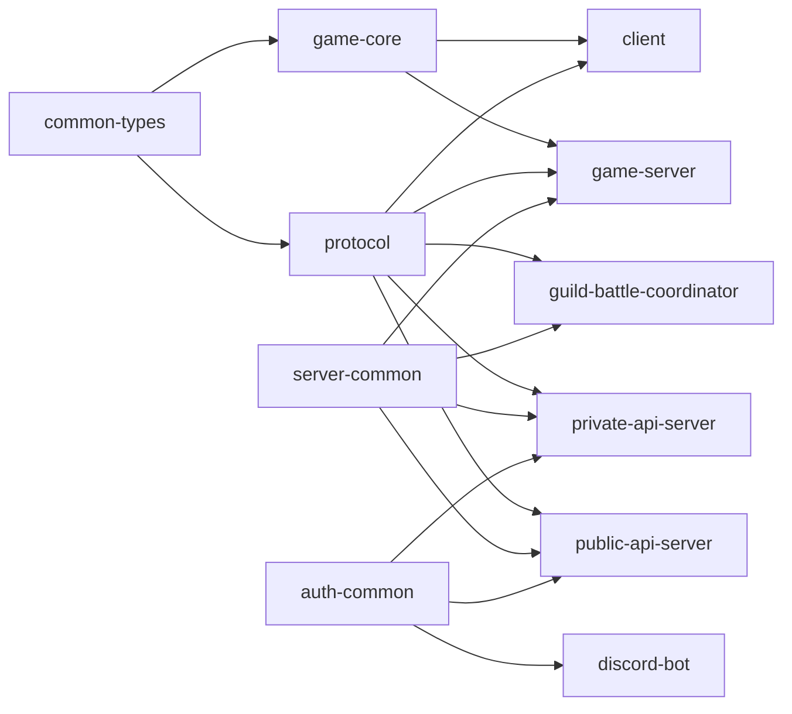

# 実装ディレクトリ構造

## 結論

資料で明示されている内部crateとComponent境界を、そのままWorkspaceの上位ディレクトリへ対応させる。

以下は**実装上の論理配置案**であり、未確定のゲーム仕様や通信仕様を追加するものではない。ファイル単位の詳細分割は固定しない。

```text
workspace/
├── crates/
│   ├── common-types/
│   ├── protocol/
│   ├── game-core/
│   ├── server-common/
│   └── auth-common/
│
├── apps/
│   ├── client/
│   ├── public-api-server/
│   ├── private-api-server/
│   ├── game-server/
│   ├── guild-battle-coordinator/
│   └── discord-bot/
│
├── tools/
│   └── master-data-pipeline/
│
├── proto/
│   ├── public_api.proto
│   └── guild_battle_replay.proto
│
└── tests/
    ├── integration/
    ├── reproducibility/
    └── replay/
```

## `game-core`の大分類

ゲーム仕様書で独立して定義されている領域を論理Module境界として扱う。

```text
game-core/
└── src/
    ├── battle/
    ├── skill/
    ├── ability/
    ├── tactics/
    ├── status_abnormality/
    ├── formation/
    ├── follower/
    ├── party_rank/
    └── pseudorandom/
```

この一覧は責務分類であり、各Module内の型名やファイル数までは本設計で固定しない。

## Server側の大分類

```text
public-api-server/
└── src/
    ├── transport/
    ├── security/
    ├── rate_limit/
    ├── routing/
    ├── session_cookie/
    └── upstream/

private-api-server/
└── src/
    ├── authentication/
    ├── account/
    ├── guild/
    ├── arena_persistence/
    ├── guild_battle_persistence/
    ├── guild_battle_lifecycle/
    └── database/

game-server/
└── src/
    ├── arena/
    ├── guild_battle/
    ├── master_data/
    ├── private_api_client/
    ├── replay/
    ├── logging/
    ├── recovery/
    └── internal_api/

guild-battle-coordinator/
└── src/
    ├── matching/
    ├── assignment/
    ├── game_server_discovery/
    ├── capacity/
    ├── preload/
    ├── reconciliation/
    └── scale_out/
```

Public API Serverの内部Module名は`design/server/public_api_responsibility.md`で明示されている。その他は、各設計書に明示された責務をコードの論理境界として配置したものである。

## 依存制約



`game-core`からServer I/O、Database、HTTP、Kubernetesへの依存は置かない。

## メリット・デメリット

### メリット

- 資料に記載された責務境界とコード配置が一致する。
- Client / GameServerで共有するゲームロジックを一箇所に保てる。
- Public APIへDomain ruleが混入しにくい。
- Database直接接続の境界をPrivate APIへ限定しやすい。

### デメリット

- Workspace内のcrate / application数が増える。
- `common-types`や`protocol`変更時に複数Componentへ影響する。
- 責務境界を維持するため、短い処理でもComponent間通信が必要になる場合がある。

## 情報源

- `design/system/rust_dependencies.md`
- `design/server/public_api_responsibility.md`
- `design/server/private_api.md`
- `design/server/game_server.md`
- `design/server/guild_battle_coordinator.md`
- `specification/game/`配下
