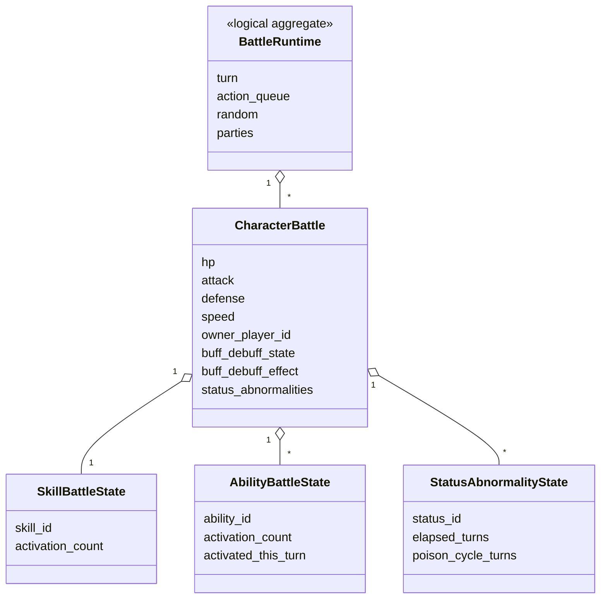
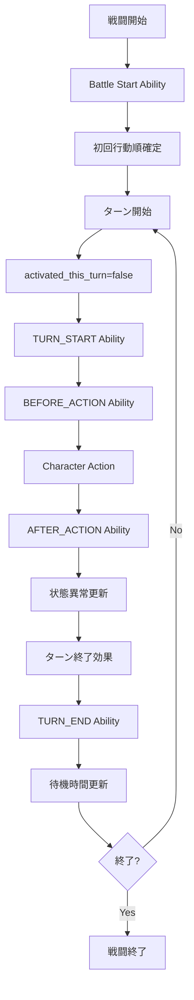

# 戦闘Runtime設計

## 結論

戦闘処理は「戦闘全体状態」「CharacterごとのRuntime状態」「PRNG状態」を明示的に持ち、仕様の処理順に従って1段階ずつ状態を更新します。

## 状態構成

`BattleRuntime`は論理Aggregate名です。内部フィールドのうち仕様に型がないものは実装型を固定しません。

## 戦闘フェーズ

初回だけ待機カウント更新前の全Character待機カウント0から行動順を確定します。

## Ability評価順

同一Character内ではAbilityスロット番号の小さい順です。

複数Characterが同時条件成立する場合は、速度、Formation内部値、PlayerIDの順で抽選対象リストの初期順序を確定し、その後仕様のPRNG抽選を使用します。

## Character Action

Character Actionは以下の大分類で実装境界を分けます。

1. Skill発動可否
2. Skill発動時のSkill Effect処理
3. 通常攻撃時のDRAW_AGGRO / Target list生成
4. COVER
5. Avoidance / Blindness / Status Abnormality Attack
6. Damage
7. Pursuit
8. Counter
9. Incapacitated Ability

Skill発動時は通常攻撃側のAvoidance、Counter、Cover、Draw Aggro、Pursuit処理へ入りません。

## Damage処理

通常攻撃系とSkill Damageを分離します。

- 通常攻撃、追撃、反撃: 通常Damage flow
- Attack Skill: Skill Damage flow

Damage乱数は対象・HITごとに個別取得します。

## 状態更新規則

- Buff / Debuff実値更新後に`BuffDebuffState`を更新します。
- 同一状態異常の再付与時は`elapsed_turns`を初期化します。
- 毒の`poison_cycle_turns`は仕様どおり独立管理します。
- 毒ダメージでHP0になった場合は戦闘不能時Abilityを発動しません。

## 情報源

- `design/game/battle.md`
- `design/shared/types.md`
- `specification/game/battle.md`
- `specification/game/skill.md`
- `specification/game/ability.md`
- `specification/game/status_abnormality.md`
