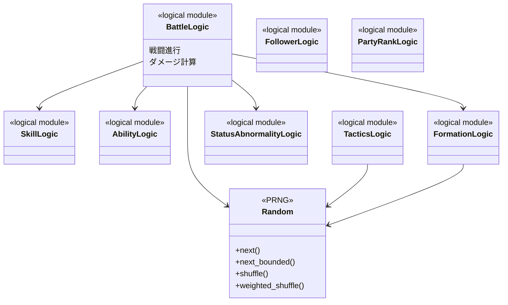
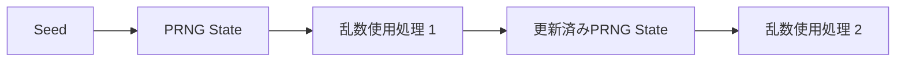

# game-core大枠設計

## 結論

`game-core`はClientとGameServerが共有する、外部I/Oを持たないゲーム計算層とする。

戦闘結果の正本はGameServerであるが、ArenaではClientが同一初期状態・Seed・同一Versionのロジックを使用して同じ戦闘を再現するため、戦闘計算とPRNGを共有する。

## 論理Module

```text
game-core
├── battle
├── skill
├── ability
├── tactics
├── status_abnormality
├── formation
├── follower
├── party_rank
└── pseudorandom
```

各Module名は`specification/game/`および`design/game/`に定義されている領域へ対応する。

## 論理クラス図

以下の図は具体的なRust型名を確定せず、ゲームロジック同士の依存関係を示す。



図中の`BattleLogic`等は責務の表示名であり、実装時の型名を仕様として固定するものではない。

## PRNG

PRNGは再現性要件の中心なので、ゲーム計算から暗黙に乱数を取得する構造にせず、同一Seedと同一消費順を維持できる境界を持たせる。



GuildBattleでは本体PRNG、出撃専用PRNG、ランダム要素を持つTacticsの専用PRNGなど、仕様で指定されたSeed生成と消費順を維持する。

## I/O境界

`game-core`へ以下を持ち込まない。

- HTTP / TLS通信
- PostgreSQLアクセス
- Kubernetes API
- Replayファイル書き込み
- System Log出力
- RecoveryファイルI/O

これらはGameServer / Client等の呼び出し側で処理する。

## メリット・デメリット

### メリット

- ArenaのClient / GameServer再現性を保ちやすい。
- 数式、状態遷移、PRNGの単体テストを外部I/Oなしで実行できる。
- Server実装詳細からゲーム計算を切り離せる。

### デメリット

- ゲームロジック変更時はClient / GameServer双方のVersion整合が必要になる。
- 外部状態を直接参照できないため、計算に必要な状態を入力として明示的に渡す必要がある。

## 情報源

- `design/system/rust_dependencies.md`
- `design/game/battle.md`
- `design/game/pseudorandom.md`
- `design/client/client.md`
- `design/test/test_policy.md`
- `specification/game/`配下
