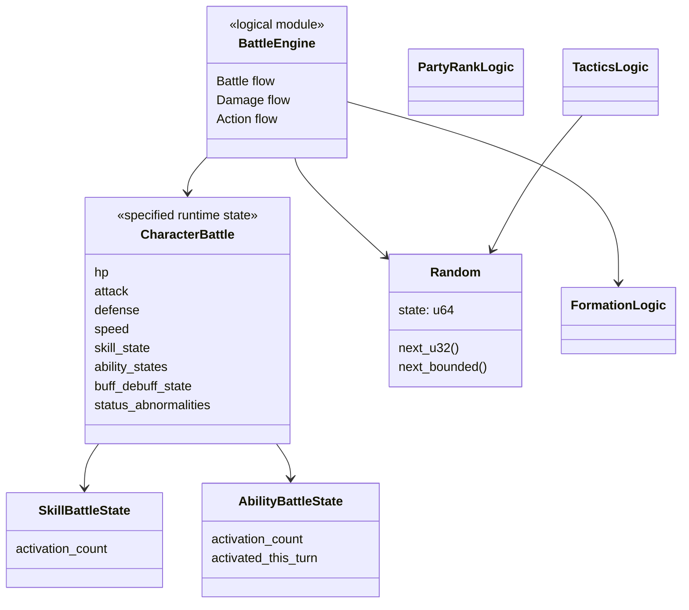

# game-core設計

## 結論

`game-core`はClientとGameServerで共有する、外部I/Oを持たない決定的ゲーム計算層とします。

戦闘結果の正本はGameServerですが、ArenaではClientが同一初期状態・Seed・Versionから同一結果を再現するため、戦闘ロジックとPRNGを共有します。

## Module構成

```text
game-core/src/
├── battle/
├── skill/
├── ability/
├── tactics/
├── status_abnormality/
├── formation/
├── follower/
├── party_rank/
└── pseudorandom/
```

## 論理クラス図



`BattleEngine`等は責務名で、具体的なRust型名を固定しません。`CharacterBattle`、`SkillBattleState`、`AbilityBattleState`、`Random`は既存資料に名称が定義されています。

## 入力と出力

`game-core`へ渡すものは、ゲーム計算に必要な初期状態、MasterData、Mode、Seed / Random状態です。

HTTP Context、Database Connection、System Clock取得、Kubernetes情報は渡しません。

## 戦闘状態

戦闘開始時に以下を初期化します。

- `SkillBattleState.activation_count = 0`
- 各`AbilityBattleState.activation_count = 0`
- 各`AbilityBattleState.activated_this_turn = false`

ターン開始時には全Abilityの`activated_this_turn`を`false`へ戻します。

## 効果状態の分離

`BuffDebuffEffectState`はSkill / Ability由来の攻撃・防御補正だけを保持します。FormationやTactics補正をこの状態へ混在させません。

`StatusAbnormalityState[]`は状態異常ごとの経過ターンと毒周期を保持します。

## I/O禁止境界

`game-core`へ以下を入れません。

- HTTP / TLS
- PostgreSQL
- Replay file
- Recovery file
- stdout / stderr
- Telemetry exporter
- Kubernetes API

## 情報源

- `design/game/battle.md`
- `design/game/pseudorandom.md`
- `design/shared/types.md`
- `specification/game/skill.md`
- `specification/game/ability.md`
- `specification/game/status_abnormality.md`
- `specification/game/formation.md`
- `specification/game/follower.md`
- `specification/game/party_rank.md`
