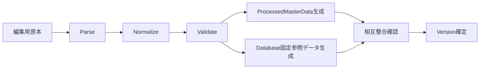

# MasterData Pipeline大枠設計

## 結論

MasterDataはRuntime Server内で場当たり的に変換せず、独立したPipelineでParse、Normalize、Validate、生成、相互整合確認を行う。

Character / Skill / Ability / Tacticsについては、同一の正規化済み入力から`ProcessedMasterData`とDatabase固定参照データを生成する。

## Pipeline

## 出力境界

### ProcessedMasterDataへ含めるもの

- CharacterMasterData
- SkillMasterData
- AbilityMasterData
- TacticsMasterData

### ProcessedMasterDataへ含めないもの

`FORMATION` / `FORMATION_POSITION` / `ITEM`はDatabase上の固定参照データとして扱う。

## 原本形式

編集用原本の具体的な形式は資料で固定されていないため、本設計ではCSV、JSON、Spreadsheet等のいずれかへ固定しない。

## Versionとの関係

GuildBattle Replayの`Version`はゲームロジックとMasterDataの組み合わせを一意に識別する。

MasterData変更をゲーム挙動へ反映する場合は対応Versionを更新し、Client / GameServerへ同一Versionとして反映する。

## 情報源

- `design/game/master_data.md`
- `design/game/master_data_pipeline.md`
- `design/server/data_base.md`
- `design/system/guild_battle_replay.proto`
