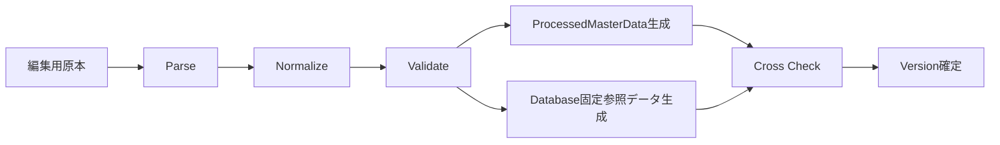
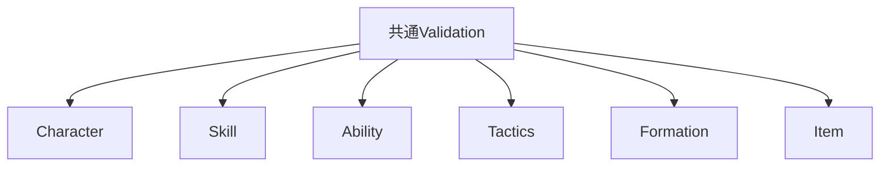

# MasterData Pipeline設計

## 結論

MasterDataは独立PipelineでParse、Normalize、Validate、生成、Cross Checkを実行します。Runtime側で不正データを補正して継続する設計にはしません。

## Pipeline

## ProcessedMasterData

含めるもの:

- `CharacterMasterData`
- `SkillMasterData`
- `AbilityMasterData`
- `TacticsMasterData`

含めないもの:

- `FORMATION`
- `FORMATION_POSITION`
- `ITEM`
- Player / Guild等の実行時可変データ

## Normalize

- トップレベルMasterDataをID昇順へ並べます。
- Tactics EffectはDatabase IDとProcessed Master上の`effect_index`の対応を決定的にします。
- 同一入力から常に同一生成結果を得られる順序へ正規化します。

## Validation層

最低限、以下をPipelineで拒否します。

- ID重複、予約値、存在しない参照
- 数値範囲外
- Enum不正
- Skill Effectと固有Dataの不一致
- Ability Effect / Condition / Targetと固有Dataの不一致
- Tactics Effect / Stage Effect / EndType / Battle Special組み合わせ不正
- Characterから存在しないSkill / Ability / Tactics参照
- Formation / Itemの仕様不整合

## Cross Check

Character / Skill / Ability / Tacticsは同じ正規化済み入力からProtocol Buffers版とDatabase版を生成し、内容の一致を確認します。

## Version

VersionはゲームロジックとMasterDataの組み合わせを一意に識別します。Replayでは記録済みVersionに対応する組み合わせを使用します。

## 未固定事項

編集用原本の形式は仕様で固定されていないため、本設計でもCSV / JSON / Spreadsheet等へ固定しません。

## 情報源

- `design/game/master_data.md`
- `design/game/master_data_pipeline.md`
- `design/server/data_base.md`
- `design/shared/types.md`
- `design/test/test_policy.md`
