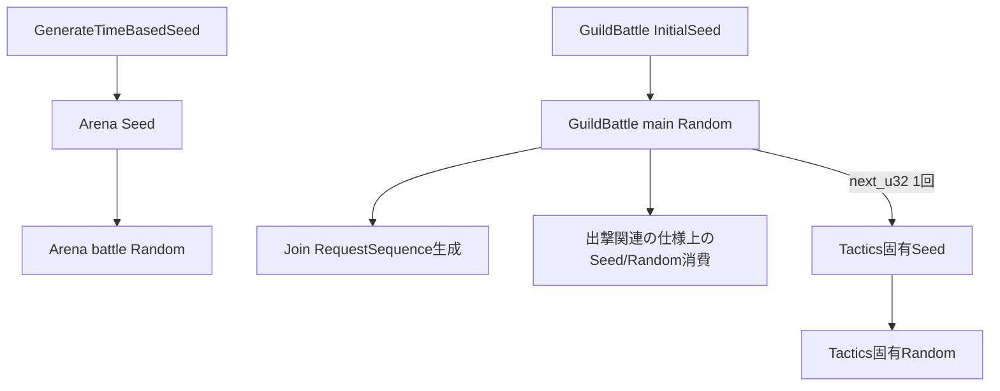

# 疑似乱数設計

## 結論

PRNGは仕様定義済みの`Random`を唯一の共通実装とし、乱数消費順をゲーム状態の一部として扱います。

## Random

仕様では`state: u64`を持ち、`next_u32()`と`next_bounded(bound)`が定義されています。生成式・定数・初期化手順は`design/game/pseudorandom.md`をそのまま正本とします。

プログラミング設計側で別の乱数ライブラリへ置き換えません。

## Randomの種類

## 時刻ベースSeed

GameServerとCoordinatorの固定シード値は`202205311459`です。

`GenerateTimeBasedSeed`は「固定シード値 XOR UNIX epochからのマイクロ秒時刻」を返します。

- Arena開始Seed: GameServer
- GuildBattle matching Seed: Coordinator

## Tactics固有Random

ランダム要素を持つTacticsでは、GuildBattle本体Randomから`next_u32()`を1回だけ取得し、`u64`へ拡張した値を専用Seedにします。

以降のTactics固有乱数は`Random::new(Seed)`からだけ取得します。

ランダム要素を持たないTacticsでは`Seed=0`を返します。Seedが0かどうかだけでランダム要素の有無を判定しません。

## 再現性ルール

- 候補リストの初期順序を仕様どおり固定してから抽選します。
- 乱数を使わない分岐でPRNGを消費しません。
- Damage乱数は対象・HITごとに取得します。
- Join初回だけRequestSequence生成で本体PRNGを消費し、再Joinでは消費しません。

## 情報源

- `design/game/pseudorandom.md`
- `design/server/game_server.md`
- `design/server/guild_battle.md`
- `design/server/guild_battle_coordinator.md`
- `specification/game/tactics.md`
- `design/test/test_policy.md`
