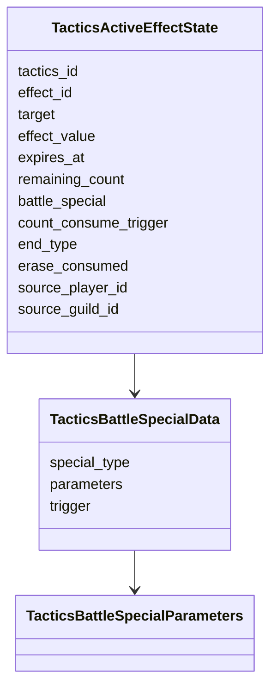
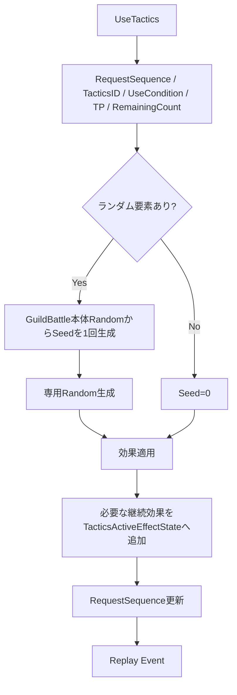

# Tactics Runtime設計

## 概要

Tacticsは「使用可否判定」「即時効果」「継続効果」「Battle Specialイベント適用」「固有Random」を分離して扱います。

## Runtime状態

継続効果の正本は`TacticsActiveEffectState`です。

## 使用処理

## Target Binding

`source_player_id`と`source_guild_id`を発動時に保持し、相対的な`TacticsTarget`を発動元基準で解決します。

`TACTICS_TARGET_OPPONENT_PARTY`は使用時点の特定Playerへ固定せず、出撃後に戦闘へ入った時点の相手Partyへ再Bindします。

## 終了方式

- `TACTICS_END_TYPE_DURATION`: `expires_at`の絶対時刻を保持します。
- `TACTICS_END_TYPE_COUNT`: `remaining_count`と`count_consume_trigger`を保持します。
- `TACTICS_END_TYPE_ON_ACTIVATION`: 発動時効果として扱います。

残り秒数の定期減算を正本にしません。

## Battle Special

GuildBattle中の出撃判定、Castle Break判定、戦闘開始、迎撃、敵全滅、Score反映、出撃完了など、仕様に定義されたイベント位置で有効効果を評価します。

数値パラメータ統合は仕様の「同系列加算後、異系列乗算」を使用し、速度だけは系列に関係なく加算します。被弾重みは仕様上の例外式を使用します。

## 参照資料

- `specification/game/tactics.md`
- `design/game/battle.md`
- `design/server/guild_battle.md`
- `design/shared/types.md`
- `design/game/master_data.md`
