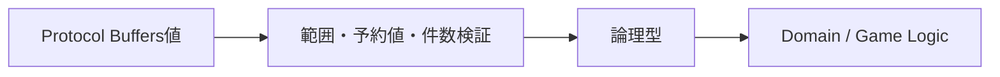
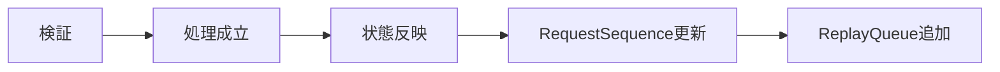

# 実装横断ルール

## 概要

複数Componentにまたがる実装で最も重要なのは、正本・順序・再現性・冪等性をコード上でも曖昧にしないことです。

## 1. 論理型を境界で検証する

wire型をそのままDomain値として使用しません。

- Protocol Buffersの`uint32`で受信する`u8` / `u16`論理型は範囲検証します。
- ID予約値を通常IDとして受け付けません。
- Enumは仕様定義値だけを受け付けます。
- 固定要素数の`repeated`はApplication層で件数検証します。

## 2. 時刻は状態値として扱う

仕様で絶対時刻を保持すると定義されているものは、残り秒数を定期減算して正本にしません。

- `TacticsActiveEffectState.expires_at`
- Sessionの`expires_at`
- GuildBattleの`start_at` / `end_at`

表示用残り時間は現在時刻との差から算出します。

## 3. PRNGは暗黙取得しない

再現対象のロジックは、対象の`Random`状態を明示的に受け取って消費します。

- Arena: 時刻ベースSeedから戦闘専用PRNGを作成します。
- GuildBattle: 本体PRNGを保持します。
- Join成立: 本体PRNGを消費して初期`RequestSequence`を生成します。
- ランダムTactics: 本体PRNGから1回だけ`next_u32()`して専用Seedを生成し、その後は専用PRNGだけを使用します。

## 4. 成立した操作だけ状態を進める

GuildBattleでは、失敗した要求で`RequestSequence`を加算しません。成立した操作では状態反映後に`RequestSequence`を更新し、その後Replay EventをReplayQueueへ追加します。

## 5. Database更新は冪等Operationとして扱う

GuildBattle Lifecycleおよび騎士団戦中のDatabase状態変更は`X-Operation-ID`を必須とします。

同一論理操作では、初回送信・1回再試行・Recovery再送のすべてで同じ128bit UUIDを使用します。

## 6. Request処理順を変更しない

GameServerが受信する要求は先に到達した順に処理します。完全に同時と扱われる要求同士は処理系定義であり、乱数で順序を決めません。

## 7. Replayと通常Logを分離する

Replay Eventは破棄しません。System Log Queueは高負荷時に`DEBUG` / `INFO`を破棄可能です。したがって同じQueueや同じBackpressure規則へ統合しません。

## 8. Domain Validationは正本Componentで再評価する

Public APIで形式検証やToken検証を行っていても、Private API / GameServerは現在状態に基づくDomain判定を自分で行います。

## 参照資料

- `design/shared/types.md`
- `design/server/public_api_responsibility.md`
- `design/server/guild_battle.md`
- `design/server/data_base.md`
- `design/system/log.md`
- `design/game/pseudorandom.md`
- `specification/game/tactics.md`
