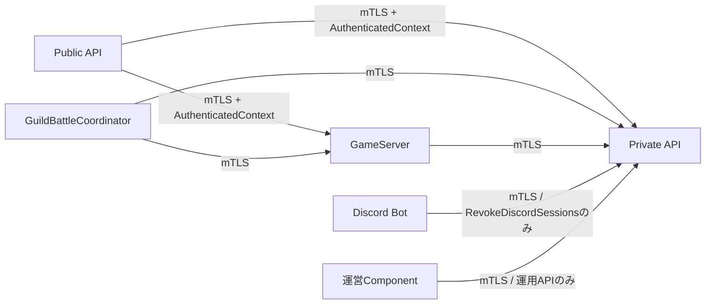
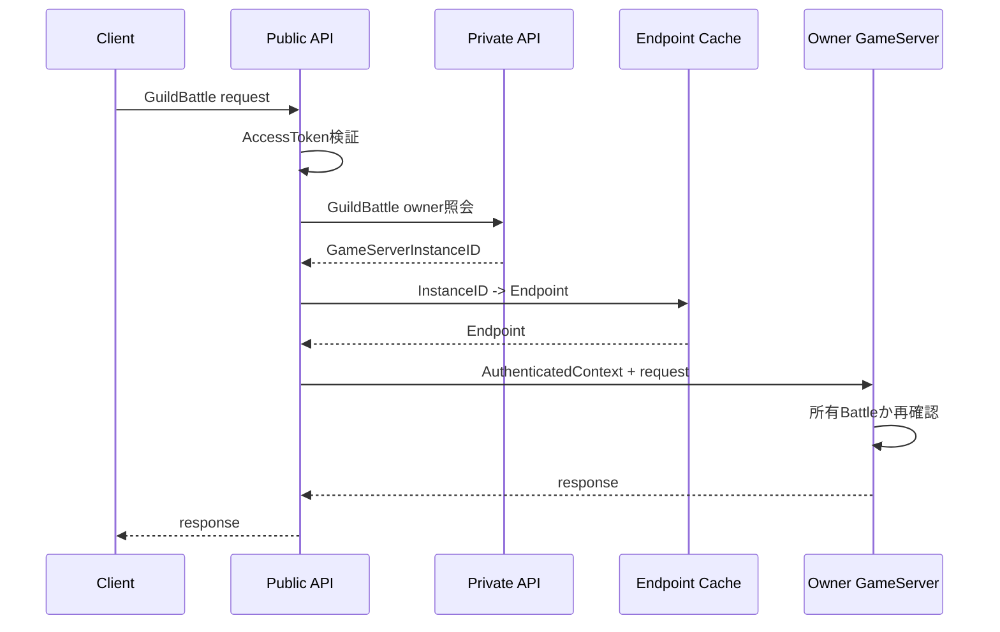

# API境界設計

## 結論

外部通信はPublic API Serverを唯一のClient向け境界とし、内部処理は責務の正本Componentへ中継します。Private API、GameServer、GuildBattleCoordinator間はPrivate Networkだけを信頼せずmTLSでService Identityを検証します。

HTTP Method、Path、gRPC service定義は現仕様で固定されていないため、本設計でも定義しません。

## Public APIのRouting

| API分類 | 主なAPI | 最終処理Component |
|---|---|---|
| Account / Session | CreateAccount, Login, RefreshAccessToken, Logout | Private API Server |
| Guild | CreateGuild, UpdateGuildLeadership, Apply/Approve Join, Invitation, LeaveGuild | Private API Server |
| Arena | UpdateArenaParty, StartArenaBattle | GameServer |
| GuildBattle | UpdateGuildBattleParty, Join, Status, Sortie, ScoreUpdate購読, Tactics, Item, Heal, Revive | 所有GameServer |

Public API Serverは認証・Boundary Validation・Rate Limit・Cookie処理・Routingを担当し、各Domainの成立可否は最終処理Componentが現在状態を用いて再判定します。

## 内部API境界

Private API Serverは呼び出し元Service Identityに応じて許可APIを制限します。Client入力からService Identityを構成しません。

## AuthenticatedContext

AccessTokenを必要とするPublic APIではPublic API ServerがToken検証後に以下を内部Contextへ変換します。

- `AccountID`
- `PlayerID`
- `SessionID`

ClientがPayload内へ指定したPlayerIDをCaller Identityとして扱いません。

## GuildBattle Routing

GuildBattle要求ではPublic API Serverが`GuildBattleID -> GameServerInstanceID`を解決し、Kubernetes Endpoint情報から所有GameServerへ直接中継します。

Public API側のOwner解決Cacheを実装する場合でも、Databaseの`GUILD_BATTLE.game_server_instance_id`が正本です。

## GuildBattle通知ストリーム境界

`SubscribeGuildBattleUpdates`は状態参照の認証付き長寿命HTTP/2 Responseストリームです。Public API Serverは認証と所有GameServerへのmTLS中継, 各接続への`GuildBattleScoreUpdate`（チェイン残り時間msを含む）フレーム転送・GameServerからの終了伝達だけを担当し, スコア・チェインを正本として保持しません。購読中のPlayerが当該GuildBattleIDにJoin済みであることはGameServerが判定します。通知フレームはProtocol Buffers varintサイズprefixで区切ります。HTTP Method/Pathは既存方針どおり未確定です。

## Payload

- Public API wire schemaは`design/system/public_api.proto`を正本とします。
- Payloadの意味・固定長・利用条件は`design/server/api_payload.md`を正本とします。
- Protocol Buffersの`uint32`で表す内部`u8`/`u16`等はBoundaryで範囲検証して論理型へ変換します。
- Public APIでHPを`uint32`として返す場合は、ゲーム側で0以上へClamp済みの`Float32`から小数点以下を切り捨てます。

## Operation ID

GuildBattle中の冪等DB更新で`X-Operation-ID`が必要な要求は、初回・Retry・Recoveryで同一UUIDを使用します。Transport側がRetryのたびに新規IDを生成してはいけません。

## エラー境界

- Domain Errorは正本Componentで決定します。
- Public APIは内部ErrorをPublic APIの`ApiErrorCode`へ変換します。
- Version不一致等、専用Responseが定義されている場合はそのPayloadを使用します。
- 未定義の内部情報や秘密情報をPublic Responseへ透過しません。

## 情報源

- `design/server/api.md`
- `design/server/api_payload.md`
- `design/server/public_api.md`
- `design/server/private_api.md`
- `design/server/public_api_responsibility.md`
- `design/server/game_server.md`
- `design/server/guild_battle_coordinator.md`
- `design/system/network.md`
- `design/system/public_api.proto`
- `design/shared/types.md`
