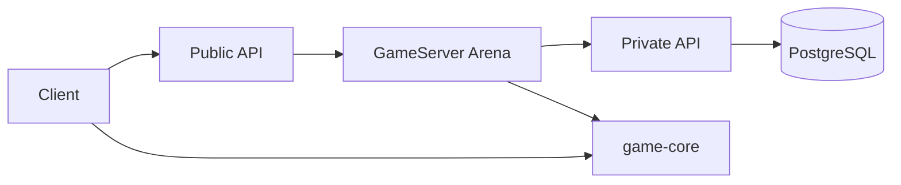
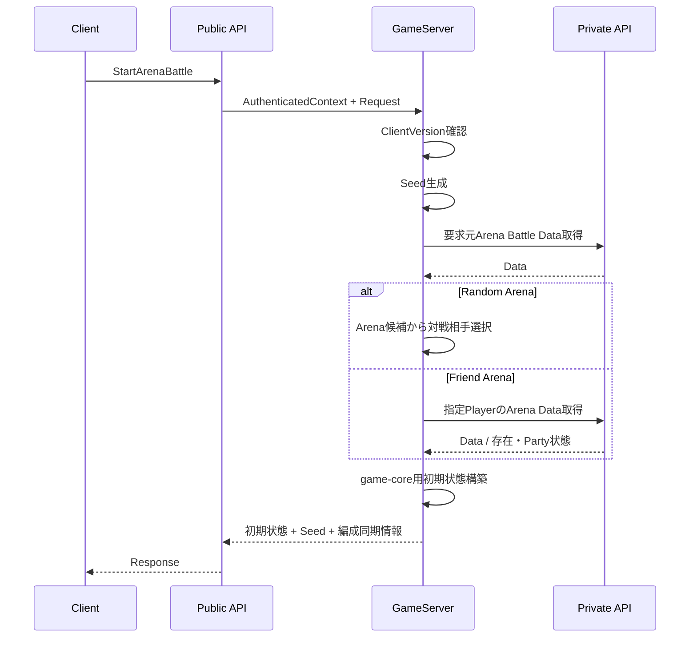

# Arenaプログラミング設計

## 結論

ArenaはGameServerが対戦相手・初期状態・Seedを確定し、Clientが同じVersionの`game-core`で戦闘を再現する構成です。GameServerでの初期状態決定とClient再現の境界を明示し、Server編成を正本として扱います。

## 責務分割

### GameServer

- `ClientVersion`確認
- 要求元Arena Party取得
- Random Arenaの候補選択
- Friend Arenaの指定Player確認
- 対戦相手Arena Party取得
- 初期Battle状態生成
- Seed生成
- Clientローカル編成との一致確認用情報返却

### Private API

- Arena Party永続化
- Arena Battle用永続データ取得
- Random候補構成に必要なPlayer情報取得

### Client

- Server初期状態への同期
- Seedと同一Versionのロジックによる戦闘再現
- 演出

## Arena Party更新

Arena PartyのValidationはGameServerでゲーム仕様に従って実行し、成立した編成だけをPrivate API経由で永続化します。

## 対戦開始

Seed生成・DB取得等の正確な処理順は`design/server/arina.md`を正とし、実装時に順序を変更しません。

## Candidate Cache

Random Arena候補をGameServer内で保持する場合、候補はArena Party登録済み通常Playerのみとし、System Dummy PlayerID `0`を含めません。

候補列の並びや抽選時の乱数消費順はArena設計を正とします。Cache更新頻度など、現仕様に明示されていない運用値は本設計で固定しません。

## Errorの分離

仕様で別Errorとして定義されている以下の状態を内部で同一Errorへ潰しません。

- 要求元PlayerのArena Party未登録
- Friend Arena対象Playerが存在しない
- Friend Arena対象PlayerのArena Party未登録
- ClientVersion不一致

## 再現性

ClientとGameServerで以下が同一なら、Arenaの戦闘結果が一致することを必須とします。

- Version
- 初期状態
- Seed
- MasterData
- PRNG実装
- 乱数消費順

## 情報源

- `design/server/arina.md`
- `design/game/arina.md`
- `design/client/client.md`
- `design/game/battle.md`
- `design/game/pseudorandom.md`
- `design/server/api_payload.md`
- `design/test/test_policy.md`
