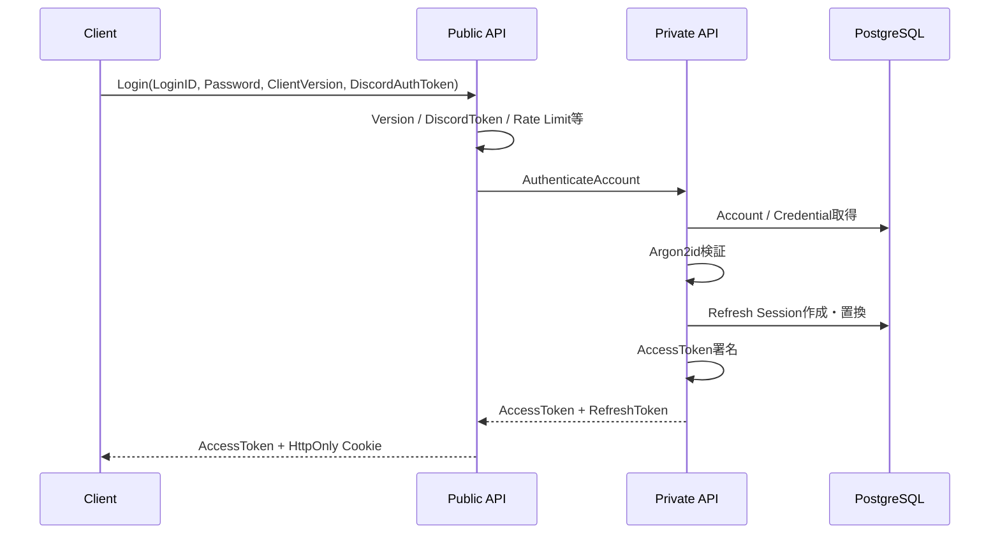
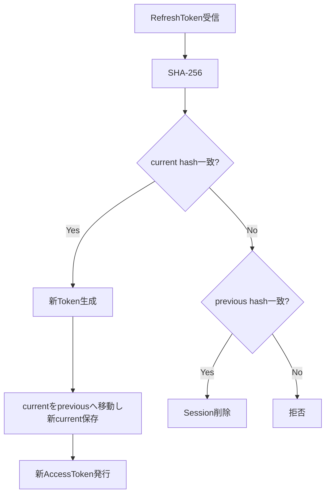

# 認証・Sessionプログラミング設計

## 概要

認証は、Public APIの署名検証とCookie境界、Private APIのCredential照合・Session永続化・Token発行へ分離します。AccessTokenとRefreshTokenは同じLifecycleとして扱わず、それぞれ仕様どおりの失効モデルを実装します。

## Key所有

| Key | 保持Component | 用途 |
|---|---|---|
| AccessToken署名秘密鍵 | Private API Serverのみ | Ed25519 JWT署名 |
| AccessToken検証公開鍵 | Public API Server | JWTローカル検証 |
| DiscordAuthorizationToken署名秘密鍵 | Discord Bot | Discord認可Token署名 |
| DiscordAuthorizationToken検証公開鍵 | Public API Server | Discord認可Token検証 |

AccessToken用KeyとDiscordAuthorizationToken用Keyは分離します。

## AccessToken

- JWT
- Ed25519
- `alg=EdDSA`
- 有効期間5分
- `iss`
- `aud=game-api`
- `sub=AccountID`
- `player_id`
- `sid=SessionID`
- `iat`
- `exp`

Public API Serverが署名・時刻・Audience・Bindingをローカル検証します。

## Refresh Session

1 Accountにつき有効なRefresh Sessionは1つです。

RefreshTokenは32 byteの暗号学的乱数として生成し、Databaseへ平文保存しません。保存値はSHA-256 Hashです。

Cookie条件は以下です。

- `__Host-RefreshToken`
- `HttpOnly`
- `Secure`
- `SameSite=Strict`
- `Path=/`
- `Domain`なし

Session有効期間は24時間で、RefreshしてもSessionの元の有効期限自体を延長しません。

## Login

## Refresh Rotation

並行Refreshで同じcurrent tokenが使用された場合、更新競合のうち1件だけを成功させます。previous tokenの再利用を検出した場合はSessionを削除します。

## Logout / Revoke

LogoutまたはSession revokeはRefresh Sessionを無効化します。

すでに発行済みAccessTokenについては、仕様どおり`exp`まではPublic APIの署名検証を通り得ます。毎要求Session DB照会による即時AccessToken失効機構は追加しません。

## Password

Password HashはArgon2idを使用し、仕様の最低設定を満たします。

- Memory: 19,456 KiB以上
- Iterations: 2以上
- Parallelism: 1以上

認証処理の同時実行数はBoundedにします。仕様にある推奨値をConfiguration初期値として使う場合も、仕様上の「推奨値」であることを保持します。

## Discord Authorization

`DiscordAuthorizationRequired=true`の場合、Account作成とLoginでDiscordAuthorizationTokenを要求します。

Tokenは以下の性質を持ちます。

- Ed25519署名
- AccessTokenとは別Key
- 有効期間5分
- `aud=game-discord-authorization`
- `jti`はUUID
- 使用済み`jti`を永続化し再利用を拒否

Role喪失時はDiscord BotからPrivate APIの`RevokeDiscordSessions`を呼び出します。

## Security Boundary

- PasswordとRefreshToken平文をLogへ出しません。
- JWT署名秘密鍵をPublic APIへ配置しません。
- Client supplied PlayerIDをAccessToken Subjectの代用にしません。
- RefreshTokenをResponse Bodyへ返しません。

## 参照資料

- `design/server/session.md`
- `design/server/public_api.md`
- `design/server/private_api.md`
- `design/server/public_api_responsibility.md`
- `design/server/data_base.md`
- `design/server/api_payload.md`
