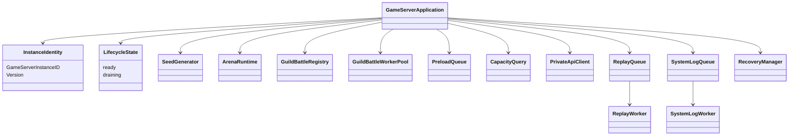
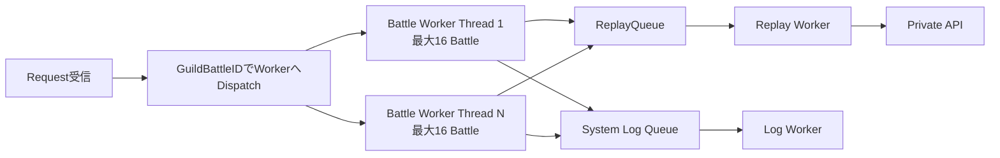
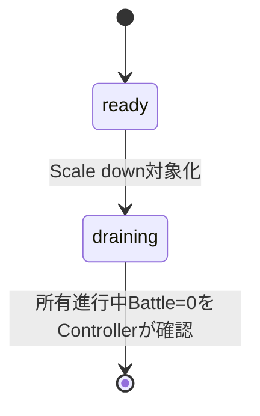

# GameServerプログラミング設計

## 概要

GameServerはArenaとGuildBattleのゲーム計算結果の正本です。Arena処理、GuildBattle所有状態、専用処理Thread、Replay / Log / Recoveryの非同期Worker、Private API Clientを明確に分離します。

## 論理構成



## Instance Identity

- 本番KubernetesではPod UIDを`GameServerInstanceID`として使用します。
- テスト環境ではProcess起動ごとに一意のUUIDを使用します。
- GameServerは自身の`Version`を保持します。
- Arena開始時とGuildBattle Join時にClientVersionを自身のVersionと再照合します。

## Seed生成

`GenerateTimeBasedSeed`は仕様どおり以下を使用します。

```text
fixed_seed = 202205311459
seed = fixed_seed XOR UNIX epoch microseconds
```

この固定値は仕様でコード内へ直接埋め込むと定義されています。本設計で別値へ置換しません。

## GuildBattle専用Thread

GuildBattleは16対戦を1単位として専用Thread上で処理します。

- CPUが扱えるThread数が4以下: 1 Thread
- 5以上: 最小1、最大`CPU Thread数 - 4`
- 1 Threadあたり最大16 GuildBattle



同一GuildBattleの状態を複数GameServerへ共有Memory同期しません。

## GuildBattle Registry

GameServerは自身へ割り当て済みのBattleだけを保持します。論理的には`GuildBattleID`からRuntimeと担当Workerを解決できるRegistryが必要です。

Registryが扱うのはGameServer上の実行状態であり、永続Ownerの正本はDatabaseの`GUILD_BATTLE.game_server_instance_id`です。

## StartGuildBattlePreload

処理境界は以下です。

1. Coordinatorから`ScheduledGuildBattle[]`を受信します。
2. 各BattleについてPrivate APIの`GetGuildBattleAssignment`を呼びます。
3. 自身がOwnerであることを確認します。
4. 既にPreload中・Preload済み・`in_progress`・`resolving`・`completed`なら二重生成しません。
5. 新規BattleだけをPreload Queueへ追加します。
6. 永続状態反映前と開戦時にもOwnerを再確認します。
7. Ownerが変更・解除済みなら保持データを破棄し、Lifecycle更新を要求しません。
8. `StartGuildBattle`成功時だけInitialSeed・Create Replay・`in_progress`が永続的に成立します。

`StartGuildBattlePreload`自体は再送可能な冪等処理です。

## Capacity

```text
GuildBattleCapacity = TotalGuildBattleThreadCount * 16
AvailableGuildBattleCount
    = max(0, GuildBattleCapacity - owned(scheduled + in_progress + resolving))
```

`preload_failed`と`completed`は容量へ含めません。

`AvailableGuildBattleThreadCount`は、対象状態のBattleを1件も担当していない完全に空きの専用Thread数です。Thread内に残枠があっても1件以上担当中なら空きThreadとして数えません。

`draining`では新規割当可能数を0として返します。

## ready / draining



- `ready`: 新規GuildBattle割当可能です。
- `draining`: 新規割当を停止しますが、所有中BattleへのPublic API要求は処理し続けます。
- CPU利用率だけで進行中Battleを所有するPodを削除しません。
- 異常終了した進行中Battleを別Instanceへ自動復旧する仕様はありません。

## Hot PathのI/O分離

GuildBattle専用Threadでは以下を同期実行しません。

- Protocol Buffers Replay Serialize
- Replay file書き込み
- `stdout` / `stderr`書き込み
- 外部Telemetry送信
- ReplayのDatabase保存完了待機

Replay Queueが満杯の場合だけ、Replayを破棄せず空きができるまで要求処理を待機します。System Log Queueの低優先Logとは異なる扱いです。

## Recovery起動処理

起動時に`/var/lib/game-server/recovery`を走査します。

`guild_battle_<GuildBattleID>_<GameServerInstanceID>.json`を検出した場合、保存順で元Private API要求を同一`X-Operation-ID`のまま再送します。全件成功したファイルだけ削除します。

Recoveryファイルの再送とGameServerが`ready`になる厳密な前後関係は現仕様に明示されていないため、本設計では追加しません。

## キャッシュ

GameServerは実行速度のためDB情報の一部をCacheできます。保持対象はID値と純粋ロジック用情報で、画像等のデータは持ちません。

Cacheは永続状態の正本ではなく、Domain判定で最新状態の確認が必要と仕様にある箇所はPrivate APIまたは自身のRuntime正本を使用します。

## 参照資料

- `design/server/game_server.md`
- `design/server/guild_battle.md`
- `design/server/guild_battle_coordinator.md`
- `design/server/guild_battle_lifecycle.md`
- `design/server/arina.md`
- `design/system/log.md`
- `design/system/network.md`
- `design/test/test_policy.md`
