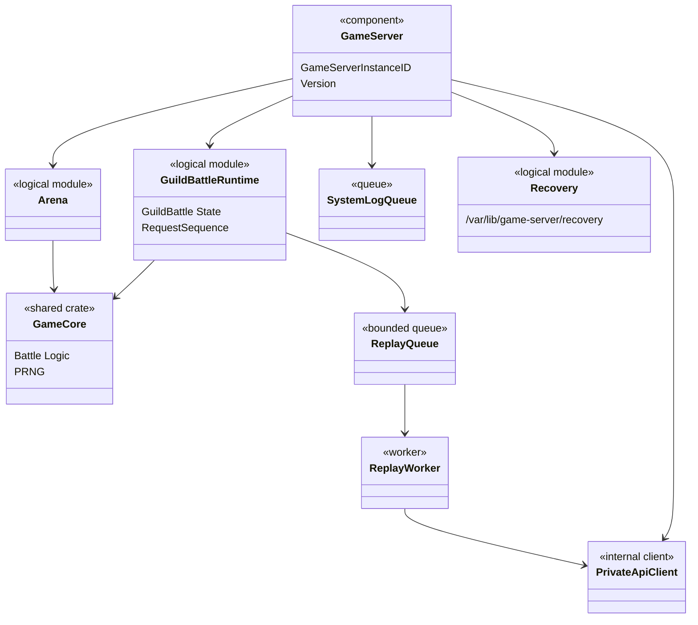
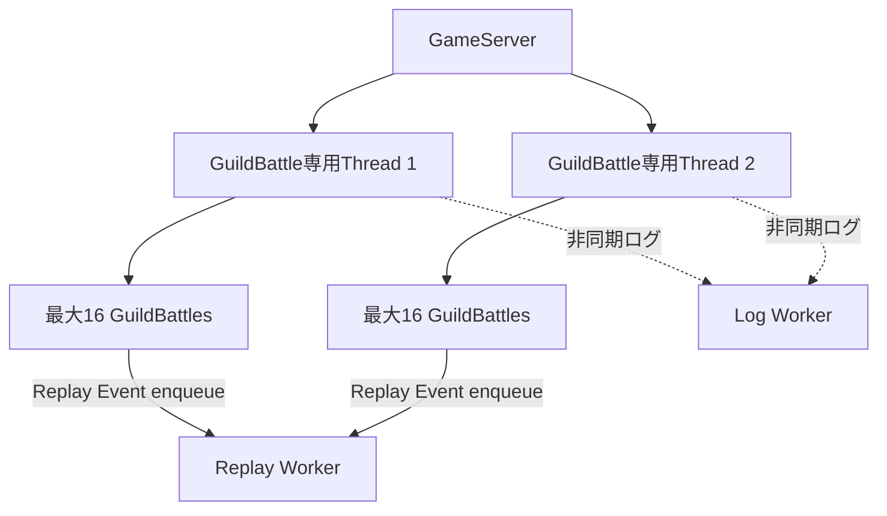
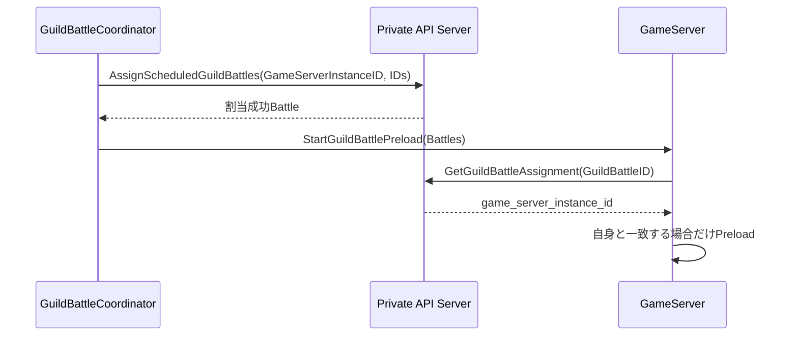

# GameServer大枠設計

## 結論

GameServerはArenaおよびGuildBattleのゲーム計算を担当し、GuildBattleについては割り当てられた対戦のメモリ状態を所有するstateful Componentとする。

## 論理構成

```text
GameServer
├── Arena
├── GuildBattle Runtime
├── game-core
├── MasterData
├── Private API Client
├── ReplayQueue / Replay Worker
├── System Log Queue / Worker
├── Recovery
└── Internal API
```

## クラス図



図中の`Arena`、`GuildBattleRuntime`等は論理境界の表示名であり、具体的なRust型名を固定しない。

## GuildBattle専用スレッド

1専用スレッドあたり16騎士団戦を処理単位とする。



専用スレッドでは、Replay Protocol Buffers Serialize、ファイル書き込み、`stdout` / `stderr`書き込み、外部Telemetry送信を直接行わない。

## GuildBattle所有権



`GUILD_BATTLE.game_server_instance_id`を割当の正本とする。

## ReplayとSystem Log

ReplayQueueとSystem Log Queueは分離する。

Replay Eventは状態反映と`RequestSequence`更新後にReplayQueueへ追加する。Replay Workerが成立順に読み出し、Replayファイル追記とPrivate API Server経由のDatabase保存を行う。

## Recovery

Database送信の初回失敗後、同一要求を1回だけ再試行する。再試行も失敗した場合はRecoveryファイルへ保存する。

GameServer起動時は`/var/lib/game-server/recovery`を走査し、保存済み`X-Operation-ID`を使用して保存順に再送する。全件成功時のみファイルを削除する。

## 情報源

- `design/server/game_server.md`
- `design/server/guild_battle.md`
- `design/system/log.md`
- `design/server/private_api.md`
- `design/server/data_base.md`
