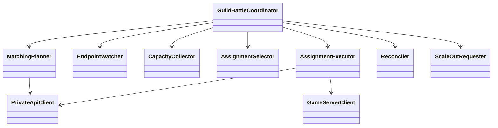
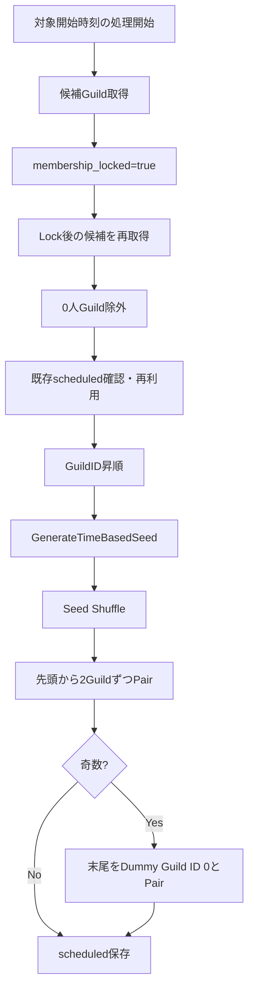
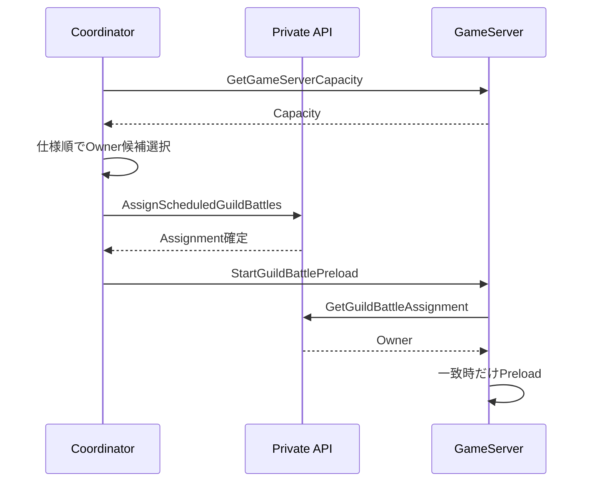

# GuildBattleCoordinatorプログラミング設計

## 結論

GuildBattleCoordinatorはGuildBattleのControl Pathだけを担当します。マッチング生成、GameServer検出、容量比較、割当、Preload開始指示、未割当`scheduled`のReconcile、Scale out開始判断を持ち、戦闘Runtime・RequestSequence・Replayは持ちません。

## 論理構成

## Replica / 永続状態

- CoordinatorはReplica 1です。
- Deployment更新は`Recreate`です。
- Databaseへ直接接続しません。
- 永続状態はPrivate API経由のDatabaseを正本とします。
- Coordinator MemoryはEndpoint / Capacity / LastAssignedAt等の制御用派生状態に限定します。

## 開戦前マッチング

開戦5分前の処理は以下です。

既存の同一対象`scheduled`がある場合の再利用規則はCoordinator仕様をそのまま実装します。

## GameServer Discovery

Kubernetes EndpointSliceを監視して割当候補GameServerを把握します。各候補へ`GetGameServerCapacity`を呼び出し、`ready`かつ割当可能なInstanceだけを比較します。

## 選択順

候補GameServerは仕様の順序で比較します。

1. `ready`
2. `AvailableGuildBattleThreadCount`が多い
3. `(TotalGuildBattleThreadCount - AvailableGuildBattleThreadCount) / TotalGuildBattleThreadCount`が低い
4. `LastAssignedAt`が古い
5. `GameServerInstanceID`昇順

比較ロジックは単一の純粋Comparatorとして切り出し、結合テストと単体テストの両方で固定します。

## 割当

DBのOwner確定前にGameServerのMemoryだけをOwner正本にしません。

## 容量不足

割当可能容量が足りない場合、CoordinatorがDedicated GameServer Scale ControllerへScale outを要求します。GameServer自身はScale outを要求しません。

Scale完了待機時間等、仕様で「推奨初期値」とされた値はConfigurationとして扱い、Domain定数として固定しません。

## Reconcile

Coordinator起動時および周期処理ではDatabase状態を再確認します。

- 未割当`scheduled`: 通常割当を試行します。
- 割当済み`scheduled`でOwner Endpointが一定時間見つからない: Assignment解放後に再割当します。
- `in_progress`以降: 自動再割当しません。

Endpoint不在判定時間について仕様の推奨初期値はConfigurationとして扱います。

## Preload Failed

`preload_failed`は自動的に通常対戦へ戻しません。運営判断に従います。

- 同一Pair再試行: `RetryPreloadFailedGuildBattle`で旧IDを`replaced`として保持し, 新IDの`scheduled`対戦を作成・割当
- 再抽選: GuildID昇順から新SeedでShuffleし、`RematchPreloadFailedGuildBattles`
- 中止: `CancelPreloadFailedGuildBattle`で`preload_failed -> canceled`およびMembership Lock解除を原子的に実行

再抽選では`PRELOAD_FAILED`のGuildBattleIDを昇順に並べて新Pairを対応させます。

## Coordinatorが保持しないもの

- GuildBattle戦闘状態
- Player HP / BP / TP
- RequestSequence
- GuildBattle本体PRNG状態
- Replay Event
- Database Transaction
- 進行中Battleの別Instance復旧状態

## メリット・デメリット

### メリット

- Schedulingと戦闘処理を分離できます。
- Coordinator再起動後もDatabaseから`scheduled`を再構築できます。
- GameServerが自己割当しないためOwner決定箇所が限定されます。

### デメリット

- Coordinator / Private API / GameServerの三者で割当確認が必要です。
- `in_progress`のInstance障害を自動再配置しないため、現仕様では運用対応が残ります。

## 情報源

- `design/server/guild_battle_coordinator.md`
- `design/server/game_server.md`
- `design/server/guild_battle.md`
- `design/server/guild_battle_lifecycle.md`
- `design/server/private_api.md`
- `design/test/test_policy.md`
