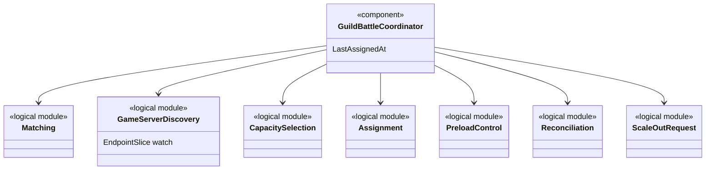
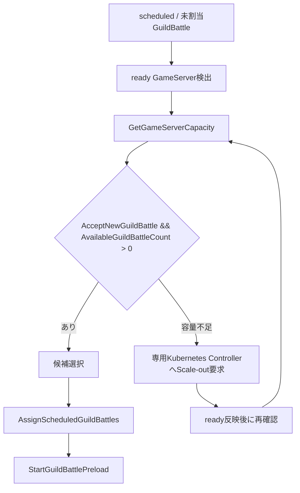
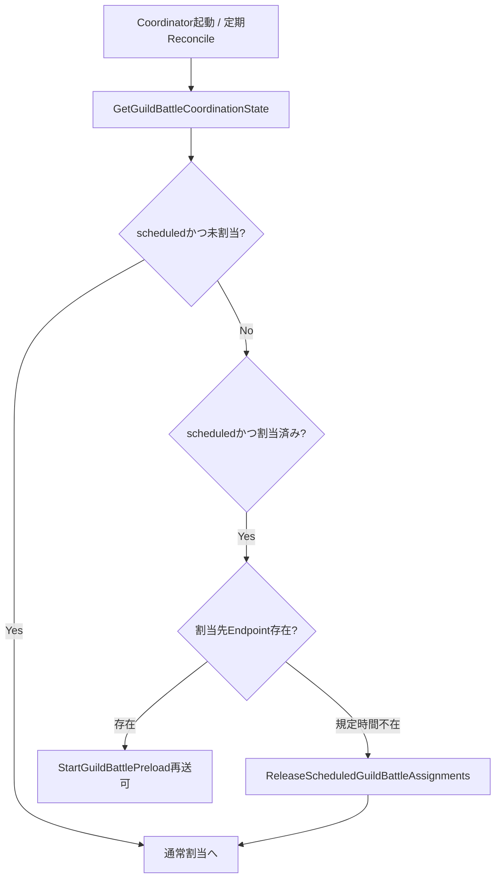

# GuildBattleCoordinator大枠設計

## 結論

GuildBattleCoordinatorはGuildBattleのControl Path専用Componentとし、生成、マッチング、GameServer選択、割当、Preload開始指示、再起動時Reconcileを担当する。

通常のClientゲーム要求、戦闘状態、RequestSequence、ReplayQueue、戦闘計算結果は保持しない。

## 論理構成

```text
GuildBattleCoordinator
├── Matching
├── Assignment
├── GameServer Discovery
├── Capacity
├── Preload Control
├── Reconciliation
└── Scale-out Request
```

## クラス図



各Module名は責務表示用であり、具体的なRust型名は固定しない。

## 割当フロー



候補選択では資料に定義された比較項目を使用する。推奨初期順序は`Ready判定 → 負荷判定 → Capacity使用率 → 最終割当時刻 → InstanceID`である。

## 再起動時Reconcile



`in_progress`以降はEndpoint不在を理由に割当解除・再割当しない。進行中GuildBattleを別GameServerへ自動復旧する方式は資料で定義されていないため、本設計でも定義しない。

## 情報源

- `design/server/guild_battle_coordinator.md`
- `design/server/game_server.md`
- `design/operation/operation.md`
- `design/test/test_policy.md`
