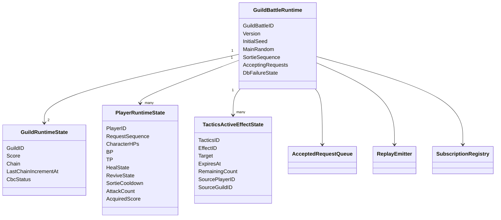
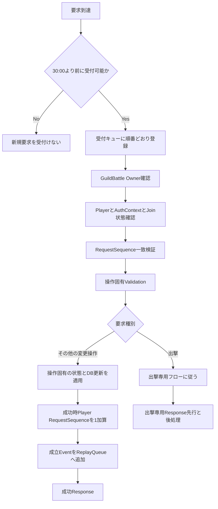
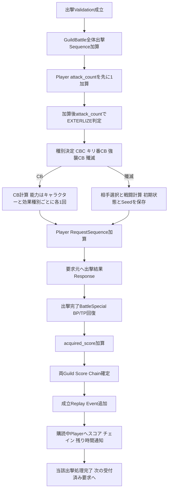
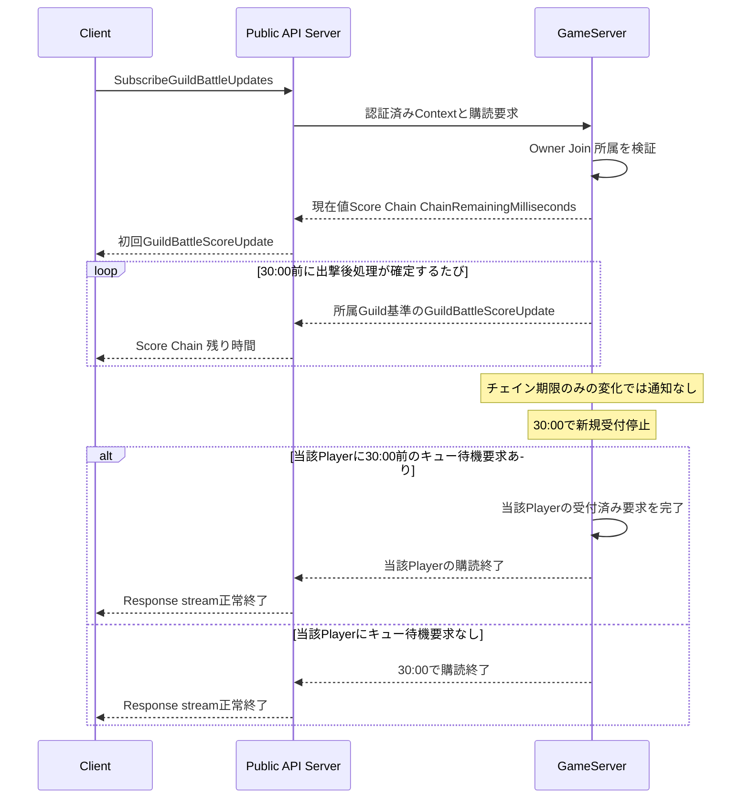
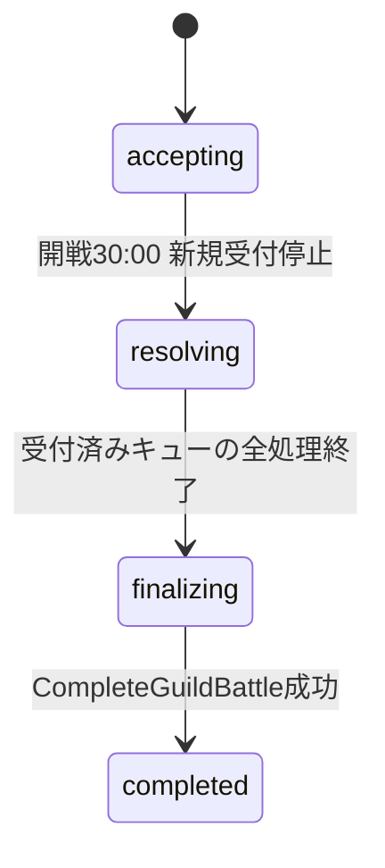

# GuildBattle Runtimeプログラミング設計

## 対象と正本

GameServerは`GuildBattleID`単位で1つのGuildBattle Runtimeを所有し, 受付済み状態変更要求を受信順に直列処理する. 戦闘・スコア計算の正本は`specification/game/`と`design/game/`, APIの入出力と処理順は`design/server/public_api.md`, `design/server/guild_battle.md`, `design/server/api_payload.md`を使用する. 本書では独自のゲームルールを定義しない.

`RequestSequence`はPlayerごとの要求順序であり, GuildBattle全体の出撃Sequenceとは異なる. 購読は読み取り専用で, いずれのSequenceも消費しない.

## Runtimeの状態と所有範囲



図は論理的な保持対象であり, 具体的なRustフィールド名・データ構造の新規規定ではない. Character, CBC, Heal, Revive, Tacticsの共有状態には`design/shared/common_data_struct.md`および`design/shared/types.md`の定義を用いる. `SubscriptionRegistry`はゲーム状態の正本ではなく, 認証済み接続の宛先と終了待ち状態だけを保持する.

## 初期化・Replay

PreloadではPrivate API経由でGuild / Member / Party / Item等の必要な情報を取得し, 開戦時の可変初期状態を`GuildBattleInitialSnapshot`へ固定する. InitialSeed, Version, GuildID, SnapshotのCreate Replayを最初のEventとする. `StartGuildBattle`成功時にCreate Replayの保存と`scheduled -> in_progress`を同一Database Transactionで確定する. Replay復元で現在のDatabaseの可変値を初期状態として使用しない.

成功した状態変更は成立順にReplay Eventとして記録する. Replayに記録するEventの意味と書式は`design/system/guild_battle_replay.proto`, 保存障害と再送は`design/system/log.md`を正とする.

## JoinとRequestSequence

初回Join成功時のみGuildBattle本体PRNGを1回消費し, 次を初期RequestSequenceとする.

```text
RequestSequence = main_random.next_bounded(1_000_000_000) + 1
```

Player間の数値重複は許す. 再Joinでは現在値を返し, PRNGを消費しない. Join成立順と初期Sequenceの消費はReplay対象. `ClientVersion`はGameServer Versionと照合し, Account Sessionは`ValidateAccountSession`で検証する. Client編成がPreload済みServer編成と一致しない場合, Server側をClientへ返して同期する.

## 受付・直列実行・共通Validation

GameServerが受信した要求は受信時刻の早い順に処理する. 完全同時の順序は処理系定義とし, 並び替えにPRNGを使用しない. 開戦30:00以降の新規状態変更要求は受付けないが, 30:00以前に受付キューへ入った要求は最後まで処理する.



失敗した操作はRequestSequenceを進めず, 成立Replay Eventを記録しない. **出撃は成功Responseを先行して返す特例**であり, 上図の「その他の変更操作」のReplay→Response順序を出撃に適用しない. DB更新を行う操作のTransaction / 冪等性 / RetryはPrivate API仕様を優先し, 共通処理で順序を変更しない. Clientの「通信中」表示状態をGameServerの独立したPlayer状態として追加しない.

## GetGuildBattleStatus

`GetGuildBattleStatus`はRequestSequence不要・Sequence不消費の状態参照で, 再接続時の正本同期に使用する. 現在HP, BP/最大BP, TP/最大TP, Heal/Reviveと残り時間, 出撃待機, Active Tactics Effects, Item残数, 両Guild Score, 所属Guild Chain, CBC, 現在RequestSequenceを返す. CharacterID, Follower, MainSkill, Ability, Formation等の静的編成はJoin時に同期済みのClient情報を利用し再送しない.

## 出撃専用処理



出撃種別は`GuildBattleSortieEventType`に従い, CBC→キリ番CB→強襲無効→強襲CB→殲滅の既定のフローで決める. `EX_DRIVE`, `SLASHER`, `ENDER_BREAK`のキリ番専用効果は`GUILD_BATTLE_SORTIE_EVENT_NUMBERED_CASTLE_BREAK`でだけ適用する. CB専用アビリティでは`ABILITY_EFFECT_BUFF`と`ABILITY_EFFECT_CASTLE_BREAK_DAMAGE_INCREASE`を独立に判定する. キャラクター1体につき各効果種別は当該CBで最大1度だけ判定し, 次のCBへ判定済み状態を持ち越さない. CB算式とフローは`specification/game/guild_battle.md`と`design/game/guild_battle.md`を正とする.

殲滅では`GuildBattleAnnihilationResponse`に戦闘開始時点の`OwnCharacters`, `EnemyCharacters`, `EnemyPlayerID`, `EnemyFormationID`, 戦闘に関係する`BattleTacticsEffects`, `Seed`を格納する. ClientはJoin時同期済み自身の編成とこの入力で同一`game-core`を実行する. 表示済みの古いHPやTacticsを流用せず, 関係しない継続効果・最終HP・行動履歴を追加送信しない.

出撃結果Responseは要求元へ先に送るが, その後のBattle Special回復, `acquired_score`, スコア・チェイン確定, Replay Event追加まで同一出撃の直列実行範囲とする. GameServerにおける騎士団合計スコアの正本はResponseの未切り捨て`SortieScore`ではなくRuntimeの確定済み`Score`である. 送信通知の失敗によって出撃を巻き戻さない.
出撃計算式はすべて`f32`で評価し, 出撃Responseの`Score`およびPlayerの`acquired_score`は`SortieScore`（`f32`）で保持する. 騎士団合計ptだけ, 1出撃ごとに小数点以下を切り捨てて`Score`（`u64`）へ加算する.


## 通知購読とチェイン残り時間

`SubscribeGuildBattleUpdates`はJoin済みPlayerの認証済みHTTP/2 Response streamで, `RequestSequence`を使用しない. 初回と出撃後処理確定時の`GuildBattleScoreUpdate`には, 受信者の所属騎士団基準の`AllyScore`, `EnemyScore`, `Chain`と`ChainRemainingMilliseconds`を含める. 送信時点の現在状態を正本として確定し, `ChainRemainingMilliseconds`は0～300000の`uint32`で表す.

- Chain=0または前回チェイン加算から5分が経過し加算不成立のままリセットされた場合は残り時間を0とする.
- その他は`max(300000 - (送信値確定時刻 - 前回チェイン加算時刻)[ms], 0)`とし, 5分ちょうどの加算はリセット判定に含めない.
- 同じPlayerの連続出撃など, チェイン値を加算しない場合は前回加算時刻を新たな加算時刻として扱わない.
- 時間経過だけでチェインが0になる場合に追加のPush通知は送らない. Clientのタイマー減算は表示用途だけであり, Serverチェイン値を確定しない.
- 接続断の通知履歴を再送しない. 再接続時には`GetGuildBattleStatus`の正本を先に同期し, 新しい購読の初回スナップショットで残り時間を取得する.



他Playerの処理待ちによって当該Playerの購読終了を延期しない. 30:00以前に受付済みの当該Playerの要求が複数ある場合は, そのPlayerの受付済み処理がすべて完了した時点で終了する. 所有GameServerは接続ごとの通知対象判定と終了指示を行い, Public API ServerはmTLSで中継する. 他GuildBattleの状態は購読者へ送らない.

## Tactics・アイテム・治療・復活

`UseTactics`成立時にはUseCondition・TP・残使用回数を確認する. Random要素ありの場合だけGuildBattle本体PRNGから専用Seedを1回生成し, `Random::new(Seed)`のTactics専用PRNGで固有抽選を行う. Random要素なしはResponse Seedを0とするが, Seedの数値からRandom使用有無を判定しない. Active Effectsは`TacticsActiveEffectState`として, 終了時刻・残回数・発動元PlayerID/GuildIDとともに保持する. DURATIONは絶対時刻, COUNTは`remaining_count`と`count_consume_trigger`を使用し, `OPPONENT_PARTY`は各出撃時の現在の対戦相手へ解決する.

Item使用はRuntimeの所持数・条件を検証し, 永続数の更新はPrivate API経由で`X-Operation-ID`の冪等性を適用する. BP50回復薬の日次配布はJST 0:00とする. 騎士団戦の最後の定刻は23:00開始で基本終了23:30だが, 遅延・障害時の競合を排除するものではないため日次アイテム配布とServerスナップショットの同期方式は未確定として固定しない. 酒場の`floor(酒場レベル / 3)`BP回復は専用UI操作として仕様化されたが, API・使用回数の集計主体・Runtime更新方式は未確定とする.

Heal / Reviveは仕様の状態遷移と待機時間に従う. Start, Cancel, Completeが成立した場合だけRequestSequenceを加算しReplayへ記録する. 出撃待機時間はHeal / Reviveとは独立して保持する. 具体的な状態と時刻処理は`specification/game/guild_battle.md`および`design/server/guild_battle.md`の各APIシーケンスを正本とする.

## 30:00受付終了と永続終了



30:00で新規受付を停止し, 待機要求のないPlayerの通知ストリームを終了する. 30:00以前にキューへ受付済みの要求はすべて処理する. 処理待ちのPlayerの購読だけを当該Playerの全受付済み要求完了時まで延長する. `BeginGuildBattleResolving`で永続状態を`resolving`にしてから受付済みQueueを解消し, 最終スコア・勝敗を決定する. `CompleteGuildBattle`成功時に当該対戦を`completed`へ更新する.

対戦Guildのmembership lockは当該騎士団戦の`completed`確定と同時に解除する. 除外Guildのmembership lockと除外一覧は, 元の`matching_target_date`/`matching_start_time`が同じ全対戦（再開で作成された新IDも含む）が`completed`・`canceled`・`replaced`の終端状態となったときに`CompleteGuildBattle`または`CancelPreloadFailedGuildBattle`のTransactionで解除・削除する. 別対戦が未完了の間は解除しない.

## DB障害・不変条件

騎士団戦中DB送信は初回失敗後に同じ要求を1回Retryし, 再失敗時はDB障害状態へ遷移して以後のDB送信を止めRecoveryへ保存する. Replay / Recovery fileの書込・再送は専用Workerの責務とし, 正本仕様は`design/system/log.md`と`design/server/guild_battle.md`を参照する. `CompleteGuildBattle`の失敗処理は別の専用規則を使用する.

- 1つの`GuildBattleID`を同時に複数のGameServerが所有しない.
- 成功したPlayerの状態変更だけでRequestSequenceを進める.
- Join再実行と状態参照・購読でGuildBattle本体PRNGを消費しない.
- 出撃を同じ受付Queueで直列に扱い, Response先行後の更新も次の出撃より前に完了する.
- Replay Eventは成立順で追加し, LiveとReplayで状態が一致する.
- 30:00以降は新規受付を増やさず, それ以前の受付済みQueueを最後まで解決する.

## 情報源

- `specification/game/guild_battle.md`
- `specification/game/ability.md`
- `specification/game/tactics.md`
- `design/game/guild_battle.md`
- `design/server/guild_battle.md`
- `design/server/guild_battle_lifecycle.md`
- `design/server/public_api.md`
- `design/server/api_payload.md`
- `design/shared/common_data_struct.md`
- `design/shared/types.md`
- `design/system/guild_battle_replay.proto`
- `design/system/log.md`
- `design/test/test_policy.md`
