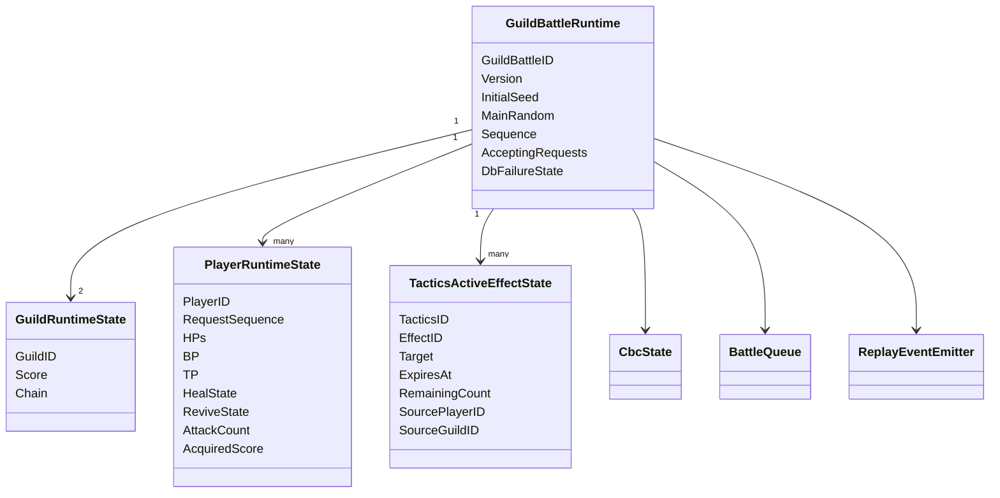
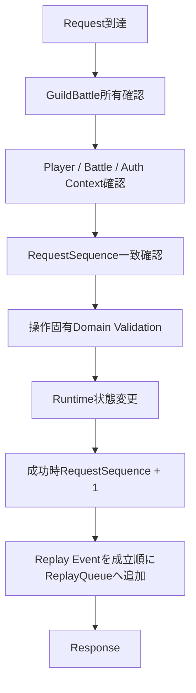
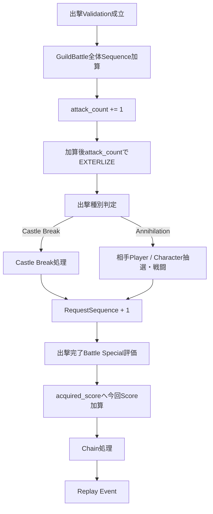
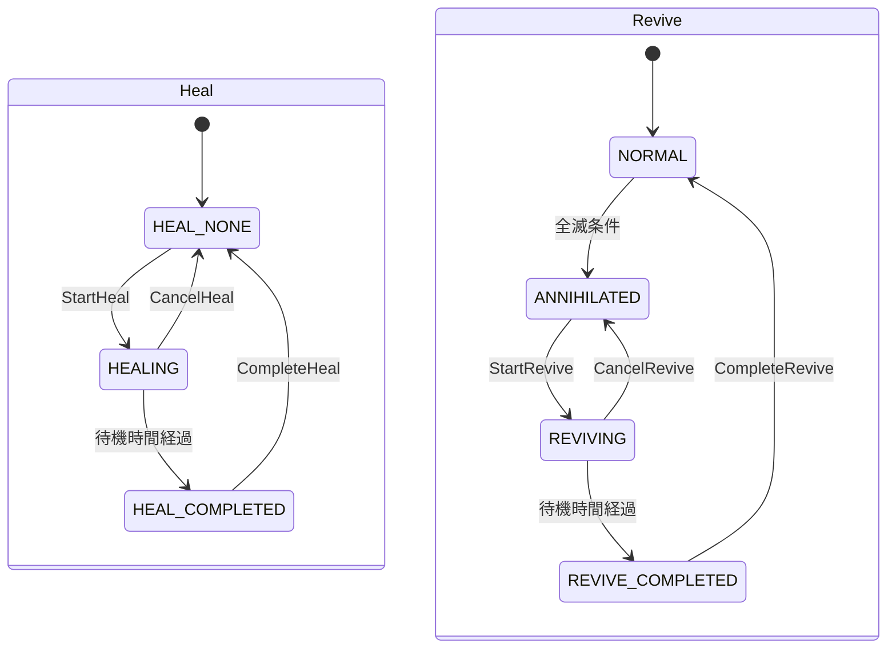
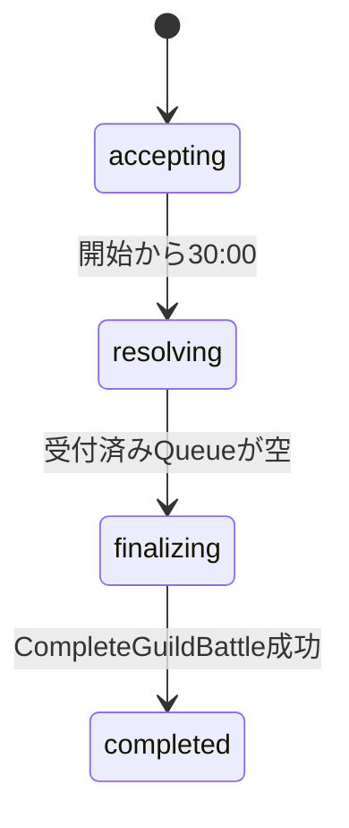

# GuildBattle Runtimeプログラミング設計

## 結論

GuildBattleは`GuildBattleID`単位の単一Runtime AggregateとしてGameServer内で所有し、要求を成立順に直列適用できる構造にします。RequestSequence、GuildBattle本体PRNG、Player Runtime、Tactics継続効果、Score / Chain / CBC、受付状態を同一整合性境界として扱います。

以下の図は「保持対象」を表す論理モデルであり、具体的なRust field名を固定するものではありません。

## Runtime Aggregate



`PlayerRuntimeState`の詳細な共有型は`GuildBattlePlayerRuntimeState`等の既存定義を使用します。

## 初期化

PreloadではPrivate API経由で必要なGuild / Member / Party / Item等を取得し、開戦時に確定した可変初期状態を`GuildBattleInitialSnapshot`へ保存します。

開戦時のInitialSeedとSnapshot、GuildID、Versionを含むCreate Replayが最初のReplay Eventです。`StartGuildBattle`成功によりCreate Replay保存と`scheduled -> in_progress`が同一Transactionで確定します。

Replay復元時は現在のDatabase可変状態を初期状態として使用しません。

## Join

初回Join成立時だけGuildBattle本体PRNGを1回消費します。

```text
RequestSequence = main_random.next_bounded(1_000_000_000) + 1
```

- Player間でRequestSequenceが重複しても構いません。
- 再Joinでは現在値を返し、PRNGを消費しません。
- Join成立順とPRNG消費はReplay対象です。
- Join時にClientVersionをGameServer Versionと比較します。
- `ValidateAccountSession`で24時間Session有効性を確認します。
- Local編成とPreload済みServer編成が異なる場合はServer編成を返して同期します。

## 状態変更要求の共通処理



操作失敗時はRequestSequenceを進めません。DB更新を伴う操作では仕様で定義された順序・冪等性を優先し、共通Pipelineで勝手に順序を入れ替えません。

## Request処理順

GameServerが受信した要求は先着順で処理します。

- 受信時刻が異なる場合は早い要求を先に処理します。
- 完全に同時と扱われる要求間は処理系定義です。
- 同時要求の順序決定にPRNGを使いません。
- Clientの「通信中」はServer Runtime状態として追加しません。

## GetGuildBattleStatus

再接続用の状態復元APIです。

入力にRequestSequenceを要求せず、実行してもSequenceを加算しません。以下の現在状態を返します。

- Character現在HP
- BP / 最大BP
- TP / 最大TP
- HealState / ReviveStateと残り時間
- 出撃待機時間
- Active Tactics Effects
- Item残数
- 両Guild Score
- Chain
- CBC状態
- 現在RequestSequence

CharacterID、Follower、MainSkill、Ability、Formation等の静的編成はJoin時に同期済みClient側情報を使用し、このAPIで再送しません。

## Sortie

成功する出撃の主要状態更新順は仕様上固定されています。



出撃種別判定の具体順序、相手抽選順、Damage等はゲーム仕様と`design/server/guild_battle.md`を正とし、本Runtime設計で再定義しません。

## Tactics

UseTactics成功時は以下を扱います。

1. Tactics利用可能性、UseCondition、TP、使用回数を確認します。
2. ランダム要素ありならGuildBattle本体PRNGの`next_u32()`を1回だけ消費してSeedを作ります。
3. `Random::new(Seed)`でTactics専用PRNGを生成します。
4. Tactics専用PRNGだけでTactics固有ランダム処理を行います。
5. 継続効果は`TacticsActiveEffectState`として保存します。
6. 成功時RequestSequenceを進め、Replay Eventを追加します。

ランダム要素なしはResponse Seedを`0`としますが、Seed値そのものからランダム利用有無を判定しません。

### 継続効果

- DURATION型は絶対時刻`expires_at`で終了判定します。
- COUNT型は`remaining_count`と`count_consume_trigger`で管理します。
- `source_player_id` / `source_guild_id`を発動時に固定し、相対Target解決へ使用します。
- `OPPONENT_PARTY`はActivation時点で特定Playerへ固定するのではなく、各出撃時の現在対戦相手へ解決します。

## Item

Item使用ではRuntime所持数と使用条件を確認し、Private API経由でPlayer Item永続値を更新します。GuildBattle中のDB変更としてOperation IDによる冪等化対象にします。

## Heal / Revive

HealとReviveは独立状態機械として実装します。



各開始・Cancel・Complete要求は成立時だけRequestSequenceを進めてReplay Eventを生成します。

出撃待機TimerはHeal / Reviveとは独立して保持します。

## 30分終了処理



30:00で新規要求受付を停止し、Private APIへ`BeginGuildBattleResolving`を要求します。すでに受付済みのQueueをすべて処理した後に最終Scoreと勝敗を決定し、`CompleteGuildBattle`で永続化します。

## DB障害状態

当該GuildBattleのDB送信で初回失敗後、同一要求を1回Retryします。再失敗時はDB障害状態へ移行し、それ以降のGuildBattle中DB送信を停止してRecoveryへ保存します。

Runtimeは「DB送信を継続してよいか」を判定できる状態を保持する必要がありますが、ファイルI/O自体は専用Workerへ分離します。

## 不変条件

最低限、実装内で以下を崩さない構造にします。

- 1 GuildBattleを1 GameServer Instanceだけが所有します。
- PlayerごとのRequestSequenceは成功操作だけで増加します。
- Join初回以外でRequestSequence生成用PRNGを消費しません。
- Replay Eventは成立操作だけを状態反映後に追加します。
- Replay Event順は成立順と一致します。
- GuildBattle本体PRNGとTactics専用PRNGを混同しません。
- 30:00以降は新規受付を増やしません。

## 情報源

- `design/server/guild_battle.md`
- `design/server/game_server.md`
- `design/server/api_payload.md`
- `design/server/guild_battle_lifecycle.md`
- `design/shared/common_data_struct.md`
- `design/game/guild_battle.md`
- `design/game/pseudorandom.md`
- `design/system/guild_battle_replay.proto`
- `design/system/log.md`
- `design/test/test_policy.md`
