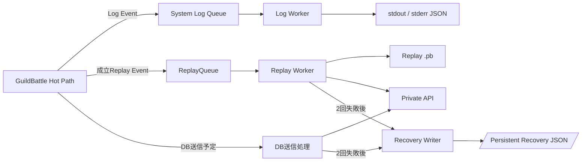
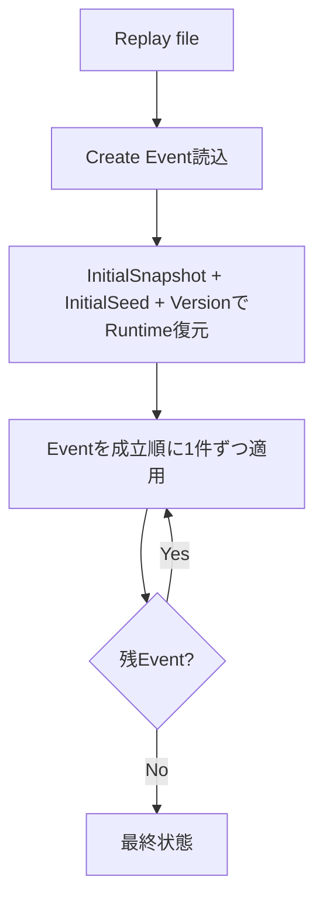
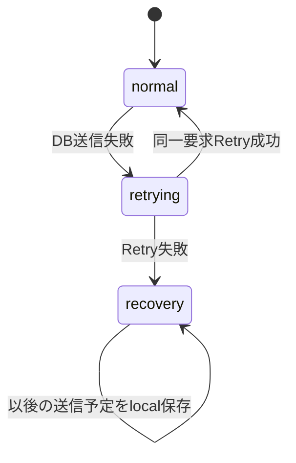

# Logging / Replay / Recoveryプログラミング設計

## 結論

System Log、GuildBattle Replay、DB Recoveryは目的と耐欠損性が異なるため、Queue・Worker・保存形式を分離します。GuildBattle Hot Pathは同期I/Oを行わず、Replayだけは欠損禁止としてQueue満杯時にBackpressureを許容します。

## 3系統の分離



## System Log Queue

- bounded queueです。
- GuildBattle専用Threadは構造化前Eventを追加するだけです。
- JSON Serializeと`stdout` / `stderr`出力はWorkerが行います。
- 本番`DEBUG` / `TRACE`は既定無効です。
- Queue高負荷時は`DEBUG` / `INFO`を破棄可能です。
- `WARN` / `ERROR`優先領域を確保します。
- 破棄件数はMetricで保持します。
- Log Queue待ちでGuildBattle Threadを停止させません。

正常なゲームルール拒否を要求ごとにLogへ出さずMetric集約します。

## ReplayQueue

- bounded queueです。
- 成立した操作だけを追加します。
- 状態反映とRequestSequence更新後に追加します。
- 追加順は処理成立順と一致させます。
- Eventを破棄しません。
- Queue満杯時だけ、空きができるまで要求処理を待機します。
- Replay WorkerがSerialize、file追記、Private API保存を担当します。

System Log Queueの大量発生でReplayを阻害しないよう、Queueを共有しません。

## Replay file

仕様のファイル名を使用します。

```text
./log/guild_battle/<生成時刻(YYYY_MMDD_HHMMSS)(JST)>_<GuildBattleID>_replay.pb
```

Formatは`GuildBattleReplayEnvelope`のlength-delimited Protocol Buffers列です。

- 各Message前にprotobuf varint長を付与します。
- JSONへ変換しません。
- `process_type`と`oneof payload`を対応させます。
- 最初のEventはCreate Eventです。
- Create EventにInitialSeed、Guild、`GuildBattleInitialSnapshot`、Versionを含めます。

## Replay復元



復元時は現在のDB可変値を初期状態として使用しません。

## Credential Redaction

以下はSystem Logへ出しません。

- Password
- AccessToken
- RefreshToken
- DiscordAuthorizationToken
- Cookie全体
- Authorization相当Header
- mTLS秘密鍵

Request/ResponseをLog化する場合は該当fieldを削除または固定文字列化します。

## Request / Trace ID

Public APIがRequest IDを生成します。Trace対象ならTrace IDも生成・伝播します。

Clientが指定したIDを正本にしません。

## Security Event集約

RequestSequence不一致や不正ID等の高頻度Security EventはMemoryで集約し、最初の発生と一定期間ごとのSummaryをSystem Log Queueへ流します。

集約期間等の「推奨初期値」は運用Configurationであり、設計上の不変定数にはしません。

## DB送信Failure State

GuildBattle中のDB更新またはReplay保存が失敗した場合、同一Operationを1回だけ再試行します。



Recovery状態では、それ以降の対象GuildBattle中DB送信を停止して送信予定データをlocal fileへ保存します。

## Recovery file

保存先:

```text
/var/lib/game-server/recovery
```

ファイル名:

```text
guild_battle_<GuildBattleID>_<GameServerInstanceID>.json
```

UTF-8 JSONに以下を保存します。

- 元Private API名
- `X-Operation-ID`
- Request Payload
- 保存順序

本番ではPersistent Volumeへmountします。

## Recovery再送

騎士団戦終了時およびGameServer起動時に保存順で再送します。

- 保存済みOperation IDを変更しません。
- 1件でも失敗した場合、fileを残します。
- 全件成功した場合だけfileを削除します。

Recovery file容量・file件数の仕様に記載された推奨値は監視・運用Configurationとして扱います。

## CompleteGuildBattle例外規則

CompleteGuildBattleは一般Recovery送信規則と別です。

- 初回失敗後、同一Operation IDで1回だけRetryします。
- Retryも失敗した場合、Error Logを保存します。
- 通知有効ならDiscord Botへ通知します。
- 原因調査・復旧は運営手動です。
- 完了Transactionが部分Commitされないことを保証します。

## Metrics

少なくとも仕様にある以下をCollectorへ渡します。

- API要求 / 拒否数
- GuildBattle処理時間
- RequestSequence不一致件数
- Owner不一致件数
- ReplayQueue要素数 / 高水位
- System Log破棄数
- DB送信失敗数
- Recovery file件数

PlayerID、GuildBattleID、Request ID等を高Cardinality Metric Labelにしません。

## 情報源

- `design/system/log.md`
- `design/server/game_server.md`
- `design/server/guild_battle.md`
- `design/server/data_base.md`
- `design/system/guild_battle_replay.proto`
- `design/operation/operation.md`
