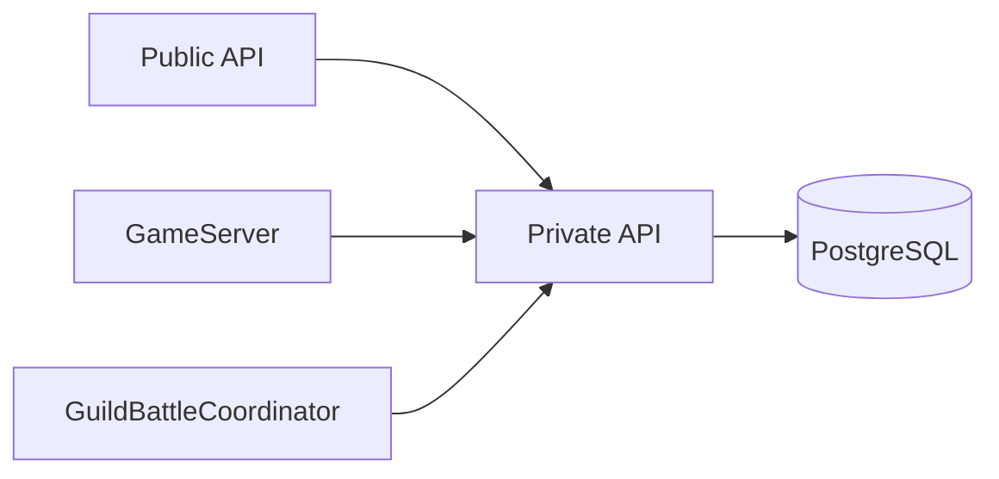
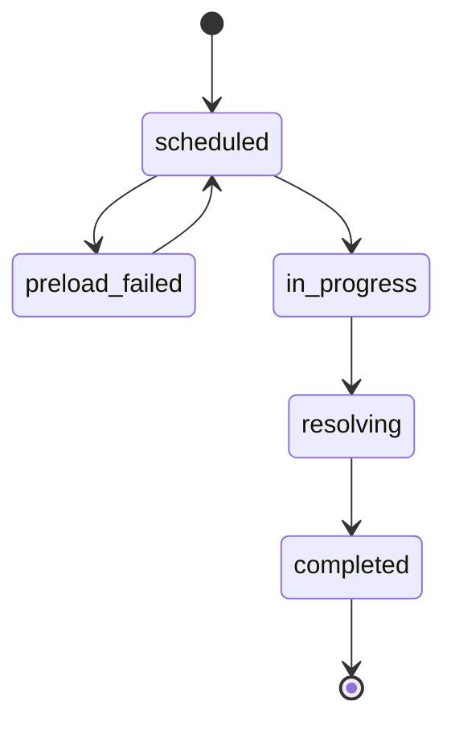
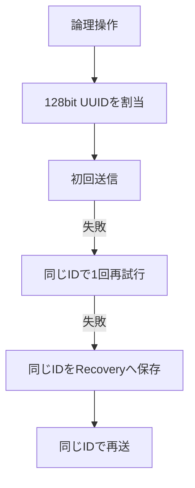

# 永続化境界

## 結論

PostgreSQLへのApplicationからの直接接続はPrivate API Serverに限定する。

GameServer、Public API Server、GuildBattleCoordinatorはDatabaseを直接更新しない。

## 依存関係

## Transaction境界

複数の永続更新を不可分に確定する必要がある処理はPrivate API Server内でDatabase transactionとして扱う。

特に`StartGuildBattle`と`CompleteGuildBattle`は既存設計に同一Transactionで確定する内容が明示されている。

## GuildBattle Lifecycle

状態遷移は`GuildBattleLifecycleService`を正本とする。

## X-Operation-ID

GuildBattle Lifecycle状態変更およびGuildBattle中のDatabase状態変更要求は`X-Operation-ID`を必須とする。

Private API ServerはTransaction内でOperation ID重複を確認し、処理済みなら更新を再適用しない。

## 情報源

- `design/server/private_api.md`
- `design/server/data_base.md`
- `design/server/guild_battle_lifecycle.md`
- `design/system/network.md`
