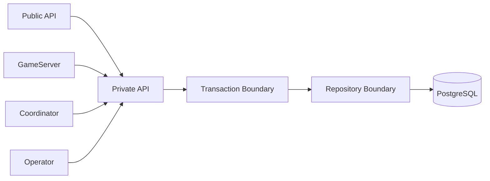
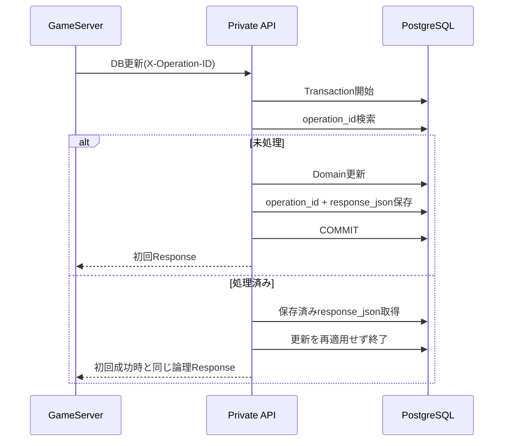

# 永続化プログラミング設計

## 結論

PostgreSQLへの直接接続はPrivate API Serverに限定し、永続化はDomain単位のRepository境界とUse Case単位のTransactionで扱います。GuildBattle中の更新は`X-Operation-ID`と`GUILD_BATTLE_DB_OPERATION`でExactly-once相当の二重適用防止を実現します。

## 永続化境界



Application ComponentがPrivate APIを迂回してDBへ直接接続しません。

## Repositoryの論理分類

具体的なRepository型名は固定しませんが、少なくとも以下の永続責務を混同しない構造にします。

| 分類 | 主なデータ |
|---|---|
| Account / Session | `ACCOUNT`, `PLAYER`, `ACCOUNT_SESSION`, Discord token usage |
| Guild | `GUILD`, `GUILD_MEMBER`, Join Application, Invitation |
| Master / Player fixed state | Master table、Formation、Item、`PLAYER_ITEM`、`PLAYER_ITEM_DAILY_GRANT`等 |
| Arena | Arena Party |
| GuildBattle Coordination | `GUILD_BATTLE`, Excluded Guild, Assignment |
| GuildBattle Party | Party / Character / Follower / Ability |
| GuildBattle Result | Guild結果、Player勝敗等 |
| Idempotency | `GUILD_BATTLE_DB_OPERATION` |
| Replay / Error | `GUILD_BATTLE_REPLAY_LOG`, `ERROR_LOG` |

DB schemaそのものは`design/server/data_base.md`を正とします。

## Transaction設計

### Account作成

AccountとPlayerを同一Transactionで作成します。片方だけを永続化しません。

### Guild Membership

人数上限、Membership Lock、Leader/Subleader条件をTransaction内の現在状態で再確認します。

Guild移動により旧GuildのLeader/Subleader状態変更が必要な場合も同じ整合性境界で扱います。

### BP50回復薬の日次配布

通常Playerの所持数増加と`PLAYER_ITEM_DAILY_GRANT`へのJST対象日付の配布実績登録を, 同一Transactionで実行します。`(player_id, target_date)`の一意性を利用して同日二重配布を防止します。配布数は1日10個であり, 翌日のJST午前0時から新しい日次配布の対象日付になります。

配布を開始する仕組み, 未配布日の取扱い, GameServerが騎士団戦中に保持するItem残数および`UpdatePlayerItem`の絶対所持数更新との同期方式は未確定であり, この設計では固定しません。

### StartGuildBattle

以下を同一Transactionで確定します。

- Owner確認
- InitialSeed保存
- Create Replay保存
- `scheduled -> in_progress`

Create Replay保存に失敗してStatusだけ`in_progress`にしません。

### CompleteGuildBattle

以下を同一Transactionで確定します。

- 最終Guild結果
- Player勝敗数
- `resolving -> completed`
- 当該対戦2Guildの`membership_locked=false`
- 同じ対象日・開始時刻の`GUILD_BATTLE`行を`GuildBattleID`昇順で`SELECT ... FOR UPDATE`し, 今回のCompletedを含め残る未完了対戦が0件の場合だけ, 除外Guildの`membership_locked=false`と対象の除外一覧削除（同時間帯の完了処理を直列化）

入力のPlayer重複、対象外Player、Guild結果とPlayer結果の矛盾、最終Scoreと勝敗の矛盾等を検証し、いずれか失敗した場合は全体Rollbackします。

## GuildBattle Lifecycle

Status更新は`GuildBattleLifecycleService`の意図APIだけから行います。

| API | 許可される主要遷移 |
|---|---|
| `MarkGuildBattlePreloadFailed` | `scheduled -> preload_failed` |
| `StartGuildBattle` | `scheduled -> in_progress` |
| `BeginGuildBattleResolving` | `in_progress -> resolving` |
| `CompleteGuildBattle` | `resolving -> completed` |
| `RetryPreloadFailedGuildBattle` | 旧IDの`preload_failed -> replaced`と新IDの`scheduled`作成を原子的に実行 |
| `RematchPreloadFailedGuildBattles` | 同一IDで`preload_failed -> scheduled` |
| `CancelPreloadFailedGuildBattle` | `preload_failed -> canceled`; 対戦Guild解除と同一枠の終端確認 |

任意Statusを受け取る汎用`UpdateGuildBattleStatus`は設けません。

## Operation ID冪等化



同一論理操作では初回、1回Retry、Recovery再送のすべてで同じOperation IDを使います。

## GuildBattleID生成

DB仕様で定義された以下を純粋関数として実装し、単体テスト対象にします。

```text
GuildBattleID
  = YYYYMMDD * 10^11
  + GuildBattleStartTimeEnumValue * 10^8
  + PairIndex
```

型は`u64`です。

## DB Row変換

- DB RowからDomain型への変換時に`design/shared/types.md`の範囲・Enumを検証します。
- Nullable列とOptionの対応はSchemaどおりにします。
- `initial_seed`は開戦前にNULLを許容するなど、Lifecycleに依存するNULL条件を勝手に狭めません。

## Replay保存

`GUILD_BATTLE_REPLAY_LOG.payload`には`GuildBattleReplayEnvelope`をProtocol Buffers Serializeしたbinaryを保存します。検索用`process_type`とEnvelope内`process_type`を一致させます。

Replayの完全再現性を保つため、DB保存用に別内容へ変換しません。

## メリット・デメリット

### メリット

- Transactionの原子性要件をUse Caseごとに検証できます。
- Retry / Recoveryで加算やReplay保存の二重適用を防げます。
- DB schema依存をPrivate APIへ閉じ込められます。

### デメリット

- Operation ID履歴とResponse保存が必要なため永続データ量が増えます。
- GameServerからの永続更新がPrivate API経由になるため内部通信障害をRecovery対象として扱う必要があります。

## 情報源

- `design/server/data_base.md`
- `design/server/private_api.md`
- `design/server/guild_battle_lifecycle.md`
- `design/server/guild_battle.md`
- `design/system/guild_battle_replay.proto`
- `design/shared/types.md`
- `design/test/test_policy.md`
