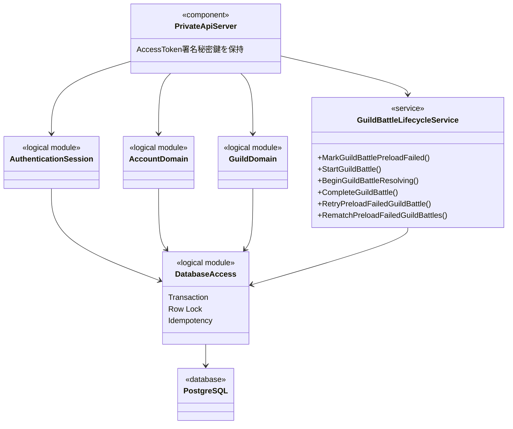
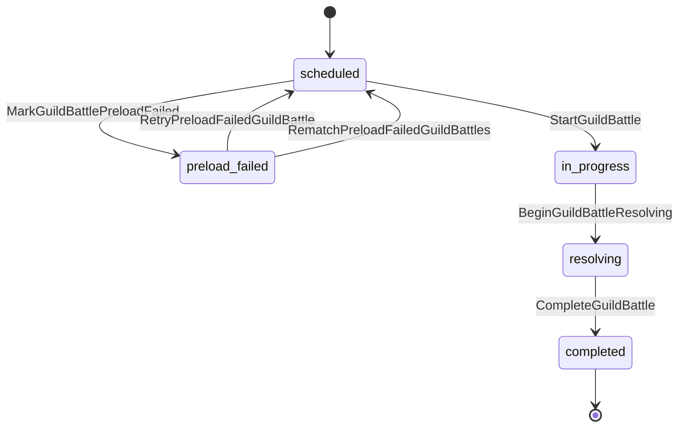
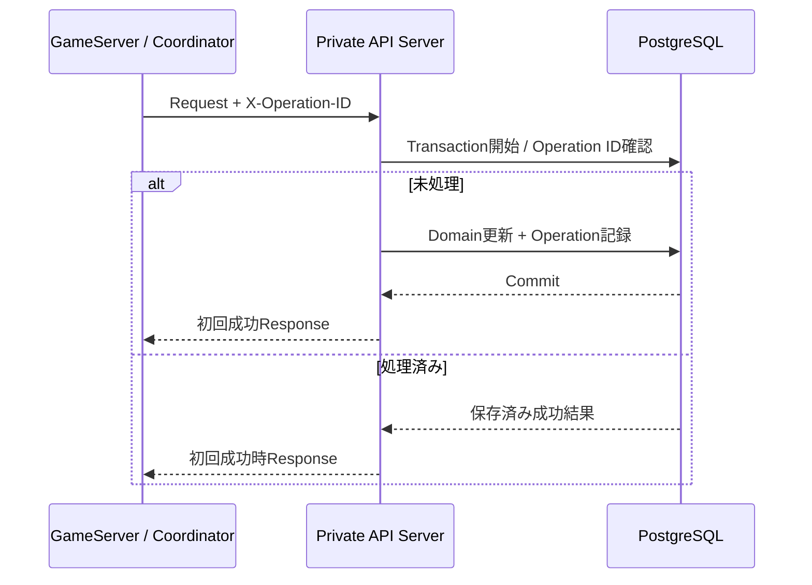

# Private API Server大枠設計

## 結論

Private API ServerはAccount / Guild等のDomain処理、認証状態、Databaseアクセス、GuildBattle永続ライフサイクルを担当する。

Application ComponentのうちPostgreSQLへ直接接続するのはPrivate API Serverだけとする。

## 論理構成

```text
Private API Server
├── Authentication / Session
├── Account
├── Guild
├── Arena Persistence
├── GuildBattle Persistence
├── GuildBattleLifecycleService
└── Database Access
```

この分類は詳細クラスを確定するものではなく、既存設計の責務を分けるための論理境界である。

## クラス図



`AuthenticationSession`等の名称は論理責務の表示名であり、Rust型名を確定するものではない。`GuildBattleLifecycleService`は既存資料で明示された名称である。

## GuildBattle永続状態



任意の`status`を指定する汎用更新APIは設けない。

## 冪等Database更新



同一論理操作の初回送信、1回再試行、Recovery再送では同じ128bit UUIDの`X-Operation-ID`を使用する。

## 情報源

- `design/server/private_api.md`
- `design/server/data_base.md`
- `design/server/guild_battle_lifecycle.md`
- `design/system/network.md`
