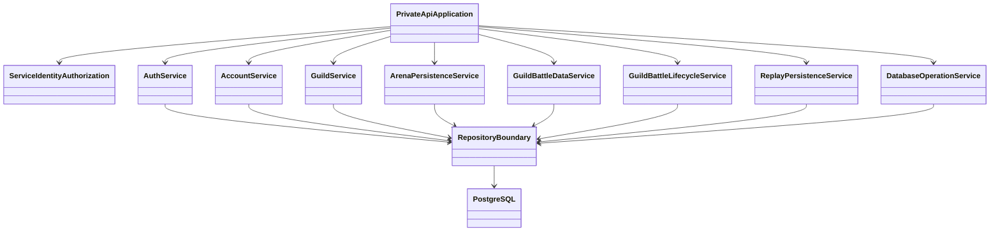
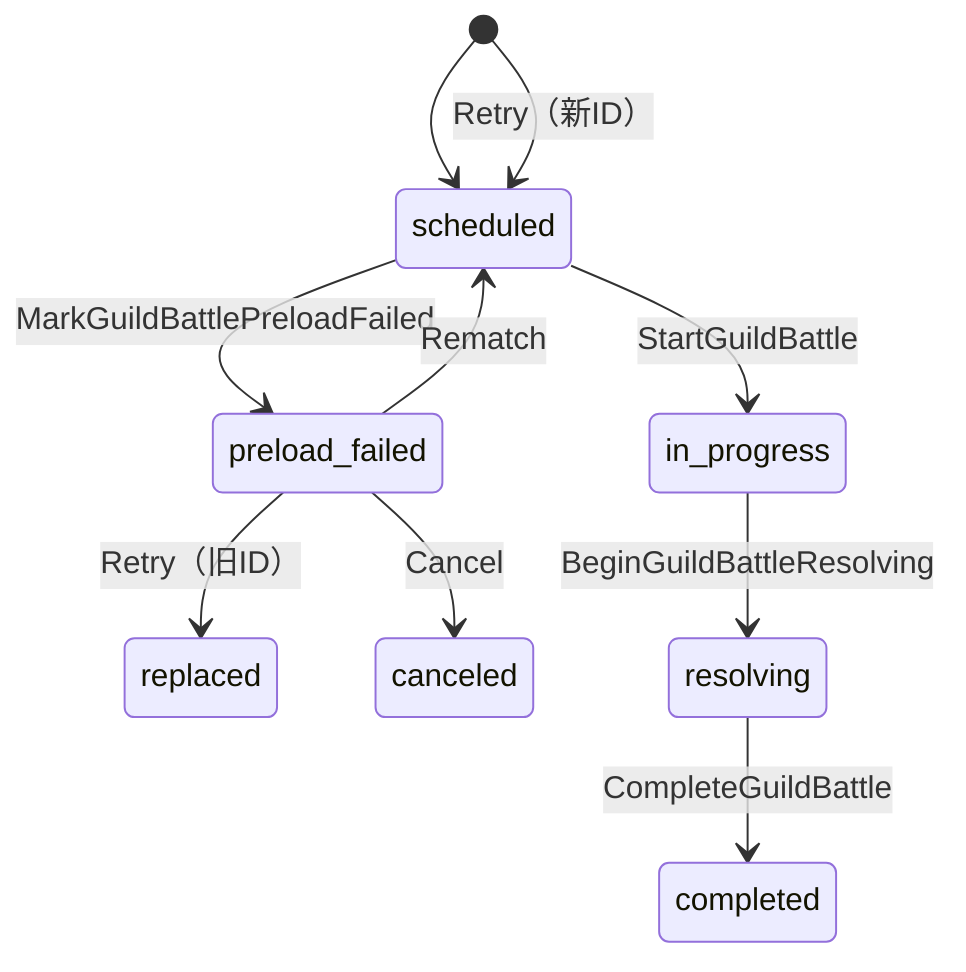

# Private API Serverプログラミング設計

## 概要

Private API ServerはAccount / Session / GuildのDomain処理、GuildBattle永続Lifecycle、Database Transaction、永続データ取得・保存の正本Applicationです。Application ComponentからPostgreSQLへ直接接続する入口をここへ集中させます。

## 論理構成

これらは論理Serviceです。具体的なRust型名やRepository数は固定しません。

## Service Identity認可

mTLSで確定した呼び出し元Service IdentityをAPI Allowlistへ照合してから業務処理を実行します。Private APIのRequest/Response PayloadはProtocol Buffersを使用します。field number・wire schemaおよびHTTP Method/Pathは未定義のため, 現段階では生成型やEndpointを推定しません。

主な呼び出し元は以下です。

- Public API Server
- GameServer
- GuildBattleCoordinator
- 運営Component
- Discord Botの`RevokeDiscordSessions`

運営Componentへ一般Client系APIを開放せず、Discord Botには定義されたSession revoke用途だけを許可します。

## Domain所有

### Account / Session

- LoginID / Password認証
- Password Hash管理
- AccessToken発行
- Refresh Session管理
- Session revoke
- Discord Role喪失に伴うSession revoke

### Guild

- Guild作成
- 団長・副団長更新
- Join申請・承認
- Invitation・承諾
- Guild移動・脱退
- `membership_locked`
- 人数上限等のDatabase現在状態を用いた最終判定

### GuildBattle永続Lifecycle

`GuildBattleLifecycleService`が状態遷移を所有します。任意のStatusを書き換える汎用APIは設けません。

## Transaction Boundary

複数の整合条件を同時に成立させる処理は1 Transactionで確定します。

| 処理 | 同一Transactionで扱う主な対象 |
|---|---|
| Account作成 | Account + Player |
| Guild Membership変更 | Member / leader / subleader / 人数・Lock条件等 |
| StartGuildBattle | InitialSeed + Create Replay + `scheduled -> in_progress` |
| 冪等GuildBattle更新 | Domain更新 + `GUILD_BATTLE_DB_OPERATION` |
| CompleteGuildBattle | 最終結果 + Player勝敗 + `completed` + 当該対戦のmembership unlock; 同一マッチング枠の全Battle終端時のみ除外Guild unlock + 除外一覧削除 |
| RetryPreloadFailedGuildBattle | 旧IDの`replaced`遷移 + 新IDの`scheduled`作成 + 後継ID参照を原子的に確定 |
| CancelPreloadFailedGuildBattle | `canceled`遷移 + 対戦Guild unlock + 同枠の終端判定 + 除外Guild unlockを原子的に確定 |

途中だけCommitする処理へ分割しません。

## AuthenticatedContextの扱い

Public API由来のAccount/Guild要求は`AuthenticatedContext`を受け取り、ContextのPlayerIDをCallerとして使用します。Payload中の任意PlayerIDでCallerを上書きしません。

ただし、Public APIが認証済みであることだけをDomain判定の根拠にせず、Guild Role、Membership Lock、人数等はDatabase現在状態で再確認します。

## Password認証負荷

Argon2id検証はCPU / Memoryを消費するため、仕様で示されたBounded Concurrencyを適用します。待ち行列を無制限にしません。

## Database Access

- SQL/DB Driver依存はPrivate APIのInfrastructure境界へ閉じ込めます。
- Domain/Application層へDB Row型をそのまま公開しません。
- `common-types`の論理型とDB型の対応は`design/shared/types.md`を正とします。
- Transaction開始・Commit・RollbackはApplication use case単位で管理します。

## 制約

- DBを使用する処理はPrivate APIを経由する。
- Private API Serverでは接続数・認証処理負荷・Transactionを監視対象とする。

## 参照資料

- `design/server/private_api.md`
- `design/server/api.md`
- `design/server/session.md`
- `design/server/data_base.md`
- `design/server/guild_battle_lifecycle.md`
- `design/server/public_api_responsibility.md`
- `design/shared/types.md`
