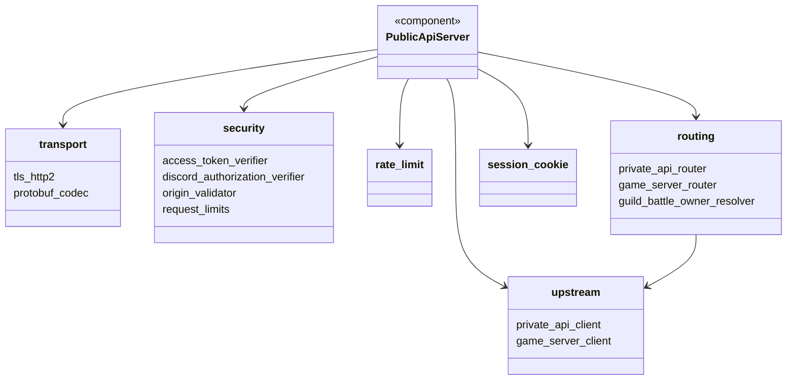
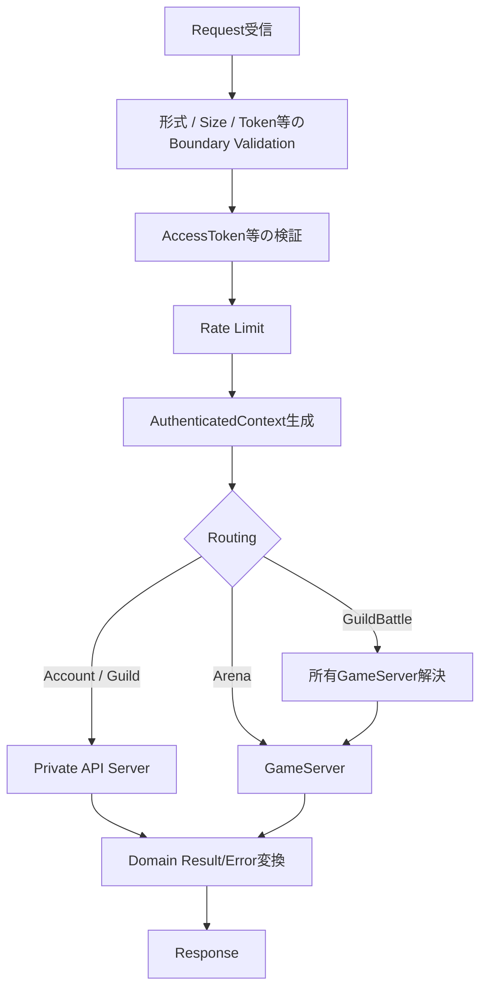

# Public API Server大枠設計

## 結論

Public API Serverは単一Deploymentのstateless Edge APIとし、Domain Logicを持たない薄いAdapterとして実装する。

## Module構成

資料で以下の論理Module構成が明示されている。

```text
PublicApiServer
├── transport
│   ├── tls_http2
│   └── protobuf_codec
├── security
│   ├── access_token_verifier
│   ├── discord_authorization_verifier
│   ├── origin_validator
│   └── request_limits
├── rate_limit
├── routing
│   ├── private_api_router
│   ├── game_server_router
│   └── guild_battle_owner_resolver
├── session_cookie
└── upstream
    ├── private_api_client
    └── game_server_client
```

## クラス図



## Request処理



## Public APIへ置かないもの

- Guild権限・所属制約等のDomain判定
- Arena編成制約、対戦相手抽選、Seed生成、戦闘計算
- GuildBattle参加・出撃・Tactics・Item・Heal・Revive等のゲームルール判定
- Database transaction / row lock
- ゲーム状態・認証状態の正本

## 情報源

- `design/server/public_api_responsibility.md`
- `design/server/public_api.md`
- `design/system/network.md`
- `design/system/public_api.proto`
